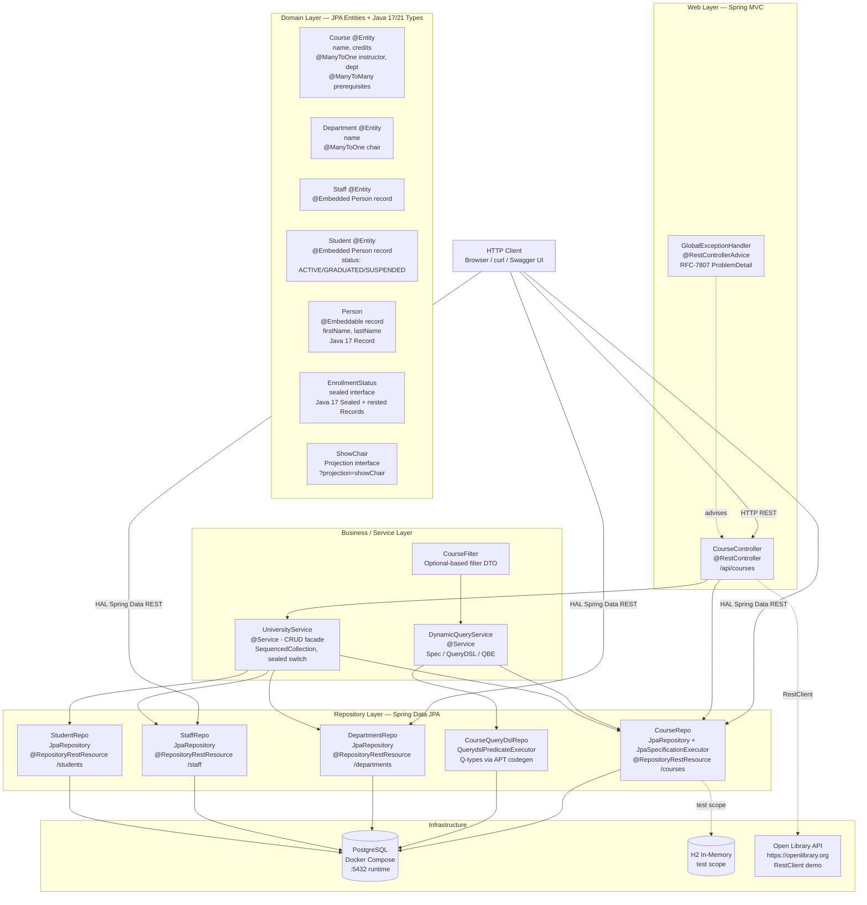
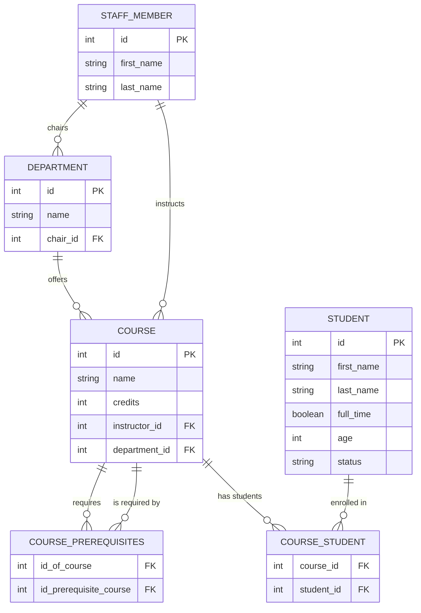
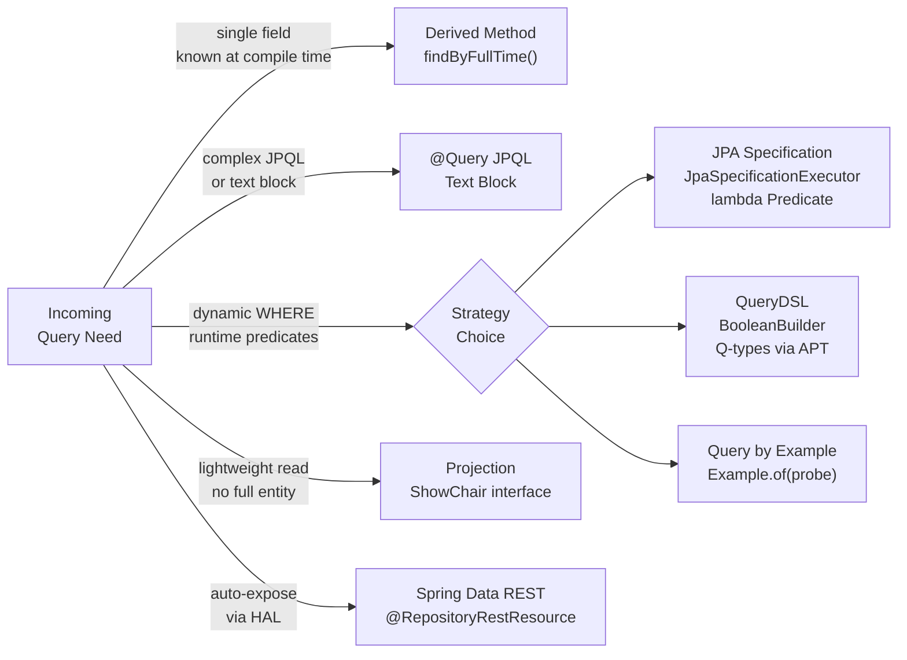

# University Modern — Architecture Reference

> **Module:** `university-modern` · Spring Boot 3.2+ · Java 17/21 · PostgreSQL  
> Principal architect view: layer structure, entity model, query strategies, and design decisions.

---

## 1. Overall System Architecture

Five vertical layers communicate top-to-bottom. Dashed arrows indicate cross-cutting or optional paths.

---

## 2. Domain Entity Relationships

---

## 3. Query Strategy Decision Tree

---

## 4. Layer Summary Tables

### 4.1 Domain Layer

| Class | Java Type | JPA Annotation | Key Relationships | Modern Java Feature |
|---|---|---|---|---|
| `Person` | `record` | `@Embeddable` | Embedded into `Staff.member`, `Student.attendee` | Java 17 Record — auto equals/hashCode/toString, zero boilerplate |
| `Staff` | `class` | `@Entity` `@Table(staff_member)` | Embeds `Person`; referenced by `Department.chair` and `Course.instructor` | Uses `Person` record as embedded value |
| `Department` | `class` | `@Entity` `@Table(department)` | `@ManyToOne Staff chair`; offers many `Course` | — |
| `Course` | `class` | `@Entity` `@Table(course)` | `@ManyToOne` instructor (Staff) + department; `@ManyToMany` self-referential prerequisites | — |
| `Student` | `class` | `@Entity` `@Table(student)` | Embeds `Person`; `@ManyToMany Course` via `course_student` join table | Status string → `EnrollmentStatus` sealed type at service layer |
| `EnrollmentStatus` | `sealed interface` | — | Permits `Active(semester)`, `Graduated(year)`, `Suspended(reason)` records | Java 17 Sealed Interface + nested Records; enables exhaustive switch |
| `ShowChair` | `interface` (Projection) | `@Projection(types=Department)` | SpEL `#{target.chair.member.firstName()} #{target.chair.member.lastName()}` | Spring Data REST Projection; record accessor in SpEL |

### 4.2 Repository Layer

| Interface | Extends | Extra API | HAL Path | Query Mechanisms |
|---|---|---|---|---|
| `CourseRepo` | `JpaRepository<Course, Integer>` + `JpaSpecificationExecutor<Course>` | `findByName()`, `findByPrerequisites()`, Specification `findAll(Spec)` | `/courses` | Derived method, JPQL text block `@Query`, JPA Specification, QBE |
| `CourseQueryDslRepo` | `JpaRepository<Course, Integer>` + `QuerydslPredicateExecutor<Course>` | Type-safe `findAll(Predicate)`, `count(Predicate)`, `exists(Predicate)` | Internal only | QueryDSL `BooleanBuilder` + APT-generated `QCourse` Q-types |
| `DepartmentRepo` | `JpaRepository<Department, Integer>` | — | `/departments` (`showChair` projection) | Basic CRUD, Projection |
| `StaffRepo` | `JpaRepository<Staff, Integer>` | JPQL `@Query` with text block | `/staff` | JPQL `@Query` with named `@Param` |
| `StudentRepo` | `JpaRepository<Student, Integer>` | `findByFullTime()`, JPQL `findYoungerThan()`, `findByStatus()` | `/students` | Derived method, JPQL text block |

### 4.3 Business / Service Layer

| Class | Annotation | Responsibility | Key Modern Java Features |
|---|---|---|---|
| `UniversityService` | `@Service` | CRUD facade over all four repos; creates/finds all entity types | `SequencedCollection.reversed()` (Java 21); `sealed switch` with record deconstruction in `describeEnrollment()` (Java 21); `instanceof`-pattern cast in `toEnrollmentStatus()` (Java 17) |
| `DynamicQueryService` | `@Service` | Demonstrates three dynamic query strategies side-by-side on `Course` | JPA `Specification` lambda (Strategy 1), QueryDSL `BooleanBuilder` + `QCourse` (Strategy 2), `Example.of(probe)` QBE (Strategy 3) |
| `CourseFilter` | POJO | Optional-based filter DTO — fields are `Optional.empty()` by default | Java 8 `Optional<T>` fields with fluent builder API; avoids null-check boilerplate |

### 4.4 Web Layer

| Class | Annotation | Endpoints | Responsibility | Spring Boot 3.2+ Feature |
|---|---|---|---|---|
| `CourseController` | `@RestController` `@RequestMapping(/api/courses)` | `GET /api/courses` · `GET /api/courses/{id}` · `GET /api/courses/reversed` · `GET /api/courses/filter` · `GET /api/courses/querydsl` · `GET /api/courses/qbe` · `GET /api/courses/library` | Course REST endpoints + external API call demo | `RestClient` (fluent; replaces `RestTemplate`); returns `SequencedCollection<Course>` (Java 21) |
| `GlobalExceptionHandler` | `@RestControllerAdvice` | All controllers (cross-cutting) | Catches `CourseNotFoundException` → 404; catches `IllegalArgumentException` → 400 | `ProblemDetail` RFC 7807 — standardised JSON error shape; `application/problem+json` content type |
| `CourseNotFoundException` | extends `RuntimeException` | — | Typed domain exception for missing course lookups | Used with `ProblemDetail` for structured 404 responses |

### 4.5 Test Layer

| Class | Annotation | Nested Test Groups | Database | Covers |
|---|---|---|---|---|
| `ModernFeaturesTest` | `@SpringBootTest` `@Transactional` | `RecordTests` · `SealedInterfaceTests` · `PatternMatchingTests` · `SequencedCollectionTests` · `SealedSwitchTests` | H2 in-memory (`data.sql`) | All Java 17/21 features end-to-end: record accessors, sealed permits, pattern-match instanceof, SequencedCollection API, sealed switch deconstruct |
| `SimpleDBCrudTest` | `@SpringBootTest` `@Transactional` | — | H2 in-memory (`data.sql`) | Basic JPA CRUD: create / findById / update / delete for all entity types; enrollment status transitions |

### 4.6 Infrastructure

| Component | Technology | Used When | Config |
|---|---|---|---|
| PostgreSQL | Docker Compose (`compose.yaml`) with `postgres:16` image | Runtime (production-like dev) | `application.properties` — datasource URL `jdbc:postgresql://localhost:5432/university` |
| H2 In-Memory | `h2` (`test` scope) | `@SpringBootTest` test runs | `src/test/resources/application.properties` + `data.sql` seed data |
| Dockerfile | Multi-stage: Maven build → JRE 21 slim | Container deployment | `EXPOSE 8080`; `ENTRYPOINT java -jar` |
| Open Library API | External REST API via `RestClient` | `GET /api/courses/library` demo | Base URL `https://openlibrary.org`; Spring Boot 3.2+ auto-configured `RestClient.Builder` |

---

*Generated 2026-03-03 · Principal architect analysis of `university-modern` (Java 17/21 + Spring Boot 3.2+)*
