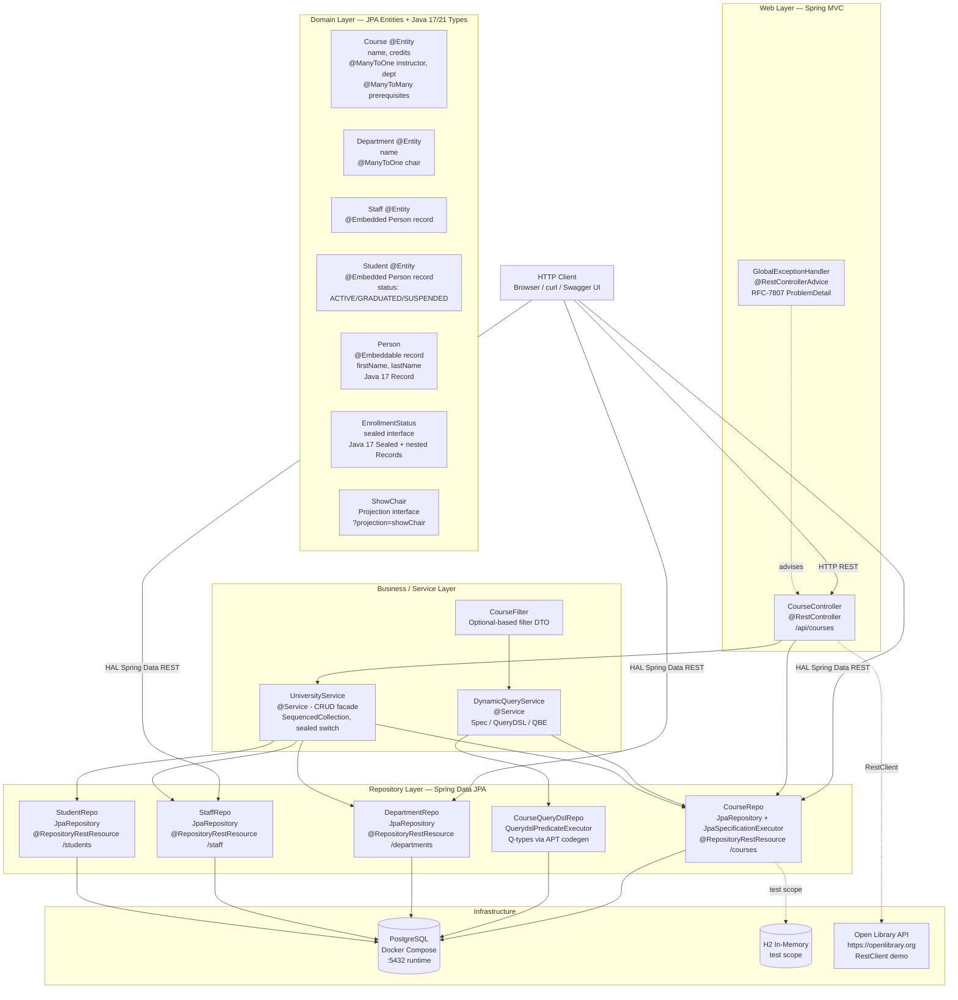
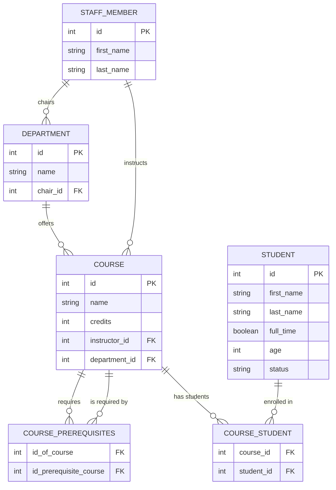
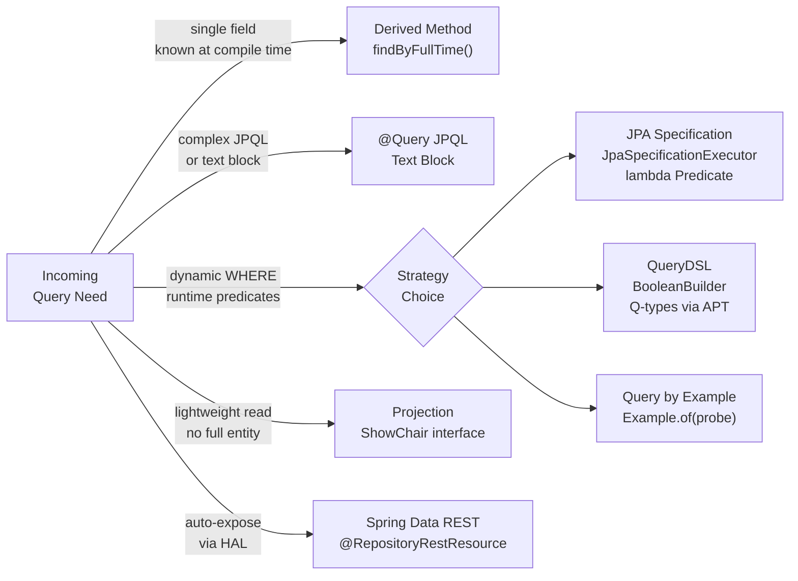
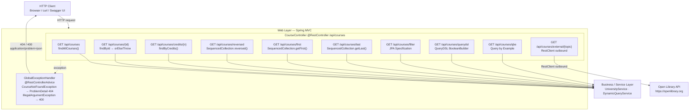
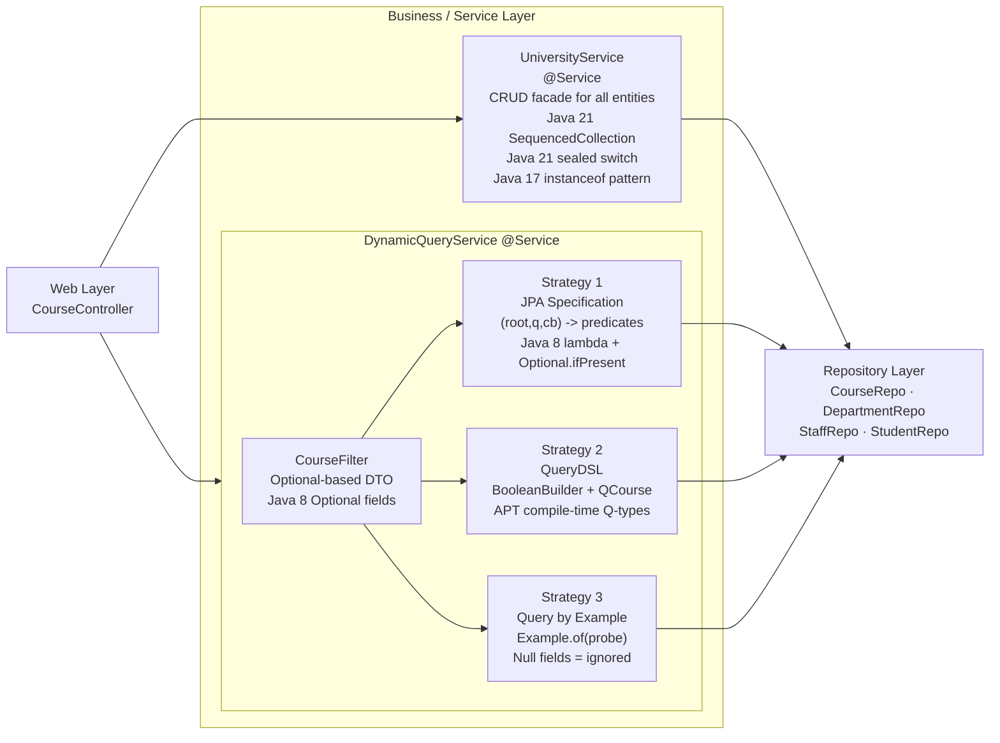
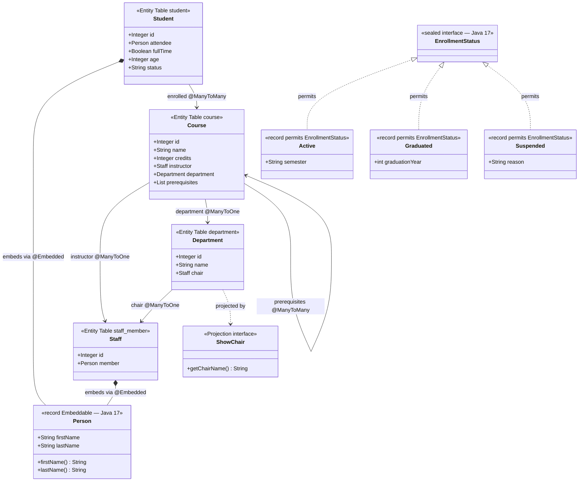
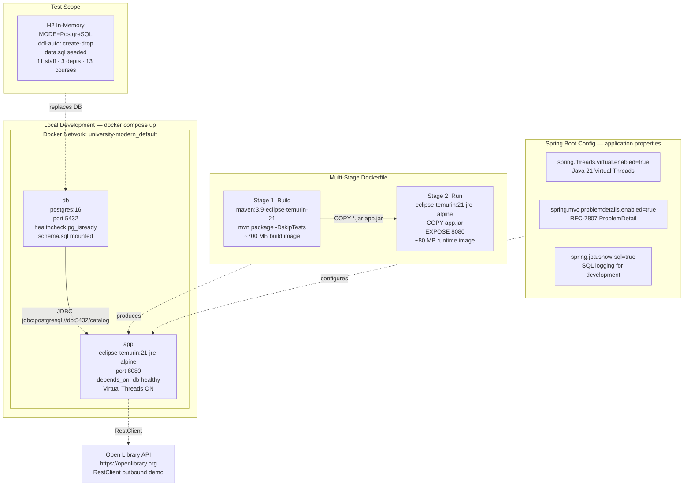
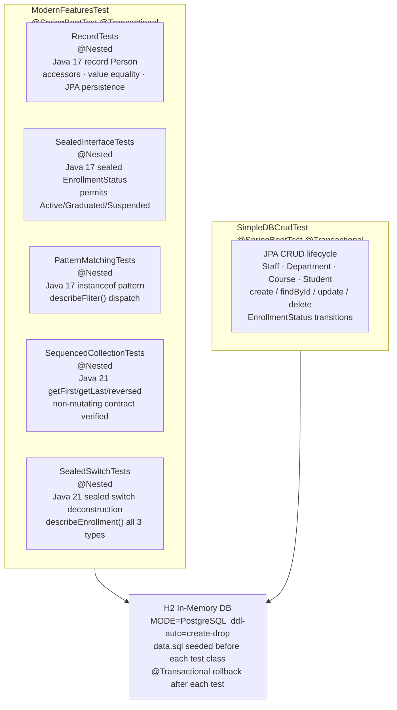

# University Modern — Architecture Reference

> **Module:** `university-modern` · Spring Boot 3.2+ · Java 17/21 · PostgreSQL  
> Principal architect view: layer structure, entity model, query strategies, and design decisions.

---

## 1. Overall System Architecture

Five vertical layers communicate top-to-bottom. Dashed arrows indicate cross-cutting or optional paths.



---

## 2. Domain Entity Relationships



---

## 3. Query Strategy Decision Tree



---

## 4. Layer Summary Tables

> End-to-end layer breakdown of `university-modern`.  
> Each section follows: **Role & Design Decisions** → **Mermaid component diagram** → **Detailed tables** → **Code / comparison reference**.  
> Ordered top-to-bottom to trace a request from the HTTP boundary down to the database and back.

---

### 4.1 Web Layer

> **Role:** HTTP boundary — translate incoming HTTP requests into domain operations and serialise results back to HTTP payloads.  
> **Pattern:** Thin controller (zero business logic); delegates all orchestration to `UniversityService` and `DynamicQueryService`; cross-cutting error handling via `@RestControllerAdvice`.  
> **Key Features:** `@RestController` · `@RestControllerAdvice` · Spring Boot 3.2+ `RestClient` · `ProblemDetail` RFC-7807 · Java 21 `SequencedCollection` return type.



#### 4.1a — Endpoint Catalog

| HTTP | Path | Handler Method | Delegates To | Returns | Java / Spring Feature |
|---|---|---|---|---|---|
| `GET` | `/api/courses` | `getAllCourses()` | `UniversityService.findAllCourses()` | `List<Course>` | — |
| `GET` | `/api/courses/{id}` | `getCourseById()` | `CourseRepo.findById().orElseThrow()` | `Course` | Throws `CourseNotFoundException` → ProblemDetail 404 |
| `GET` | `/api/courses/credits/{n}` | `getCoursesByCredits()` | `CourseRepo.findByCredits()` | `List<Course>` | JPQL text block `@Query` |
| `GET` | `/api/courses/reversed` | `getCoursesReversed()` | `UniversityService.findCoursesReversed()` | `SequencedCollection<Course>` | **Java 21** `List.reversed()` — non-destructive reversed view |
| `GET` | `/api/courses/first` | `getFirstCourse()` | `UniversityService.findFirstCourse()` | `Course` | **Java 21** `List.getFirst()` — self-documenting |
| `GET` | `/api/courses/last` | `getLastCourse()` | `UniversityService.findLastCourse()` | `Course` | **Java 21** `List.getLast()` |
| `GET` | `/api/courses/filter` | `getFilteredCourses()` | `DynamicQueryService.filterBySpecification()` | `List<Course>` | JPA `Specification` lambda predicate |
| `GET` | `/api/courses/querydsl` | `getQueryDslCourses()` | `DynamicQueryService.filterByQueryDsl()` | `List<Course>` | QueryDSL `BooleanBuilder` + `QCourse` APT types |
| `GET` | `/api/courses/qbe` | `getQbeCourses()` | `DynamicQueryService.filterByExample()` | `List<Course>` | `Example.of(probe)` Query by Example |
| `GET` | `/api/courses/external/{topic}` | `getExternalLibraryInfo()` | `RestClient` → `openlibrary.org` | `String` (raw JSON) | **Spring Boot 3.2+** `RestClient` replaces `RestTemplate` |

#### 4.1b — Exception → ProblemDetail Mapping

```
CourseNotFoundException (id)
    ↓  caught by GlobalExceptionHandler
    ↓  ProblemDetail.forStatusAndDetail(404, "Course with ID {id} was not found.")
    ↓  .setType(URI.create("https://api.university.example/errors/course-not-found"))
    ↓  .setProperty("timestamp", Instant.now())
    ↓  .setProperty("path", request.getRequestURI())

HTTP/1.1 404 Not Found
Content-Type: application/problem+json

{
  "type":      "https://api.university.example/errors/course-not-found",
  "title":     "Course Not Found",
  "status":    404,
  "detail":    "Course with ID 99 was not found.",
  "timestamp": "2026-03-04T10:00:00Z",
  "path":      "/api/courses/99"
}
```

#### 4.1c — Design Decisions

| Decision | Choice Made | Reason |
|---|---|---|
| Error serialisation | RFC-7807 `ProblemDetail` | Industry-standard `application/problem+json` — any client knows the schema |
| Outbound HTTP | `RestClient` (not `RestTemplate`) | Fluent, immutable, Spring Boot 3.2+ recommended replacement for `RestTemplate` |
| Controller responsibility | Zero business logic | All branching lives in `UniversityService` / `DynamicQueryService`; controller is a thin adapter |
| Ordered collection return type | `SequencedCollection<Course>` | Signals to callers that element ordering is intentional and part of the API contract |

---

### 4.2 Business / Service Layer

> **Role:** Business logic boundary — orchestrates repository calls, applies domain rules, shields the Web layer from persistence concerns.  
> **Pattern:** Facade (`UniversityService` — single entry point for all CRUD); Strategy pattern (`DynamicQueryService` — three interchangeable query strategies behind one service).  
> **Key Features:** Java 21 `SequencedCollection` (`reversed`, `getFirst`, `getLast`) · Sealed switch with record deconstruction (`describeEnrollment`) · Java 17 `instanceof` pattern matching · `Optional`-based `CourseFilter` DTO.



#### 4.2a — Service Class Catalog

| Class | Annotation | Role | Injects |
|---|---|---|---|
| `UniversityService` | `@Service` | CRUD facade — creates and retrieves all entity types; applies Java 21 `SequencedCollection` and sealed switch logic at the service boundary | `CourseRepo`, `DepartmentRepo`, `StaffRepo`, `StudentRepo` |
| `DynamicQueryService` | `@Service` | Side-by-side demonstration of three dynamic query strategies on `Course`; accepts `CourseFilter` and routes to the selected strategy | `CourseRepo` (Specification + QBE), `CourseQueryDslRepo` (QueryDSL) |
| `CourseFilter` | POJO (no annotation) | Optional-based filter DTO — absent fields (`Optional.empty()`) mean "do not filter on this dimension"; built via fluent `filterBy()` factory | Constructed by controller; consumed by `DynamicQueryService` |

#### 4.2b — Key Method Catalog

| Class | Method | Return Type | Java / Spring Feature |
|---|---|---|---|
| `UniversityService` | `findCoursesReversed()` | `SequencedCollection<Course>` | **Java 21** `List.reversed()` — returns a non-mutating reversed view |
| `UniversityService` | `findFirstCourse()` | `Course` | **Java 21** `List.getFirst()` — replaces opaque `get(0)` |
| `UniversityService` | `findLastCourse()` | `Course` | **Java 21** `List.getLast()` — replaces `get(size - 1)` |
| `UniversityService` | `describeEnrollment(EnrollmentStatus)` | `String` | **Java 21** sealed pattern-matching switch with record deconstruction — no `default` branch needed |
| `UniversityService` | `toEnrollmentStatus(Student, String)` | `EnrollmentStatus` | **Java 17** `instanceof` pattern matching + switch on string |
| `DynamicQueryService` | `filterBySpecification(CourseFilter)` | `List<Course>` | JPA `Specification<Course>` lambda + `Optional.ifPresent()` per predicate |
| `DynamicQueryService` | `filterByQueryDsl(CourseFilter)` | `List<Course>` | QueryDSL `BooleanBuilder` + APT-generated `QCourse` — type-safe field references |
| `DynamicQueryService` | `filterByExample(CourseFilter)` | `List<Course>` | Spring Data `Example.of(probe)` — null fields excluded automatically |
| `DynamicQueryService` | `describeFilter(Object)` | `String` | **Java 17** `instanceof` pattern matching — `if (filterObject instanceof CourseFilter cf)` |

#### 4.2c — Query Strategy Comparison

| Attribute | Specification (Strategy 1) | QueryDSL (Strategy 2) | QBE (Strategy 3) |
|---|---|---|---|
| **Type safety** | Field names as Strings — typos caught at runtime | Compile-time `QCourse` Q-types — typos caught at compile time | Java object fields — refactoring-safe |
| **Null / absent handling** | `Optional.ifPresent()` per predicate | Manual `BooleanBuilder.and()` conditions | Probe object — null fields are automatically excluded |
| **Predicate composition** | `criteriaBuilder.and(array)` | `BooleanBuilder.and(pred)` — chainable | Single `Example.of(probe)` — not composable |
| **IDE auto-complete** | No — String field names | Full — `QCourse.course.credits.eq(3)` | Partial — uses entity class fields |
| **Setup cost** | Zero — built into `JpaSpecificationExecutor` | Requires QueryDSL APT Maven plugin + compile step | Zero — built into `JpaRepository` |
| **Best for** | Simple to moderate dynamic WHERE clauses | Complex, large-scale, enterprise-grade dynamic filtering | Exact-match lookups on entity fields |

#### 4.2d — Java 21 Sealed Switch (live code)

```java
// UniversityService.describeEnrollment() — zero-boilerplate exhaustive switch
// Sealed interface guarantees compiler checks ALL 3 types are handled (no default needed)
public String describeEnrollment(EnrollmentStatus status) {
    return switch (status) {
        case EnrollmentStatus.Active    s -> "Currently enrolled in semester: " + s.semester();
        case EnrollmentStatus.Graduated s -> "Graduated in " + s.graduationYear();
        case EnrollmentStatus.Suspended s -> "Suspended — reason: " + s.reason();
        // No 'default' — compiler verified all permitted types are covered
    };
}
```

---

### 4.3 Repository Layer

> **Role:** Data access boundary — abstracts all database interactions behind typed Spring Data interfaces; owns every query strategy from simple CRUD to complex dynamic predicates.  
> **Pattern:** One interface per aggregate root; dual-repo pattern for `Course` (Specification executor + QueryDSL executor); `@RepositoryRestResource` for zero-code HAL endpoint generation.  
> **Key Features:** `JpaRepository` · `JpaSpecificationExecutor` · `QuerydslPredicateExecutor` · JPQL text blocks (Java 17) · `@RepositoryRestResource` HAL · `ShowChair` projection.


#### 4.3a — Repository Interface Reference

| Interface | Entity | Extends | HAL Path | Spring Data Extras |
|---|---|---|---|---|
| `CourseRepo` | `Course` | `JpaRepository` + `JpaSpecificationExecutor` | `/courses` | `@RepositoryRestResource`; JPQL text block queries; Specification; QBE |
| `CourseQueryDslRepo` | `Course` | `JpaRepository` + `QuerydslPredicateExecutor` | Internal only | QueryDSL `BooleanBuilder` + APT-generated `QCourse`, `QStaff`, `QDepartment` |
| `DepartmentRepo` | `Department` | `JpaRepository` | `/departments` | `@RepositoryRestResource`; `?projection=showChair` |
| `StaffRepo` | `Staff` | `JpaRepository` | `/staff` | `@RepositoryRestResource`; JPQL `@Query` with `@Param` |
| `StudentRepo` | `Student` | `JpaRepository` | `/students` | `@RepositoryRestResource`; derived methods + JPQL text blocks |

#### 4.3b — Query Method Catalog

| Repository | Method | Mechanism | Generated / Written SQL Shape |
|---|---|---|---|
| `CourseRepo` | `findByName(name)` | Derived method | `WHERE c.name = ?` |
| `CourseRepo` | `findByCredits(n)` | JPQL text block `@Query` | `WHERE c.credits = :credits ORDER BY c.name ASC` |
| `CourseRepo` | `findByPrerequisites(course)` | Derived method | `JOIN course_prerequisites WHERE prerequisite_id = ?` |
| `CourseRepo` | `findByDepartmentChairMemberLastName(chair)` | JPQL text block — deep path navigation | `WHERE c.department.chair.member.lastName = :chair` |
| `CourseRepo` | `findCoursesWithMoreThan(n)` | JPQL text block | `WHERE c.credits > :n ORDER BY credits DESC` |
| `StaffRepo` | `findByMemberLastName(name)` | JPQL `@Query` + `@Param` | `WHERE s.member.lastName = :lastName` |
| `StudentRepo` | `findByFullTime(bool)` | Derived method | `WHERE full_time = ?` |
| `StudentRepo` | `findYoungerThan(age)` | JPQL text block | `WHERE s.age < :age ORDER BY s.age ASC` |
| `StudentRepo` | `findByStatus(status)` | JPQL text block | `WHERE s.status = :status` |

#### 4.3c — Spring Data REST HAL Quick Reference

```
GET  /courses                          → Page<Course>  (includes _links.self, _links.next)
GET  /courses/{id}                     → Course        (_links.self, _links.instructor, _links.department)
POST /courses         {JSON body}      → 201 Created
PUT  /courses/{id}    {JSON body}      → 200 OK
DELETE /courses/{id}                   → 204 No Content

GET  /departments?projection=showChair → [{ "chairName": "FirstName LastName" }, ...]
GET  /staff                            → Page<Staff>
GET  /students                         → Page<Student>
```

---

### 4.4 Domain Layer

> **Role:** Business model boundary — defines what the system knows about; canonical source of truth for entity identity, structure, constraints, and type hierarchies.  
> **Pattern:** Rich domain model with modern Java types: value objects as Records (zero boilerplate), closed type taxonomies as Sealed Interfaces (compiler-enforced), computed views as Projection interfaces.  
> **Key Features:** `@Embeddable record Person` (Java 17) · `sealed interface EnrollmentStatus` (Java 17) · nested `record` permits (`Active`, `Graduated`, `Suspended`) · `@Projection ShowChair` with SpEL.



#### 4.4a — Entity Field Catalog

| Entity | Table | PK | Key Fields | Relationships | Modern Java Feature |
|---|---|---|---|---|---|
| `Person` | — (embedded) | — | `firstName`, `lastName` | Embedded in `Staff.member`, `Student.attendee` | **Java 17 `record`** — compiler generates constructor, accessors (not `getX()` — `x()`!), `equals`, `hashCode`, `toString` |
| `Staff` | `staff_member` | `Integer id` | `@Embedded Person member` | Referenced by `Department.chair`, `Course.instructor` | Uses `Person` Java 17 record; columns `first_name` / `last_name` live in `staff_member` row |
| `Department` | `department` | `Integer id` | `name`, `@ManyToOne Staff chair` | Offers many `Course`; projected by `ShowChair` | SpEL `#{target.chair.member.firstName()}` calls record accessor directly |
| `Course` | `course` | `Integer id` | `name`, `credits`, `instructor`, `department` | `@ManyToOne` Staff + Department; `@ManyToMany EAGER` self-referential prerequisites | Self-referential M:N via `course_prerequisites(id_of_course, id_prerequisite_course)` |
| `Student` | `student` | `Integer id` | `@Embedded Person`, `fullTime`, `age`, `status` | `@ManyToMany Course` via `course_student` | `status` stored as string (`ACTIVE` / `GRADUATED` / `SUSPENDED`); converted to sealed type in service layer |
| `EnrollmentStatus` | — (in-memory only) | — | `Active(semester)`, `Graduated(year)`, `Suspended(reason)` | Mapped from `Student.status` at service layer | **Java 17 sealed interface** + nested records — enables exhaustive Java 21 switch without `default` |
| `ShowChair` | — (projection) | — | `getChairName()` SpEL expression | `@Projection(name="showChair", types=Department.class)` | Spring Data REST projection — adds virtual computed field; activate with `?projection=showChair` |

#### 4.4b — Entity Relationship Matrix

| From | Cardinality | To | Storage | Notes |
|---|---|---|---|---|
| `Staff` | 1:1 embed | `Person` | `@Embedded` — columns inline in `staff_member` | `first_name`, `last_name` in same row as staff id |
| `Student` | 1:1 embed | `Person` | `@Embedded` — columns inline in `student` | Same inline strategy as Staff |
| `Department` | N:1 | `Staff` (chair) | `chair_id FK` in `department` | One staff member may chair multiple departments |
| `Course` | N:1 | `Staff` (instructor) | `instructor_id FK` in `course` | One staff member may instruct many courses |
| `Course` | N:1 | `Department` | `department_id FK` in `course` | Department offers many courses |
| `Course` | M:N (self) | `Course` (prerequisites) | `course_prerequisites` join table | `id_of_course` + `id_prerequisite_course`; `EAGER` fetch |
| `Student` | M:N | `Course` | `course_student` join table | `course_id` + `student_id` |

#### 4.4c — EnrollmentStatus Sealed Type Hierarchy

```
sealed interface EnrollmentStatus
    permits Active, Graduated, Suspended

    record Active(String semester)         → "ACTIVE"   DB string
    record Graduated(int graduationYear)   → "GRADUATED" DB string
    record Suspended(String reason)        → "SUSPENDED" DB string

Usage in Java 21 sealed switch (exhaustive — no default):
    case EnrollmentStatus.Active    s -> "Enrolled in: " + s.semester()
    case EnrollmentStatus.Graduated s -> "Graduated in " + s.graduationYear()
    case EnrollmentStatus.Suspended s -> "Suspended: "   + s.reason()
```

---

### 4.5 Infrastructure

> **Role:** Runtime boundary — provides compute, data storage, configuration, and external integrations that all layers depend on.  
> **Pattern:** Containerised local development via Docker Compose; multi-stage Dockerfile producing a lean Alpine JRE 21 image; single-property virtual thread enablement.  
> **Key Features:** `postgres:16` Docker Compose with readiness health check · Multi-stage Dockerfile (Maven build → JRE 21 Alpine, ~80 MB final image) · `spring.threads.virtual.enabled=true` (Java 21 Virtual Threads) · `springdoc-openapi 2.5.0` Swagger UI · H2 `MODE=PostgreSQL` for test parity.



#### 4.5a — Infrastructure Component Reference

| Component | Technology | Scope | Config Location | Key Detail |
|---|---|---|---|---|
| PostgreSQL | `postgres:16` Docker image | Runtime (dev / prod-like) | `compose.yaml` | DB `catalog`, user `user`, pass `pass`; health check `pg_isready -U user -d catalog`; interval 10s, 5 retries |
| H2 In-Memory | `com.h2database:h2` (test scope) | `@SpringBootTest` test runs | `src/test/resources/application.properties` | `MODE=PostgreSQL` for SQL compatibility; `ddl-auto=create-drop`; seeded from `data.sql` each run |
| Dockerfile | Multi-stage: Maven JDK 21 → JRE 21 Alpine | Docker image build | Project root `Dockerfile` | Stage 1 ~700 MB build image discarded; Stage 2 ~80 MB runtime image shipped |
| Docker Compose | `compose.yaml` | Local orchestration | Project root | `db` service starts first; `app` depends on `db` health check passing before starting |
| Virtual Threads | JVM / Tomcat integration (Spring Boot 3.2+) | Runtime | `application.properties` | One line: `spring.threads.virtual.enabled=true` replaces entire Tomcat platform thread pool |
| Swagger UI | `springdoc-openapi 2.5.0` | Runtime (dev) | `pom.xml` dependency | `http://localhost:8080/swagger-ui.html` and `http://localhost:8080/v3/api-docs` |
| Open Library API | External REST — `https://openlibrary.org` | Demo only | `CourseController` (hardcoded base URL) | Demonstrates Spring Boot 3.2+ `RestClient.Builder` auto-configuration |

#### 4.5b — Docker Compose Start-up Order

```
docker compose up
    │
    ├─▶ db (postgres:16)
    │       POSTGRES_USER=user  POSTGRES_PASSWORD=pass  POSTGRES_DB=catalog
    │       healthcheck: pg_isready -U user -d catalog
    │       interval: 10s · retries: 5
    │       ↓  healthcheck passes
    │
    └─▶ app (eclipse-temurin:21-jre-alpine)
            depends_on: db  condition: service_healthy
            SPRING_DATASOURCE_URL=jdbc:postgresql://db:5432/catalog
            SPRING_THREADS_VIRTUAL_ENABLED=true
            ↓  listening
            http://localhost:8080
            http://localhost:8080/swagger-ui.html
```

#### 4.5c — Configuration Properties Reference

| Property | Runtime Value | Test Value | Effect |
|---|---|---|---|
| `spring.threads.virtual.enabled` | `true` | `true` | Replaces Tomcat platform thread pool with Java 21 virtual threads; one-line scalability upgrade |
| `spring.mvc.problemdetails.enabled` | `true` | `true` | Routes `@ExceptionHandler` return values through RFC-7807 `ProblemDetail` serialiser |
| `spring.jpa.hibernate.ddl-auto` | `none` | `create-drop` | Runtime: schema owned by `schema.sql`; test: H2 creates fresh schema each run, dropped after |
| `spring.sql.init.mode` | _(not set)_ | `always` | Forces `data.sql` seed to execute even when `ddl-auto` controls schema |
| `spring.datasource.url` | `jdbc:postgresql://localhost:5432/catalog` | `jdbc:h2:mem:testdb;MODE=PostgreSQL` | Switches datasource transparently between environments |
| `spring.jpa.show-sql` | `true` | `true` | Logs every Hibernate-generated SQL statement (development aid) |

---

### 4.6 Test Layer

> **Role:** Quality gate — verifies that every modern Java language feature and Spring Data integration works end-to-end against a real loaded application context and a seeded in-memory database.  
> **Pattern:** `@SpringBootTest` full context load (not sliced) + `@Transactional` auto-rollback after each test + JUnit 5 `@Nested` for logical grouping and isolated failure reporting.  
> **Key Features:** H2 in-memory (`MODE=PostgreSQL`) for zero-dependency test runs · `data.sql` seed (11 staff, 3 departments, 13 courses, students) · Each `@Nested` group maps to exactly one Java 17/21 language feature.



#### 4.6a — Test Class Summary

| Class | Annotation | Database | Seed Data | Scope |
|---|---|---|---|---|
| `ModernFeaturesTest` | `@SpringBootTest` `@Transactional` | H2 in-memory | `data.sql` (11 staff, 3 depts, 13 courses) | Modern Java 17/21 language feature verification — all assertions run through the full Spring application context |
| `SimpleDBCrudTest` | `@SpringBootTest` `@Transactional` | H2 in-memory | `data.sql` | JPA CRUD lifecycle — create / read / update / delete for every entity type; enrollment status string → sealed type transitions |

#### 4.6b — `@Nested` Test Group Catalog (`ModernFeaturesTest`)

| Nested Class | Language Feature | Key Assertions |
|---|---|---|
| `RecordTests` | **Java 17 `record Person`** | Accessor names match component names (`firstName()` not `getFirstName()`); two records with identical values are equal (`p1.equals(p2) → true`); `toString()` follows `Person[firstName=…]` format; record persists and reloads correctly via JPA |
| `SealedInterfaceTests` | **Java 17 `sealed interface EnrollmentStatus`** | All three permitted types (`Active`, `Graduated`, `Suspended`) instantiate correctly; `toEnrollmentStatus()` converts DB strings `ACTIVE`, `GRADUATED`, `SUSPENDED` to corresponding sealed record types |
| `PatternMatchingTests` | **Java 17 `instanceof` pattern matching** | `describeFilter(CourseFilter)` returns a string listing active filter dimensions; `describeFilter(SomeOtherObject)` returns the fallback "Unknown filter type" path — no `ClassCastException` |
| `SequencedCollectionTests` | **Java 21 `SequencedCollection`** | `findCoursesReversed()` is non-null; `findFirstCourse()` returns the alphabetically first course; `findLastCourse()` returns the alphabetically last; calling `reversed()` does not mutate the original list |
| `SealedSwitchTests` | **Java 21 sealed switch with record deconstruction** | `describeEnrollment(new Active("Spring 2026"))` contains the semester; `describeEnrollment(new Graduated(2024))` contains the year; `describeEnrollment(new Suspended("Policy violation"))` contains the reason; all three results are distinct non-empty strings |

#### 4.6c — Feature Coverage Matrix

| Java Feature | Verified By | Assertion Style |
|---|---|---|
| `record` — accessor naming convention | `RecordTests` | `assertThat(p.firstName()).isEqualTo("Jane")` |
| `record` — value-based equality | `RecordTests` | `assertThat(p1).isEqualTo(p2)` for same-field instances |
| `record` — JPA persistence round-trip | `RecordTests` | Save entity → `findById` → assert embedded record fields |
| `sealed interface` — permit types instantiate | `SealedInterfaceTests` | Direct `new Active(...)`, `new Graduated(...)`, `new Suspended(...)` |
| `sealed interface` — DB string conversion | `SealedInterfaceTests` | `toEnrollmentStatus()` returns correct sealed subtype per string |
| `instanceof` pattern matching | `PatternMatchingTests` | Return string differs between `CourseFilter` and non-`CourseFilter` input |
| `SequencedCollection.reversed()` | `SequencedCollectionTests` | Non-null; original list unmodified after call |
| `SequencedCollection.getFirst()` | `SequencedCollectionTests` | Alphabetically first course name |
| `SequencedCollection.getLast()` | `SequencedCollectionTests` | Alphabetically last course name |
| Sealed switch record deconstruct | `SealedSwitchTests` | Three distinct non-empty strings, each containing the record component value |

---

*Generated 2026-03-04 · Principal architect analysis of `university-modern` (Java 17/21 + Spring Boot 3.3.5)*
