# University Modern — Architecture Reference

> **Module:** `university-modern` · Spring Boot 3.2+ · Java 17/21 · PostgreSQL  
> Principal architect view: layer structure, entity model, query strategies, and design decisions.

---

## 1. Overall System Architecture

Five vertical layers communicate top-to-bottom. Dashed arrows indicate cross-cutting or optional paths.

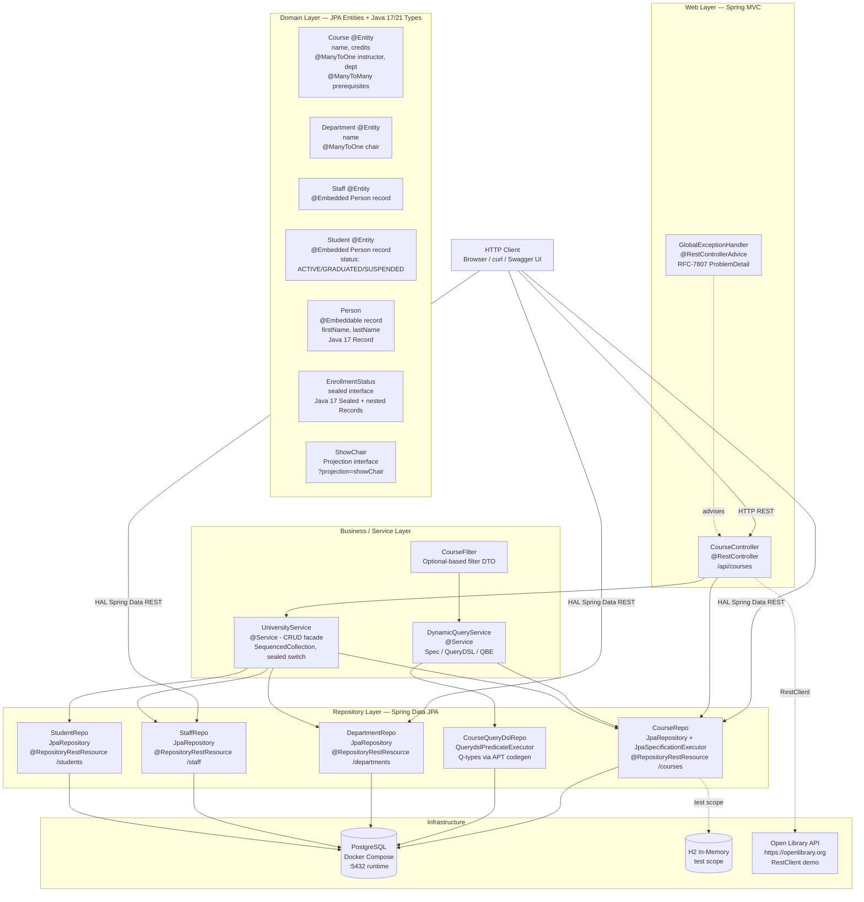

---

## 2. Domain Entity Relationships

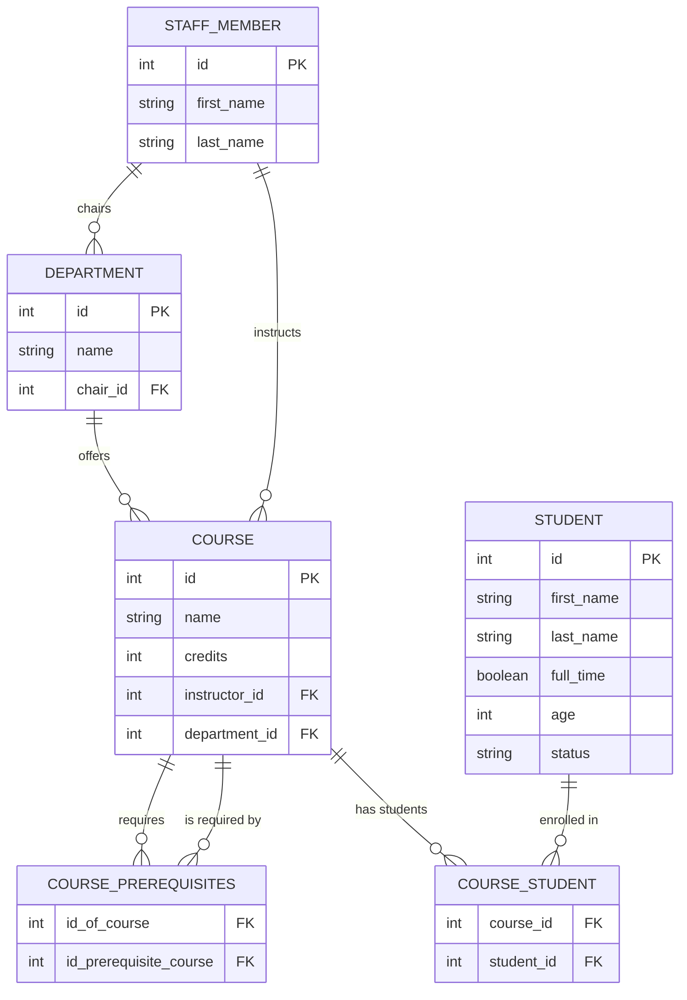

---

## 3. Query Strategy Decision Tree

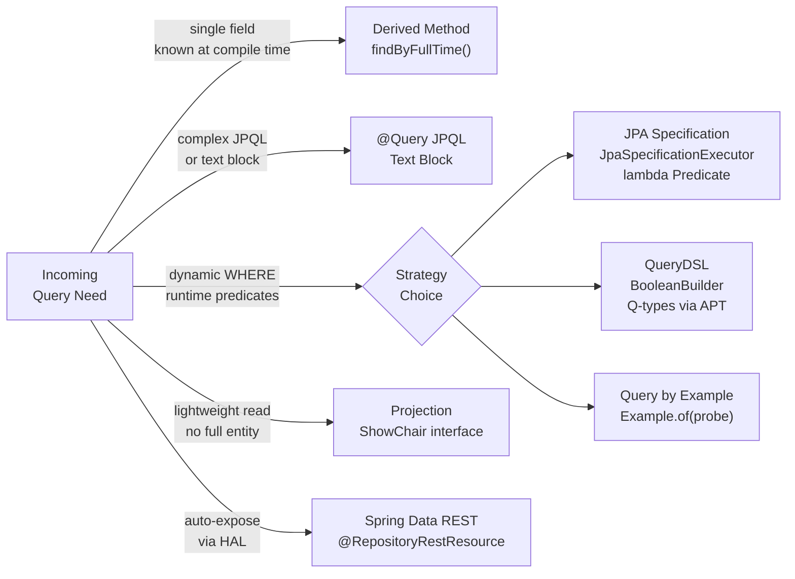

---

## 4. Layer Summary Tables

> End-to-end layer breakdown of `university-modern`.  
> Each section follows: **Role & Design Decisions** → **Mermaid component diagram** → **Detailed tables** → **Code / comparison reference**.  
> Ordered top-to-bottom: **Bootstrap → Web → Business → Repository → Domain → Infrastructure → Test**.

---

### 4.0 Application Bootstrap

> **Role:** Application entry point — wires the entire Spring container, activates auto-configuration, starts the embedded web server, and registers all beans declared across the other layers.  
> **Pattern:** Convention-over-configuration (`@SpringBootApplication` = `@Configuration` + `@EnableAutoConfiguration` + `@ComponentScan`). The bootstrap layer is intentionally thin — it owns zero business logic.  
> **Key Features:** Auto-configuration · Starter dependency management · Embedded Apache Tomcat (virtual-thread mode) · Spring Boot Actuator (health / metrics / info) · `RestClient.Builder` auto-bean · `springdoc-openapi` Swagger UI auto-registration.

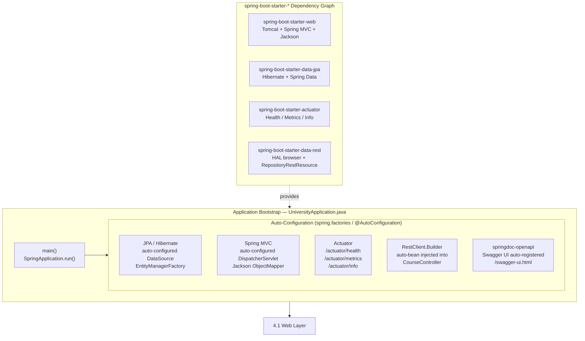

#### 4.0a — `@SpringBootApplication` Decomposition

| Meta-annotation | What it activates | Practical effect in this project |
|---|---|---|
| `@Configuration` | Marks the class as a bean-definition source | `@Bean` methods here are added to the Spring context |
| `@EnableAutoConfiguration` | Scans `META-INF/spring/org.springframework.boot.autoconfigure.AutoConfiguration.imports` | Configures DataSource, Hibernate, Tomcat, Jackson, Actuator without any XML |
| `@ComponentScan` | Scans `com.example.university` and all sub-packages | Discovers `@RestController`, `@Service`, `@Repository`, `@RestControllerAdvice` automatically |

#### 4.0b — Spring Boot vs Spring Cloud Responsibility Split

> **Mental model:** Spring Boot builds the **individual service**. Spring Cloud coordinates **many services talking to each other**.

```
┌──────────────────────────────────────────────────────────┐
│  Spring Cloud  — Distributed System Coordination Layer   │
│  Circuit Breaker · Config Server · Service Discovery     │
│  Client-Side Load Balancer · API Gateway                 │
│  ┌────────────────────────────────────────────────────┐  │
│  │  Spring Boot  — Individual Service Platform Layer  │  │
│  │  Auto-configuration · Embedded Tomcat · Actuator   │  │
│  │  Starter dependencies · Virtual Threads            │  │
│  │  ┌──────────────────────────────────────────────┐  │  │
│  │  │  Business Application Code                   │  │  │
│  │  │  Web · Service · Repository · Domain         │  │  │
│  │  └──────────────────────────────────────────────┘  │  │
│  └────────────────────────────────────────────────────┘  │
└──────────────────────────────────────────────────────────┘
```

#### 4.0c — Actuator Endpoints Reference

| Endpoint | HTTP | Output | Used in K8s |
|---|---|---|---|
| `/actuator/health` | `GET` | `{"status":"UP"}` + component details | **Liveness probe** + **Readiness probe** |
| `/actuator/health/liveness` | `GET` | JVM alive | `livenessProbe.httpGet.path` |
| `/actuator/health/readiness` | `GET` | DB connection + dependencies ready | `readinessProbe.httpGet.path` |
| `/actuator/metrics` | `GET` | Micrometer metric names | Scraped by Prometheus via `/actuator/prometheus` |
| `/actuator/info` | `GET` | App version, build info | Deployment dashboards |
| `/actuator/env` | `GET` | All resolved property sources | Configuration debugging |

---

### 4.1 Web Layer

> **Role:** HTTP boundary — translate incoming HTTP requests into domain operations and serialise results back to HTTP payloads.  
> **Pattern:** Thin controller (zero business logic); delegates all orchestration to `UniversityService` and `DynamicQueryService`; cross-cutting error handling via `@RestControllerAdvice`.  
> **Key Features:** `@RestController` · `@RestControllerAdvice` · Spring Boot 3.2+ `RestClient` · `ProblemDetail` RFC-7807 · Java 21 `SequencedCollection` return type.

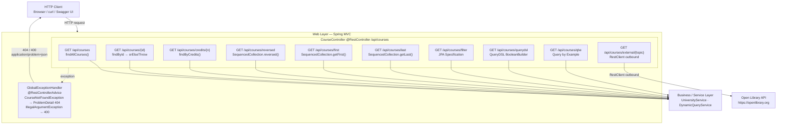

#### 4.1a — Endpoint Catalog

| HTTP | Path | Handler Method | Delegates To | Returns | Java / Spring Feature |
|---|---|---|---|---|---|
| `GET` | `/api/courses` | `getAllCourses()` | `UniversityService.findAllCourses()` | `List<Course>` | — |
| `GET` | `/api/courses/{id}` | `getCourseById()` | `CourseRepo.findById().orElseThrow()` | `Course` | Throws `CourseNotFoundException` → ProblemDetail 404 |
| `GET` | `/api/courses/credits/{n}` | `getCoursesByCredits()` | `CourseRepo.findByCredits()` | `List<Course>` | JPQL text block `@Query` |
| `GET` | `/api/courses/reversed` | `getCoursesReversed()` | `UniversityService.findCoursesReversed()` | `SequencedCollection<Course>` | **Java 21** `List.reversed()` — non-destructive reversed view |
| `GET` | `/api/courses/first` | `getFirstCourse()` | `UniversityService.findFirstCourse()` | `Course` | **Java 21** `List.getFirst()` — self-documenting |
| `GET` | `/api/courses/last` | `getLastCourse()` | `UniversityService.findLastCourse()` | `Course` | **Java 21** `List.getLast()` |
| `GET` | `/api/courses/filter` | `getFilteredCourses()` | `DynamicQueryService.filterBySpecification()` | `List<Course>` | JPA `Specification` lambda predicate |
| `GET` | `/api/courses/querydsl` | `getQueryDslCourses()` | `DynamicQueryService.filterByQueryDsl()` | `List<Course>` | QueryDSL `BooleanBuilder` + `QCourse` APT types |
| `GET` | `/api/courses/qbe` | `getQbeCourses()` | `DynamicQueryService.filterByExample()` | `List<Course>` | `Example.of(probe)` Query by Example |
| `GET` | `/api/courses/external/{topic}` | `getExternalLibraryInfo()` | `RestClient` → `openlibrary.org` | `String` (raw JSON) | **Spring Boot 3.2+** `RestClient` replaces `RestTemplate` |

#### 4.1b — Exception → ProblemDetail Mapping

```
CourseNotFoundException (id)
    ↓  caught by GlobalExceptionHandler
    ↓  ProblemDetail.forStatusAndDetail(404, "Course with ID {id} was not found.")
    ↓  .setType(URI.create("https://api.university.example/errors/course-not-found"))
    ↓  .setProperty("timestamp", Instant.now())
    ↓  .setProperty("path", request.getRequestURI())

HTTP/1.1 404 Not Found
Content-Type: application/problem+json

{
  "type":      "https://api.university.example/errors/course-not-found",
  "title":     "Course Not Found",
  "status":    404,
  "detail":    "Course with ID 99 was not found.",
  "timestamp": "2026-03-04T10:00:00Z",
  "path":      "/api/courses/99"
}
```

#### 4.1c — Design Decisions

| Decision | Choice Made | Reason |
|---|---|---|
| Error serialisation | RFC-7807 `ProblemDetail` | Industry-standard `application/problem+json` — any client knows the schema |
| Outbound HTTP | `RestClient` (not `RestTemplate`) | Fluent, immutable, Spring Boot 3.2+ recommended replacement for `RestTemplate` |
| Controller responsibility | Zero business logic | All branching lives in `UniversityService` / `DynamicQueryService`; controller is a thin adapter |
| Ordered collection return type | `SequencedCollection<Course>` | Signals to callers that element ordering is intentional and part of the API contract |

---

### 4.2 Business / Service Layer

> **Role:** Business logic boundary — orchestrates repository calls, applies domain rules, shields the Web layer from persistence concerns.  
> **Pattern:** Facade (`UniversityService` — single entry point for all CRUD); Strategy pattern (`DynamicQueryService` — three interchangeable query strategies behind one service).  
> **Key Features:** Java 21 `SequencedCollection` (`reversed`, `getFirst`, `getLast`) · Sealed switch with record deconstruction (`describeEnrollment`) · Java 17 `instanceof` pattern matching · `Optional`-based `CourseFilter` DTO.

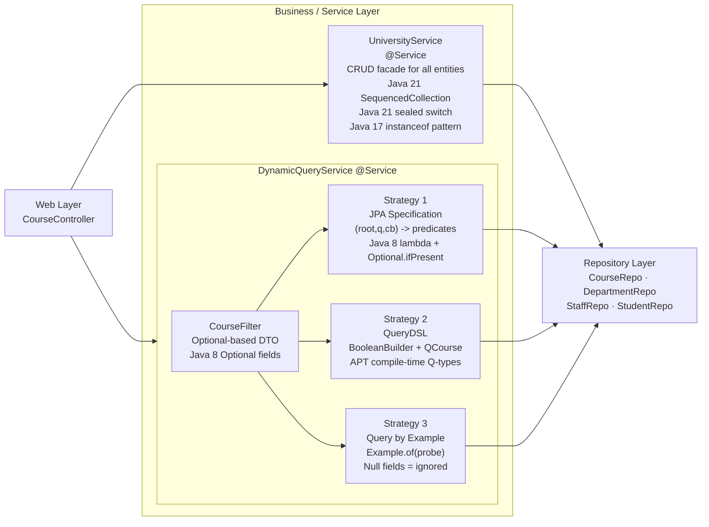

#### 4.2a — Service Class Catalog

| Class | Annotation | Role | Injects |
|---|---|---|---|
| `UniversityService` | `@Service` | CRUD facade — creates and retrieves all entity types; applies Java 21 `SequencedCollection` and sealed switch logic at the service boundary | `CourseRepo`, `DepartmentRepo`, `StaffRepo`, `StudentRepo` |
| `DynamicQueryService` | `@Service` | Side-by-side demonstration of three dynamic query strategies on `Course`; accepts `CourseFilter` and routes to the selected strategy | `CourseRepo` (Specification + QBE), `CourseQueryDslRepo` (QueryDSL) |
| `CourseFilter` | POJO (no annotation) | Optional-based filter DTO — absent fields (`Optional.empty()`) mean "do not filter on this dimension"; built via fluent `filterBy()` factory | Constructed by controller; consumed by `DynamicQueryService` |

#### 4.2b — Key Method Catalog

| Class | Method | Return Type | Java / Spring Feature |
|---|---|---|---|
| `UniversityService` | `findCoursesReversed()` | `SequencedCollection<Course>` | **Java 21** `List.reversed()` — returns a non-mutating reversed view |
| `UniversityService` | `findFirstCourse()` | `Course` | **Java 21** `List.getFirst()` — replaces opaque `get(0)` |
| `UniversityService` | `findLastCourse()` | `Course` | **Java 21** `List.getLast()` — replaces `get(size - 1)` |
| `UniversityService` | `describeEnrollment(EnrollmentStatus)` | `String` | **Java 21** sealed pattern-matching switch with record deconstruction — no `default` branch needed |
| `UniversityService` | `toEnrollmentStatus(Student, String)` | `EnrollmentStatus` | **Java 17** `instanceof` pattern matching + switch on string |
| `DynamicQueryService` | `filterBySpecification(CourseFilter)` | `List<Course>` | JPA `Specification<Course>` lambda + `Optional.ifPresent()` per predicate |
| `DynamicQueryService` | `filterByQueryDsl(CourseFilter)` | `List<Course>` | QueryDSL `BooleanBuilder` + APT-generated `QCourse` — type-safe field references |
| `DynamicQueryService` | `filterByExample(CourseFilter)` | `List<Course>` | Spring Data `Example.of(probe)` — null fields excluded automatically |
| `DynamicQueryService` | `describeFilter(Object)` | `String` | **Java 17** `instanceof` pattern matching — `if (filterObject instanceof CourseFilter cf)` |

#### 4.2c — Query Strategy Comparison, Recommendations & Best Practices

> **Principal Architect Note:**  
> Spring Data offers five distinct query mechanisms. No single strategy is universally best — the right choice depends on query complexity, compile-time safety requirements, runtime dynamism, team skill level, and cloud portability constraints. This section provides a complete decision framework at the principal engineer level.

---

##### Strategy Overview

Spring Data JPA ships five strategies that sit on a spectrum from "zero code" to "full programmatic control":

```
SIMPLICITY ◄─────────────────────────────────────────────────► CONTROL & FLEXIBILITY
     │                                                               │
  Derived       @Query       @Query            QBE           JPA Criteria
  Methods       (JPQL)    (nativeQuery)   (Probe+Matcher)    / QueryDSL
     │              │           │               │               │
  auto-gen     co-located    raw SQL        null-equals      type-safe
  from name    string SQL    max perf       dynamic form     compile-safe
```

---

##### Master Comparison Table

| Attribute | 1 · Derived Methods | 2 · @Query JPQL | 3 · Native Query | 4 · Query by Example | 5 · JPA Criteria / QueryDSL |
|---|---|---|---|---|---|
| **Type safety** | Method signature is type-safe; field names encoded in method string — refactor misses caught at test time | Strings — JPQL syntax errors caught at runtime startup | Strings — SQL errors caught at runtime startup | Java object — null fields excluded automatically; refactor-safe | **Fully compile-time** — QueryDSL `QCourse.course.credits.eq(3)`; Criteria `root.get("credits")` is String but wrapped |
| **Runtime dynamism** | None — fixed WHERE every call | None — fixed query every call | None — fixed SQL every call | **High** — any field may be null (skipped) | **Maximum** — predicates added/omitted per request |
| **Query complexity** | Simple single-table conditions only | Moderate — joins, subselects, GROUP BY, ORDER BY | **Maximum** — any SQL including CTEs, window functions, LATERAL joins | Equality and `LIKE` only — no `>`, `<`, joins, subqueries | **Maximum** — any condition expressible in JPA |
| **Null/absent handling** | Method must be overloaded or use `Optional` | Manual `WHERE (:p IS NULL OR col = :p)` pattern | Manual SQL null checks | **Automatic** — null probe fields are ignored | `Optional.ifPresent()` guard per predicate; explicit |
| **Predicate composition** | Not composable — one method per case | Not composable | Not composable | Single `Example.of(probe)` — AND only, no OR | Fully composable — `and()`, `or()`, `not()`, nested groups |
| **IDE auto-complete / refactoring** | Partial — method naming conventions in IDE | No — SQL in a string | No — SQL in a string | Full — works with entity class fields | **Full** — QueryDSL Q-types generated at compile time |
| **Cross-DB portability** | ✅ Full — JPQL generated per dialect | ✅ Full — JPQL | ❌ None — raw SQL may differ across PostgreSQL / MySQL / Oracle | ✅ Full | ✅ Full — Criteria API; QueryDSL also dialect-independent |
| **Setup cost** | None — zero config | None | None | None — built into `JpaRepository` | Criteria: zero. QueryDSL: APT Maven plugin + compile step for Q-types |
| **Testing ease** | Easy to unit-test return type | Medium — integration test to verify JPQL | Hard — DB-specific SQL; Testcontainers required | Easy | Medium — Specification can be isolated; QueryDSL predicates are pure Java |
| **Named parameters** | Via `@Param` if needed | `@Param("name")` on method args | `@Param("name")` | N/A | Programmatic — no param binding |
| **Pagination support** | ✅ `findAll(Pageable)` | ✅ `Page<T> findBy...(Pageable)` | ✅ with `countQuery` | ✅ `findAll(Example, Pageable)` | ✅ `findAll(Spec, Pageable)` |
| **Principal recommendation** | ✅ Default for simple reads | ✅ Co-located moderate queries | ⚠️ Last resort — justify in ADR | ✅ Search forms / prototyping | ✅ **Production standard for dynamic APIs** |

---

##### Decision Flowchart

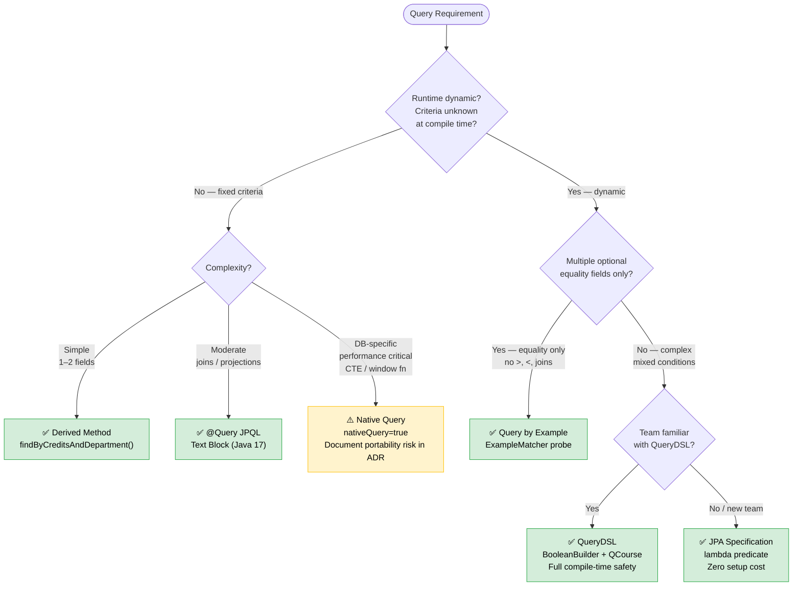

---

##### Strategy 1 — Derived Methods (Finder Methods)

**When to use:** Read operations with 1–3 fixed conditions known at compile time. The standard starting point for any new repository — zero code, zero SQL.

```java
// CourseRepo.java — illustrative examples from university-modern
// Spring Data generates the SQL automatically from the method name

// Single condition
Optional<Course> findByName(String name);

// Multiple conditions — AND
List<Course> findByCreditsAndDepartment(int credits, Department dept);

// Comparison + ordering
List<Course> findByCreditsGreaterThanOrderByNameAsc(int minCredits);

// Navigating relationships (joins generated automatically)
// "find courses whose department's chair's member's last name = ?"
List<Course> findByDepartmentChairMemberLastName(String chairLastName);

// Paginated result — LIMIT/OFFSET generated automatically
Page<Course> findByCredits(int credits, Pageable pageable);
```

**Principal best practices:**
- Keep method names short. If the name exceeds ~4 conditions, switch to `@Query`.
- Always add `Optional<T>` return type for single-result finders — avoids `EmptyResultDataAccessException`.
- Use `findBy` (returns null-safe) not `getBy` (throws exception on not-found) for predictable error handling upstream.
- Prefer `findByDepartment(Department dept)` over `findByDepartmentId(int id)` to keep joins at the JPA level, not the caller's level.

**Anti-patterns:**
```java
// ❌ BAD — method name encodes business logic; 7-part chain is unmaintainable
List<Course> findByDepartmentChairMemberFirstNameAndDepartmentChairMemberLastNameAndCreditsGreaterThan(...);
// ✅ GOOD — use @Query JPQL once method name exceeds 3–4 navigated fields
```

---

##### Strategy 2 — @Query JPQL / HQL

**When to use:** Fixed queries of moderate complexity — joins, projections, aggregates, subqueries — that method naming cannot express cleanly. The standard for all non-trivial fixed SQL in enterprise codebases.

```java
// StaffRepo.java — Java 17 Text Block makes multi-line JPQL readable
// Text blocks (""") eliminate string concatenation and escape hell

@Query("""
        SELECT s
        FROM   Staff s
        WHERE  s.member.lastName = :lastName
        ORDER  BY s.member.firstName ASC
        """)
List<Staff> findByMemberLastName(String lastName);

// CourseRepo.java — JPQL with named parameter, projection join
@Query("""
        SELECT c
        FROM   Course c
        WHERE  c.credits = :credits
        ORDER  BY c.name ASC
        """)
List<Course> findByCredits(@Param("credits") int credits);

// Aggregate — count courses per department (JPQL DTO constructor expression)
@Query("""
        SELECT new com.example.university.web.DeptCourseCount(
                   d.name, COUNT(c))
        FROM   Department d
        LEFT   JOIN d.courses c
        GROUP  BY d.name
        ORDER  BY COUNT(c) DESC
        """)
List<DeptCourseCount> countCoursesPerDepartment();
```

**Principal best practices:**
- Always use **Java 17 text blocks** (`"""`) for multi-line JPQL — single-line strings are unreadable and error-prone.
- Prefer **named parameters** (`：name`) over positional (`?1`) — named params survive method signature reordering.
- Add `@Modifying @Transactional` for UPDATE/DELETE `@Query` methods — Spring Data requires both annotations.
- Validate JPQL queries in integration tests (H2 `MODE=PostgreSQL` + Testcontainers) — string queries fail silently until runtime if untested.
- For projections, prefer interface-based projections (`ShowChair`) or DTO record constructors over raw `Object[]` — type safety is preserved.

**Anti-patterns:**
```java
// ❌ BAD — string concatenation, SQL injection risk, unreadable
@Query("SELECT c FROM Course c WHERE c.name LIKE '%" + name + "%'")

// ❌ BAD — positional params break when signature changes
@Query("SELECT s FROM Staff s WHERE s.member.lastName = ?1 AND s.member.firstName = ?2")

// ✅ GOOD — named params + text block
@Query("""
        SELECT s FROM Staff s
        WHERE  s.member.lastName  = :lastName
          AND  s.member.firstName = :firstName
        """)
Optional<Staff> findByFullName(@Param("firstName") String fn, @Param("lastName") String ln);
```

---

##### Strategy 3 — Native Queries (`nativeQuery = true`)

**When to use:** Last resort. Justify in an Architecture Decision Record (ADR). Valid use cases: database-specific window functions, CTEs, `EXPLAIN`-proven performance bottlenecks, PostgreSQL `JSONB` operators, or `COPY` bulk operations.

```java
// ⚠️ Portability warning: SQL below is PostgreSQL-specific

// Use case: PostgreSQL window function — no JPQL equivalent
@Query(
    value = """
            SELECT c.name,
                   c.credits,
                   RANK() OVER (PARTITION BY c.department_id ORDER BY c.credits DESC) AS rank
            FROM   course c
            WHERE  c.department_id = :deptId
            """,
    nativeQuery = true
)
List<Object[]> findCourseRankingByDepartment(@Param("deptId") int deptId);

// Use case: PostgreSQL full-text search
@Query(
    value = "SELECT * FROM course WHERE to_tsvector('english', name) @@ plainto_tsquery('english', :term)",
    nativeQuery = true
)
List<Course> fullTextSearch(@Param("term") String term);
```

**Principal best practices:**
- **Always document the ADR reason** — add a comment in the repository interface explaining why native SQL was chosen.
- **Abstract results behind a projection interface** — never return `List<Object[]>` to the service layer; map to a typed record or interface projection.
- **Test with Testcontainers** (`RealPostgresIT`) — H2 will not execute PostgreSQL-specific syntax; native queries must be verified against the exact production DB engine.
- **Extract to a `@NamedNativeQuery` on the entity** for reuse across multiple repositories.
- Consider wrapping complex native queries in a **database VIEW** and mapping a read-only `@Entity` to it — this keeps the Java code clean while keeping complex SQL in the DB where it belongs.

**Anti-patterns:**
```java
// ❌ BAD — no portability rationale, no ADR, no comment
@Query(value = "SELECT * FROM course WHERE name ILIKE :n", nativeQuery = true)
// ✅ PREFER — JPQL LOWER() works everywhere; nativeQuery not needed here
@Query("SELECT c FROM Course c WHERE LOWER(c.name) LIKE LOWER(CONCAT('%', :n, '%'))")

// ❌ BAD — raw Object[] leaks to service layer
List<Object[]> findRaw();
// ✅ GOOD — map to record projection
interface CourseRankView { String getName(); int getCredits(); int getRank(); }
List<CourseRankView> findCourseRankingByDepartment(@Param("deptId") int deptId);
```

---

##### Strategy 4 — Query by Example (QBE)

**When to use:** Search forms where any combination of equality fields may be present. Excellent for admin UIs and rapid prototyping. Graduate to Specification or QueryDSL if you need range queries (`>`, `<`), `OR` conditions, or joins.

```java
// DynamicQueryService.java — QBE in university-modern
public List<Course> filterByExample(CourseFilter filter) {
    // Build a "probe" — a Course object with only the fields you want to match.
    // Fields left null are automatically EXCLUDED from the WHERE clause.
    Course probe = new Course();
    filter.getCredits().ifPresent(probe::setCredits);
    filter.getDepartment().ifPresent(probe::setDepartment);

    // ExampleMatcher — controls matching rules:
    //   withIgnoreCase()          → LOWER(name) = LOWER(:probe)
    //   withStringMatcher(CONTAINING) → LIKE '%probe%'
    //   withIgnoreNullValues()    → null fields are not added to WHERE
    ExampleMatcher matcher = ExampleMatcher.matching()
            .withIgnoreCase()
            .withIgnoreNullValues()
            .withStringMatcher(ExampleMatcher.StringMatcher.CONTAINING);

    return courseRepo.findAll(Example.of(probe, matcher));
}
```

**Principal best practices:**
- **Prefer QBE for forms with 4+ optional equality filters** — it eliminates the if/null guard pattern entirely.
- Always use `ExampleMatcher.withIgnoreNullValues()` — the default behaviour includes null fields as `IS NULL`, which almost never matches what you want.
- For string fields, use `StringMatcher.CONTAINING` instead of `StringMatcher.EXACT` to enable partial matches.
- **QBE ceiling:** The moment you need `age > 18` or `OR name = 'x' OR name = 'y'`, switch to **Specification** — QBE cannot express these conditions.

**Anti-patterns:**
```java
// ❌ BAD — no ExampleMatcher, null fields generate IS NULL predicates
courseRepo.findAll(Example.of(probe));

// ❌ BAD — using QBE for a range query that it cannot express
// QBE has no API for greater-than — it silently falls back to equality
// Use JpaSpecificationExecutor instead
```

---

##### Strategy 5 — JPA Criteria API / QueryDSL

**When to use:** Production standard for any API with dynamic query parameters (search endpoints, filter panels, report builders). The only strategies that guarantee both **compile-time type safety** and **full runtime dynamism**.

**JPA Criteria API — Specification pattern (university-modern `filterBySpecification`):**

```java
// DynamicQueryService.java — Specification with Optional.ifPresent guards
// Each predicate is only added to the WHERE clause if the filter has a value.

public List<Course> filterBySpecification(CourseFilter filter) {
    return courseRepo.findAll((root, query, cb) -> {
        List<Predicate> predicates = new ArrayList<>();

        // Equality predicates — added only if filter field is present
        filter.getDepartment().ifPresent(d ->
                predicates.add(cb.equal(root.get("department"), d)));
        filter.getCredits().ifPresent(c ->
                predicates.add(cb.equal(root.get("credits"), c)));
        filter.getInstructor().ifPresent(i ->
                predicates.add(cb.equal(root.get("instructor"), i)));

        // case-insensitive LIKE — added only if nameLike is present
        filter.getNameLike().ifPresent(n ->
                predicates.add(cb.like(
                        cb.lower(root.get("name")),
                        "%" + n.toLowerCase() + "%")));

        // Combine all active predicates with AND
        return cb.and(predicates.toArray(new Predicate[0]));
    });
}
```

**QueryDSL — type-safe predicate builder (university-modern `filterByQueryDsl`):**

```java
// DynamicQueryService.java — QueryDSL with QCourse APT-generated type
// QCourse.course.credits is a NumberPath<Integer> — eq(), gt(), lt() all type-checked

public List<Course> filterByQueryDsl(CourseFilter filter) {
    QCourse q = QCourse.course;
    BooleanBuilder pred = new BooleanBuilder();

    // Each predicate uses strongly typed field references — typos caught at compile time
    filter.getDepartment().ifPresent(d -> pred.and(q.department.eq(d)));
    filter.getCredits().ifPresent(c   -> pred.and(q.credits.eq(c)));
    filter.getInstructor().ifPresent(i -> pred.and(q.instructor.eq(i)));
    // Range query — only possible with QueryDSL / Criteria, not QBE or Derived
    // filter.getMinCredits().ifPresent(min -> pred.and(q.credits.goe(min)));

    List<Course> results = new ArrayList<>();
    queryDslRepo.findAll(pred).forEach(results::add);
    return results;
}
```

**Principal best practices — Specification:**
- **Extract reusable predicates to a `CourseSpecifications` utility class** — each static method returns a `Specification<Course>`. The controller composes them with `.and()` / `.or()`.
- Use `root.join("department", JoinType.LEFT)` for optional relationship joins — `INNER JOIN` silently drops rows with null FK.
- Wrap `Specification.where(null)` as the base — `null` is identity for `and()` chains; safer than starting with an empty predicate.

**Principal best practices — QueryDSL:**
- **Always generate Q-types from a clean Maven build** — stale Q-types after entity renames cause silent compile failures.
- Use `JPAQueryFactory` for multi-table joins and projections that Specification cannot easily express:

```java
// Advanced QueryDSL — multi-join projection into a DTO record
@Bean
JPAQueryFactory jpaQueryFactory(EntityManager em) { return new JPAQueryFactory(em); }

// In service: joining Course → Department → Staff in one typed query
List<CourseSummary> query = jpaQueryFactory
        .select(Projections.constructor(CourseSummary.class,
                QCourse.course.name,
                QCourse.course.credits,
                QDepartment.department.name))
        .from(QCourse.course)
        .innerJoin(QCourse.course.department, QDepartment.department)
        .where(QCourse.course.credits.goe(3))
        .orderBy(QCourse.course.name.asc())
        .fetch();
```

---

##### Principal Recommendation Matrix

| Scenario | Recommended Strategy | Rationale |
|---|---|---|
| Simple CRUD — `findById`, `findAll`, single-condition reads | **Derived Methods** | Zero code; no maintenance cost; readable by any developer |
| Fixed query with joins, GROUP BY, or subselects | **@Query JPQL + Text Block** | Co-located, readable, JPQL is portable across all SQL databases |
| Admin search form with 3–8 optional equality filters | **Query by Example** | Null-equals eliminates if/null boilerplate; ExampleMatcher is expressive |
| REST API filter endpoint (`/api/courses/filter?name=&credits=`) | **JPA Specification** | Zero setup, composable predicates, Pageable support; standard enterprise pattern |
| Enterprise dynamic query with range predicates, OR logic, complex joins | **QueryDSL** | Full compile-time type safety; APT cost worth it at >= 3 dynamic joins |
| PostgreSQL-specific feature (window function, full-text, JSONB) | **Native Query** | Last resort; must justify in ADR; must test with Testcontainers |
| Read-only reporting / lightweight projection (no full entity needed) | **@Query + interface projection** | Avoids loading entire entity graph; reduces SELECT n+1 risk |
| Multi-tenant SaaS — dynamic tenant WHERE clause on every query | **Specification + Filter bean** | `@Bean TenantFilter` injected automatically into all query Specifications |

---

##### Cross-Cutting Best Practices (All Strategies)

1. **Always test with the real engine.** H2 `MODE=PostgreSQL` is not PostgreSQL. `RealPostgresIT` (Testcontainers `postgres:16`) catches dialect-specific differences before cloud deployment.

2. **Select only what you need.** Use **projections** (`ShowChair`, DTO records) instead of fetching full entity graphs for read-heavy list endpoints. This can reduce payload size 10–50× on wide entities.

3. **Avoid N+1 queries.** In JPQL, use `JOIN FETCH` for eagerly needed associations. In QueryDSL, use `.fetchJoin()`. Monitor with Hibernate's `spring.jpa.show-sql=true` during development.

4. **Add `@Transactional(readOnly = true)` to ALL read service methods.** This tells Hibernate to skip dirty-checking, skips the flush before query execution, and allows the connection pool (`HikariCP`) to route reads to read replicas on AWS Aurora, Azure Flexible Server read replicas, or GCP AlloyDB read pools.

5. **Paginate every collection endpoint.** `Pageable` support is built into all five strategies. Never return unbounded `List<T>` from a production API — one large department could return tens of thousands of courses.

6. **Cloud portability: avoid native queries where possible.** AWS RDS PostgreSQL, Azure Flexible Server, and GCP Cloud SQL all run PostgreSQL — JPQL queries are portable across all three. Native queries lock you to PostgreSQL syntax but gain access to PostgreSQL-specific optimisations when needed.

7. **Log slow queries, not all queries.** In production, configure `spring.jpa.show-sql=false` and use `logging.level.org.hibernate.SQL=DEBUG` only in local/dev profiles. Use `spring.jpa.properties.hibernate.generate_statistics=true` + Actuator `/actuator/metrics` in staging to surface slow queries.

---

##### Performance Impact Summary

```
Query Strategy   │  Parse Time  │  Type Check  │  Runtime Safety  │  ORM Overhead
─────────────────┼──────────────┼──────────────┼──────────────────┼───────────────
Derived Method   │  Startup     │  Partial     │  ✅ High         │  Low
@Query JPQL      │  Startup     │  None        │  ⚠️  Medium      │  Low
Native Query     │  Runtime     │  None        │  ❌ Low (SQL err) │  None (raw)
QBE              │  Runtime     │  Type-safe   │  ✅ High         │  Low
Criteria (Spec)  │  Runtime     │  Partial     │  ✅ High         │  Low
QueryDSL         │  Compile ✅  │  Full ✅     │  ✅ Highest      │  Low
```

#### 4.2d — Java 21 Sealed Switch (live code)

```java
// UniversityService.describeEnrollment() — zero-boilerplate exhaustive switch
// Sealed interface guarantees compiler checks ALL 3 types are handled (no default needed)
public String describeEnrollment(EnrollmentStatus status) {
    return switch (status) {
        case EnrollmentStatus.Active    s -> "Currently enrolled in semester: " + s.semester();
        case EnrollmentStatus.Graduated s -> "Graduated in " + s.graduationYear();
        case EnrollmentStatus.Suspended s -> "Suspended — reason: " + s.reason();
        // No 'default' — compiler verified all permitted types are covered
    };
}
```

---

### 4.3 Repository Layer

> **Role:** Data access boundary — abstracts all database interactions behind typed Spring Data interfaces; owns every query strategy from simple CRUD to complex dynamic predicates.  
> **Pattern:** One interface per aggregate root; dual-repo pattern for `Course` (Specification executor + QueryDSL executor); `@RepositoryRestResource` for zero-code HAL endpoint generation.  
> **Key Features:** `JpaRepository` · `JpaSpecificationExecutor` · `QuerydslPredicateExecutor` · JPQL text blocks (Java 17) · `@RepositoryRestResource` HAL · `ShowChair` projection.

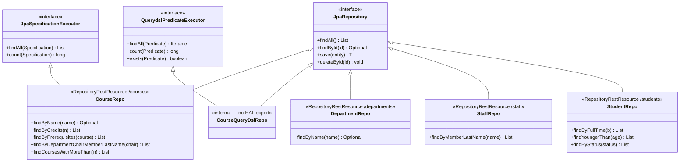

#### 4.3a — Repository Interface Reference

| Interface | Entity | Extends | HAL Path | Spring Data Extras |
|---|---|---|---|---|
| `CourseRepo` | `Course` | `JpaRepository` + `JpaSpecificationExecutor` | `/courses` | `@RepositoryRestResource`; JPQL text block queries; Specification; QBE |
| `CourseQueryDslRepo` | `Course` | `JpaRepository` + `QuerydslPredicateExecutor` | Internal only | QueryDSL `BooleanBuilder` + APT-generated `QCourse`, `QStaff`, `QDepartment` |
| `DepartmentRepo` | `Department` | `JpaRepository` | `/departments` | `@RepositoryRestResource`; `?projection=showChair` |
| `StaffRepo` | `Staff` | `JpaRepository` | `/staff` | `@RepositoryRestResource`; JPQL `@Query` with `@Param` |
| `StudentRepo` | `Student` | `JpaRepository` | `/students` | `@RepositoryRestResource`; derived methods + JPQL text blocks |

#### 4.3b — Query Method Catalog

| Repository | Method | Mechanism | Generated / Written SQL Shape |
|---|---|---|---|
| `CourseRepo` | `findByName(name)` | Derived method | `WHERE c.name = ?` |
| `CourseRepo` | `findByCredits(n)` | JPQL text block `@Query` | `WHERE c.credits = :credits ORDER BY c.name ASC` |
| `CourseRepo` | `findByPrerequisites(course)` | Derived method | `JOIN course_prerequisites WHERE prerequisite_id = ?` |
| `CourseRepo` | `findByDepartmentChairMemberLastName(chair)` | JPQL text block — deep path navigation | `WHERE c.department.chair.member.lastName = :chair` |
| `CourseRepo` | `findCoursesWithMoreThan(n)` | JPQL text block | `WHERE c.credits > :n ORDER BY credits DESC` |
| `StaffRepo` | `findByMemberLastName(name)` | JPQL `@Query` + `@Param` | `WHERE s.member.lastName = :lastName` |
| `StudentRepo` | `findByFullTime(bool)` | Derived method | `WHERE full_time = ?` |
| `StudentRepo` | `findYoungerThan(age)` | JPQL text block | `WHERE s.age < :age ORDER BY s.age ASC` |
| `StudentRepo` | `findByStatus(status)` | JPQL text block | `WHERE s.status = :status` |

#### 4.3c — Spring Data REST HAL Quick Reference

```
GET  /courses                          → Page<Course>  (includes _links.self, _links.next)
GET  /courses/{id}                     → Course        (_links.self, _links.instructor, _links.department)
POST /courses         {JSON body}      → 201 Created
PUT  /courses/{id}    {JSON body}      → 200 OK
DELETE /courses/{id}                   → 204 No Content

GET  /departments?projection=showChair → [{ "chairName": "FirstName LastName" }, ...]
GET  /staff                            → Page<Staff>
GET  /students                         → Page<Student>
```

---

### 4.4 Domain Layer

> **Role:** Business model boundary — defines what the system knows about; canonical source of truth for entity identity, structure, constraints, and type hierarchies.  
> **Pattern:** Rich domain model with modern Java types: value objects as Records (zero boilerplate), closed type taxonomies as Sealed Interfaces (compiler-enforced), computed views as Projection interfaces.  
> **Key Features:** `@Embeddable record Person` (Java 17) · `sealed interface EnrollmentStatus` (Java 17) · nested `record` permits (`Active`, `Graduated`, `Suspended`) · `@Projection ShowChair` with SpEL.


#### 4.4a — Entity Field Catalog

| Entity | Table | PK | Key Fields | Relationships | Modern Java Feature |
|---|---|---|---|---|---|
| `Person` | — (embedded) | — | `firstName`, `lastName` | Embedded in `Staff.member`, `Student.attendee` | **Java 17 `record`** — compiler generates constructor, accessors (not `getX()` — `x()`!), `equals`, `hashCode`, `toString` |
| `Staff` | `staff_member` | `Integer id` | `@Embedded Person member` | Referenced by `Department.chair`, `Course.instructor` | Uses `Person` Java 17 record; columns `first_name` / `last_name` live in `staff_member` row |
| `Department` | `department` | `Integer id` | `name`, `@ManyToOne Staff chair` | Offers many `Course`; projected by `ShowChair` | SpEL `#{target.chair.member.firstName()}` calls record accessor directly |
| `Course` | `course` | `Integer id` | `name`, `credits`, `instructor`, `department` | `@ManyToOne` Staff + Department; `@ManyToMany EAGER` self-referential prerequisites | Self-referential M:N via `course_prerequisites(id_of_course, id_prerequisite_course)` |
| `Student` | `student` | `Integer id` | `@Embedded Person`, `fullTime`, `age`, `status` | `@ManyToMany Course` via `course_student` | `status` stored as string (`ACTIVE` / `GRADUATED` / `SUSPENDED`); converted to sealed type in service layer |
| `EnrollmentStatus` | — (in-memory only) | — | `Active(semester)`, `Graduated(year)`, `Suspended(reason)` | Mapped from `Student.status` at service layer | **Java 17 sealed interface** + nested records — enables exhaustive Java 21 switch without `default` |
| `ShowChair` | — (projection) | — | `getChairName()` SpEL expression | `@Projection(name="showChair", types=Department.class)` | Spring Data REST projection — adds virtual computed field; activate with `?projection=showChair` |

#### 4.4b — Entity Relationship Matrix

| From | Cardinality | To | Storage | Notes |
|---|---|---|---|---|
| `Staff` | 1:1 embed | `Person` | `@Embedded` — columns inline in `staff_member` | `first_name`, `last_name` in same row as staff id |
| `Student` | 1:1 embed | `Person` | `@Embedded` — columns inline in `student` | Same inline strategy as Staff |
| `Department` | N:1 | `Staff` (chair) | `chair_id FK` in `department` | One staff member may chair multiple departments |
| `Course` | N:1 | `Staff` (instructor) | `instructor_id FK` in `course` | One staff member may instruct many courses |
| `Course` | N:1 | `Department` | `department_id FK` in `course` | Department offers many courses |
| `Course` | M:N (self) | `Course` (prerequisites) | `course_prerequisites` join table | `id_of_course` + `id_prerequisite_course`; `EAGER` fetch |
| `Student` | M:N | `Course` | `course_student` join table | `course_id` + `student_id` |

#### 4.4c — EnrollmentStatus Sealed Type Hierarchy

```
sealed interface EnrollmentStatus
    permits Active, Graduated, Suspended

    record Active(String semester)         → "ACTIVE"   DB string
    record Graduated(int graduationYear)   → "GRADUATED" DB string
    record Suspended(String reason)        → "SUSPENDED" DB string

Usage in Java 21 sealed switch (exhaustive — no default):
    case EnrollmentStatus.Active    s -> "Enrolled in: " + s.semester()
    case EnrollmentStatus.Graduated s -> "Graduated in " + s.graduationYear()
    case EnrollmentStatus.Suspended s -> "Suspended: "   + s.reason()
```

---

### 4.5 Infrastructure

> **Role:** Runtime boundary — provides every platform capability required to run, scale, observe, and operate `university-modern` across local development, CI/CD, and production multi-cloud Kubernetes environments.  
> **Pattern:** Five progressive tiers: **Local Dev** (Docker Compose) → **Spring Boot Platform** (embedded server + Actuator) → **Spring Cloud Coordination** (Config / Discovery / Load Balancer / Circuit Breaker) → **Container Runtime** (Docker image) → **Multi-Cloud Kubernetes** (AWS EKS · Azure AKS · GCP GKE).  
> **Key Features:** Spring Boot Actuator K8s health probes · Spring Cloud Config (centralised config) · Spring Cloud Service Discovery (Eureka / K8s service) · Spring Cloud LoadBalancer (client-side) · Resilience4j Circuit Breaker · Multi-stage Dockerfile (~80 MB Alpine JRE 21) · Kubernetes `Deployment`, `Service`, `ConfigMap`, `HorizontalPodAutoscaler` · Micrometer → Prometheus → Grafana observability stack.

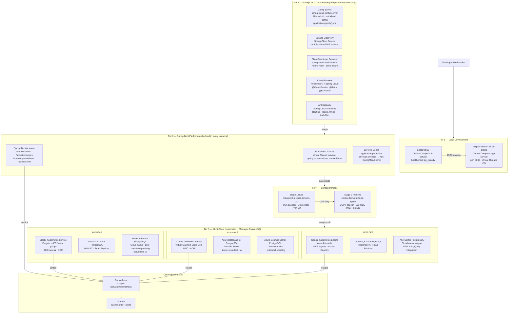

#### 4.5a — Infrastructure Tier Reference

| Tier | Technology | Scope | Purpose |
|---|---|---|---|
| Local Dev | Docker Compose (`compose.yaml`) | Developer workstation | Zero-install full-stack: `docker compose up` starts PostgreSQL + app with health-check ordering |
| Spring Boot Platform | Embedded Tomcat · Actuator · Virtual Threads | Every runtime instance | Auto-configures web server, datasource, Jackson, health probes; single JAR deployment unit |
| Spring Cloud Config | `spring-cloud-config-server` | Centralized config service | Git-backed `application-{env}.yml` delivered to all services at startup; eliminates per-pod config drift |
| Spring Cloud Discovery | Eureka Server / K8s DNS | Service registry | Services register on startup; clients discover peers without hard-coded URLs |
| Spring Cloud LoadBalancer | `spring-cloud-loadbalancer` | Client (in-process) | Round-robin or weighted client-side LB replacing deprecated Ribbon; integrates with `RestClient` |
| Resilience4j Circuit Breaker | `spring-cloud-circuitbreaker-resilience4j` | Client (in-process) | `@CircuitBreaker` + `@Retry` + `@Bulkhead` on `RestClient` calls; prevents cascade failure |
| Spring Cloud Gateway | `spring-cloud-gateway` | Edge / API Gateway | Single ingress: routing, rate limiting, JWT auth filter, CORS; replaces Zuul |
| Container Image | Multi-stage Dockerfile | CI/CD + K8s | Stage 1 ~700 MB build discarded; Stage 2 ~80 MB JRE Alpine shipped; push to ECR / ACR / Artifact Registry |
| AWS EKS | Elastic Kubernetes Service | AWS production | Fargate serverless nodes or EC2 node groups; RDS Aurora PostgreSQL; ALB Ingress Controller |
| Azure AKS | Azure Kubernetes Service | Azure production | Azure CNI networking; Azure Database for PostgreSQL Flexible Server; Azure Container Registry |
| GCP GKE | Google Kubernetes Engine | GCP production | Autopilot mode; Cloud SQL PostgreSQL; Artifact Registry; GKE Ingress (GCE LB) |
| Observability | Micrometer → Prometheus → Grafana | All environments | Actuator exposes `/actuator/prometheus`; Prometheus scrapes; Grafana visualises JVM, HTTP, DB pool metrics |

#### 4.5b — Spring Cloud Component Map

> Each Spring Cloud component maps to a **distributed system problem**. The table below shows the problem, the Spring Cloud solution, and the configuration hook.

| Distributed Problem | Spring Cloud Solution | Key Annotation / Class | Config Property |
|---|---|---|---|
| **Centralised configuration** | Spring Cloud Config Server | `@EnableConfigServer` on config-server app; `@RefreshScope` on consuming beans | `spring.config.import=configserver:http://config:8888` |
| **Service discovery — registration** | Eureka Server + `@EnableDiscoveryClient` | `@EnableEurekaServer` / `@EnableDiscoveryClient` | `eureka.client.service-url.defaultZone=http://eureka:8761/eureka` |
| **Service discovery — lookup** | Spring Cloud LoadBalancer | `@LoadBalanced RestClient.Builder` | `spring.cloud.loadbalancer.ribbon.enabled=false` |
| **Client-side load balancing** | `ReactorLoadBalancerExchangeFilterFunction` | Injected into `RestClient` builder | Round-robin default; custom `ServiceInstanceListSupplier` for zone-aware |
| **Circuit breaker / fault tolerance** | Resilience4j via Spring Cloud CircuitBreaker | `@CircuitBreaker(name="extApi", fallbackMethod="fallback")` | `resilience4j.circuitbreaker.instances.extApi.slidingWindowSize=10` |
| **Retry** | Resilience4j Retry | `@Retry(name="extApi")` | `resilience4j.retry.instances.extApi.maxAttempts=3` |
| **Bulkhead (concurrency limit)** | Resilience4j Bulkhead | `@Bulkhead(name="extApi", type=SEMAPHORE)` | `resilience4j.bulkhead.instances.extApi.maxConcurrentCalls=25` |
| **API Gateway / edge routing** | Spring Cloud Gateway | `RouteLocator` bean or `application.yml` routes | `spring.cloud.gateway.routes[0].uri=lb://university-service` |
| **Distributed tracing** | Micrometer Tracing + Zipkin / OTLP | Auto-instrumented via Spring Boot Actuator | `management.tracing.sampling.probability=1.0` |

#### 4.5c — Docker Compose Start-up Order (Local Dev)

```
docker compose up
    │
    ├─▶ db (postgres:16)
    │       POSTGRES_USER=user  POSTGRES_PASSWORD=pass  POSTGRES_DB=catalog
    │       volume: schema.sql → /docker-entrypoint-initdb.d/
    │       healthcheck: pg_isready -U user -d catalog  interval:10s  retries:5
    │       ↓  healthcheck passes
    │
    └─▶ app (eclipse-temurin:21-jre-alpine)
            depends_on: db  condition: service_healthy
            SPRING_DATASOURCE_URL=jdbc:postgresql://db:5432/catalog
            SPRING_THREADS_VIRTUAL_ENABLED=true
            ↓  listening
            http://localhost:8080              (REST API)
            http://localhost:8080/swagger-ui.html
            http://localhost:8080/actuator/health
```

#### 4.5d — Multi-Cloud Kubernetes Deployment Pattern

> The same OCI image is deployed to all three clouds. Only the `StorageClass`, managed database endpoint, and ingress class differ. All other K8s manifests are identical.

```yaml
# kubernetes/deployment.yaml  (cloud-agnostic)
apiVersion: apps/v1
kind: Deployment
metadata:
  name: university-modern
spec:
  replicas: 3
  selector:
    matchLabels: { app: university-modern }
  template:
    metadata:
      labels: { app: university-modern }
      annotations:
        prometheus.io/scrape: "true"
        prometheus.io/path: /actuator/prometheus
        prometheus.io/port:  "8080"
    spec:
      containers:
        - name: university-modern
          image: <REGISTRY>/university-modern:latest   # ECR / ACR / Artifact Registry
          ports: [{ containerPort: 8080 }]
          env:
            - name: SPRING_DATASOURCE_URL
              valueFrom: { secretKeyRef: { name: db-secret, key: url } }
            - name: SPRING_THREADS_VIRTUAL_ENABLED
              valueFrom: { configMapKeyRef: { name: app-config, key: virtualThreads } }
          livenessProbe:
            httpGet: { path: /actuator/health/liveness, port: 8080 }
            initialDelaySeconds: 30  periodSeconds: 10
          readinessProbe:
            httpGet: { path: /actuator/health/readiness, port: 8080 }
            initialDelaySeconds: 20  periodSeconds: 5
---
apiVersion: autoscaling/v2
kind: HorizontalPodAutoscaler
metadata:
  name: university-modern-hpa
spec:
  scaleTargetRef: { apiVersion: apps/v1, kind: Deployment, name: university-modern }
  minReplicas: 2
  maxReplicas: 20
  metrics:
    - type: Resource
      resource: { name: cpu, target: { type: Utilization, averageUtilization: 70 } }
```

#### 4.5e — Cloud-Specific Differences

| Concern | AWS EKS | Azure AKS | GCP GKE |
|---|---|---|---|
| **Managed K8s control plane** | EKS (managed) | AKS (managed) | GKE Autopilot (fully managed) |
| **Node group / compute** | EC2 Auto Scaling Groups or Fargate | Virtual Machine Scale Sets | Spot / Standard node pools or Autopilot |
| **Standard PostgreSQL service** | **Amazon RDS for PostgreSQL** — Multi-AZ, Read Replicas, IAM auth, DMS migration | **Azure Database for PostgreSQL — Flexible Server** — Zone-redundant HA, Azure AD auth, VNet endpoints | **Cloud SQL for PostgreSQL** — Regional HA, Read Replicas, BigQuery federation |
| **Cloud-native PostgreSQL engine** | **Amazon Aurora (PostgreSQL-compatible)** — 6-way replication, Serverless v2, zero-downtime patching, Global Database | **Azure Cosmos DB for PostgreSQL** — Citus extension for horizontal sharding, distributed tables, columnar storage | **AlloyDB for PostgreSQL** — Google-built engine, 4× faster analytics, AI/ML integration, no-downtime major upgrades |
| **PostgreSQL HA mechanism** | Multi-AZ: synchronous standby in separate AZ; automatic failover < 30 s | Zone-redundant: synchronous standby in paired zone; automatic failover < 120 s | Regional: primary + secondary zone; automatic failover via Cloud SQL HA |
| **PostgreSQL key integrations** | AWS IAM DB auth, AWS DMS schema migration, Aurora zero-downtime patching | Azure AD authentication, VNet service endpoints, Azure Kubernetes Service pod identity | Vertex AI / BigQuery analytics, AlloyDB Omni (on-prem), Kubernetes Engine Workload Identity |
| **Container registry** | Amazon ECR | Azure Container Registry (ACR) | GCP Artifact Registry |
| **Ingress / load balancer** | AWS Load Balancer Controller (ALB) | Application Gateway Ingress Controller (AGIC) | GCE Ingress (Google Cloud LB) |
| **Secrets management** | AWS Secrets Manager + CSI driver | Azure Key Vault + CSI driver | GCP Secret Manager + Workload Identity |
| **Cluster autoscaler** | Karpenter | Cluster Autoscaler | GKE Node Auto-Provisioning |
| **Service mesh (optional)** | AWS App Mesh / Istio | Open Service Mesh / Istio | Anthos Service Mesh / Istio |
| **Observability** | CloudWatch Container Insights | Azure Monitor + Container Insights | Cloud Monitoring + Cloud Logging |
| **Spring Cloud Config source** | S3-backed Git / CodeCommit | Azure Repos Git | Cloud Source Repositories |

#### 4.5f — Spring Boot Platform Configuration Properties

| Property | Local Dev | K8s (all clouds) | Effect |
|---|---|---|---|
| `spring.threads.virtual.enabled` | `true` | `true` | Replaces Tomcat platform thread pool with Java 21 virtual threads — handles high concurrency with minimal memory overhead |
| `spring.mvc.problemdetails.enabled` | `true` | `true` | Serialises `@ExceptionHandler` returns as RFC-7807 `application/problem+json` |
| `spring.jpa.hibernate.ddl-auto` | `none` | `none` | Schema managed by `schema.sql` / Flyway migration; never auto-drop in production |
| `spring.datasource.url` | `jdbc:postgresql://localhost:5432/catalog` | Injected from K8s Secret | Transparent datasource switch per environment |
| `management.endpoints.web.exposure.include` | `*` | `health,info,prometheus` | Expose all Actuator endpoints locally; restrict to safe set in K8s |
| `management.health.livenessstate.enabled` | `true` | `true` | Enables `/actuator/health/liveness` for K8s `livenessProbe` |
| `management.health.readinessstate.enabled` | `true` | `true` | Enables `/actuator/health/readiness` for K8s `readinessProbe` |
| `spring.config.import` | _(not set)_ | `configserver:http://config-svc:8888` | Pull centralised config from Spring Cloud Config Server at startup |

#### 4.5g — Multi-Cloud Managed PostgreSQL Deep Dive

> **Architect's note:** PostgreSQL's open-source portability is the single biggest multi-cloud enabler — the JDBC driver, Spring Data JPA, and Hibernate dialect are identical across all three clouds. Only the connection URL, SSL certificate, and authentication mechanism change per environment.

##### Service Tier Comparison

| Feature | AWS | Azure | GCP |
|---|---|---|---|
| **Primary Service** | Amazon RDS for PostgreSQL | Azure Database for PostgreSQL — Flexible Server | Cloud SQL for PostgreSQL |
| **Cloud-Native Engine** | Amazon Aurora (PostgreSQL-compatible) | Azure Cosmos DB for PostgreSQL *(Citus extension — horizontal scaling)* | AlloyDB for PostgreSQL |
| **High Availability** | Multi-AZ deployments — synchronous standby, automatic failover | Zone-redundant or zonal HA — automatic failover with standby replica | Regional instances — primary + secondary zone, automatic failover |
| **Key Integrations** | AWS IAM DB auth · AWS DMS · Aurora zero-downtime patching · Aurora Global Database | Azure AD authentication · VNet service endpoints · Azure Kubernetes Service pod identity | Vertex AI / ML services · BigQuery federation · AlloyDB Omni · Workload Identity |
| **Horizontal scaling** | Aurora Parallel Query + read replicas | Cosmos DB for PostgreSQL (Citus) — coordinator + worker nodes | AlloyDB — read pool instances; Cloud Spanner (separate product) |
| **Serverless / auto-pause** | Aurora Serverless v2 — scales to zero | Flexible Server — burstable SKU | AlloyDB — no auto-pause; Cloud SQL — no auto-pause |
| **Max storage (auto-grow)** | 64 TB (RDS) / 128 TB (Aurora) | 32 TB (Flexible Server) | 64 TB (Cloud SQL) / unlimited (AlloyDB) |
| **pgvector support** | ✅ RDS + Aurora | ✅ Flexible Server | ✅ AlloyDB (optimised) |
| **Major version upgrade** | In-place upgrade (RDS) / Aurora: blue/green | In-place upgrade + read replica promotion | AlloyDB: no-downtime major upgrade; Cloud SQL: in-place |

##### Portability Strategy — Spring Boot `application.properties` per Environment

```properties
# ── Local / CI (Docker Compose postgres:16) ────────────────────────────────
spring.datasource.url=jdbc:postgresql://localhost:5432/catalog
spring.datasource.username=user
spring.datasource.password=pass

# ── AWS RDS for PostgreSQL ──────────────────────────────────────────────────
# spring.datasource.url=jdbc:postgresql://university.xxxx.us-east-1.rds.amazonaws.com:5432/catalog
# spring.datasource.username=${DB_USER}          # from Secrets Manager
# spring.datasource.password=${DB_PASSWORD}      # from Secrets Manager
# spring.datasource.hikari.ssl=true

# ── AWS Aurora (PostgreSQL-compatible) ─────────────────────────────────────
# spring.datasource.url=jdbc:postgresql://university-cluster.cluster-xxxx.us-east-1.rds.amazonaws.com:5432/catalog
# # Writer endpoint ↑ for writes; use reader endpoint for read-only DataSource

# ── Azure Database for PostgreSQL — Flexible Server ────────────────────────
# spring.datasource.url=jdbc:postgresql://university.postgres.database.azure.com:5432/catalog?sslmode=require
# spring.datasource.username=appuser@university  # Azure AD token or password
# spring.datasource.password=${AZURE_DB_PASSWORD}

# ── Azure Cosmos DB for PostgreSQL (Citus) ─────────────────────────────────
# spring.datasource.url=jdbc:postgresql://c.university.postgres.cosmos.azure.com:5432/citus?sslmode=require
# # Coordinator node endpoint — Citus distributes queries to worker nodes transparently

# ── GCP Cloud SQL for PostgreSQL ────────────────────────────────────────────
# spring.datasource.url=jdbc:postgresql:///catalog?cloudSqlInstance=project:region:instance&socketFactory=com.google.cloud.sql.postgres.SocketFactory
# spring.datasource.username=${DB_USER}           # from GCP Secret Manager
# spring.datasource.password=${DB_PASSWORD}

# ── GCP AlloyDB for PostgreSQL ──────────────────────────────────────────────
# spring.datasource.url=jdbc:postgresql://10.x.x.x:5432/catalog?sslmode=require
# # Primary IP via VPC peering; use AlloyDB Auth Proxy for Cloud-native auth
# # Same JDBC driver — alloydb-jdbc-connector can replace Auth Proxy for K8s
```

##### Selection Guidance

| Decision Driver | Recommended Service | Reason |
|---|---|---|
| **AWS-primary, need max performance** | Aurora PostgreSQL | 6-way replication, Serverless v2, Global Database for multi-region writes |
| **AWS-primary, cost-sensitive / standard workload** | RDS for PostgreSQL | Simpler operations, lower cost, still enterprise-grade HA |
| **Azure-primary, standard OLTP** | Flexible Server | Zone-redundant HA, Azure AD SSO, direct AKS pod identity integration |
| **Azure-primary, need horizontal scale-out** | Cosmos DB for PostgreSQL (Citus) | Distribute tables across shards; scale writes beyond single-node limits |
| **GCP-primary, analytics + AI/ML** | AlloyDB | 4× faster analytical queries, pgvector optimised for AI embeddings, BigQuery federation |
| **GCP-primary, standard workload** | Cloud SQL for PostgreSQL | Simpler ops, Cloud SQL Auth Proxy, native GKE Workload Identity |
| **Multi-cloud portability (all three)** | Standard PostgreSQL tier on each cloud | All three use identical open-source pg engine — same schema, same SQL, same JDBC driver; only DSN changes |
| **AI / Vector Search** | AlloyDB (GCP) · pgvector on RDS/Aurora (AWS) · pgvector on Flexible Server (Azure) | All support `pgvector`; AlloyDB has hardware-accelerated ANN index |

---

### 4.6 Test Layer

> **Role:** Multi-level quality gate — verifies Java language features, Spring Data integrations, API contracts, and production readiness across the full testing pyramid from fast unit tests to slow infrastructure integration tests.  
> **Pattern:** JUnit 5 `@Nested` for cohesive feature grouping · `@SpringBootTest` full context (not sliced) for end-to-end integration · `@Transactional` auto-rollback for test isolation · Testcontainers (roadmap) for real PostgreSQL parity in CI · Spring Cloud Contract (roadmap) for consumer-driven API contracts.  
> **Key Features:** H2 in-memory (`MODE=PostgreSQL`) for zero-dependency unit speed · `data.sql` seed (11 staff, 3 departments, 13 courses, students) · Each `@Nested` group maps to one Java 17/21 language feature · Actuator health probe testable via `TestRestTemplate` · K8s readiness verified by `/actuator/health/readiness` assertions.

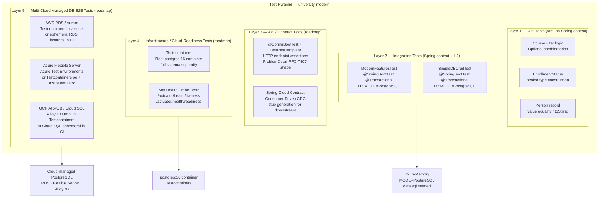

#### 4.6a — Test Class Summary

| Class | Annotation | Database | Seed Data | Scope |
|---|---|---|---|---|
| `ModernFeaturesTest` | `@SpringBootTest` `@Transactional` | H2 in-memory | `data.sql` (11 staff, 3 depts, 13 courses) | Modern Java 17/21 language feature verification — all assertions run through the full Spring application context |
| `SimpleDBCrudTest` | `@SpringBootTest` `@Transactional` | H2 in-memory | `data.sql` | JPA CRUD lifecycle — create / read / update / delete for every entity type; enrollment status string → sealed type transitions |

#### 4.6b — `@Nested` Test Group Catalog (`ModernFeaturesTest`)

| Nested Class | Language Feature | Key Assertions |
|---|---|---|
| `RecordTests` | **Java 17 `record Person`** | Accessor names match component names (`firstName()` not `getFirstName()`); two records with identical values are equal (`p1.equals(p2) → true`); `toString()` follows `Person[firstName=…]` format; record persists and reloads correctly via JPA |
| `SealedInterfaceTests` | **Java 17 `sealed interface EnrollmentStatus`** | All three permitted types (`Active`, `Graduated`, `Suspended`) instantiate correctly; `toEnrollmentStatus()` converts DB strings `ACTIVE`, `GRADUATED`, `SUSPENDED` to corresponding sealed record types |
| `PatternMatchingTests` | **Java 17 `instanceof` pattern matching** | `describeFilter(CourseFilter)` returns a string listing active filter dimensions; `describeFilter(SomeOtherObject)` returns the fallback "Unknown filter type" path — no `ClassCastException` |
| `SequencedCollectionTests` | **Java 21 `SequencedCollection`** | `findCoursesReversed()` is non-null; `findFirstCourse()` returns the alphabetically first course; `findLastCourse()` returns the alphabetically last; calling `reversed()` does not mutate the original list |
| `SealedSwitchTests` | **Java 21 sealed switch with record deconstruction** | `describeEnrollment(new Active("Spring 2026"))` contains the semester; `describeEnrollment(new Graduated(2024))` contains the year; `describeEnrollment(new Suspended("Policy violation"))` contains the reason; all three results are distinct non-empty strings |

#### 4.6c — Feature Coverage Matrix

| Java Feature | Verified By | Assertion Style |
|---|---|---|
| `record` — accessor naming convention | `RecordTests` | `assertThat(p.firstName()).isEqualTo("Jane")` |
| `record` — value-based equality | `RecordTests` | `assertThat(p1).isEqualTo(p2)` for same-field instances |
| `record` — JPA persistence round-trip | `RecordTests` | Save entity → `findById` → assert embedded record fields |
| `sealed interface` — permit types instantiate | `SealedInterfaceTests` | Direct `new Active(...)`, `new Graduated(...)`, `new Suspended(...)` |
| `sealed interface` — DB string conversion | `SealedInterfaceTests` | `toEnrollmentStatus()` returns correct sealed subtype per string |
| `instanceof` pattern matching | `PatternMatchingTests` | Return string differs between `CourseFilter` and non-`CourseFilter` input |
| `SequencedCollection.reversed()` | `SequencedCollectionTests` | Non-null; original list unmodified after call |
| `SequencedCollection.getFirst()` | `SequencedCollectionTests` | Alphabetically first course name |
| `SequencedCollection.getLast()` | `SequencedCollectionTests` | Alphabetically last course name |
| Sealed switch record deconstruct | `SealedSwitchTests` | Three distinct non-empty strings, each containing the record component value |

#### 4.6d — Cloud-Readiness Test Extensions (Layer 4 Roadmap)

> These test patterns are the next recommended additions to bring the test suite to production / cloud-deployment grade.

| Test Pattern | Tool | What to Test | Cloud Relevance |
|---|---|---|---|
| Real PostgreSQL integration | `org.testcontainers:postgresql` | `schema.sql` DDL correctness; index coverage; full SQL compatibility vs H2 | Eliminates H2 dialect gaps before deploying to RDS / Cloud SQL / Flexible Server |
| K8s Liveness probe | `TestRestTemplate` + `@SpringBootTest(webEnvironment=RANDOM_PORT)` | `GET /actuator/health/liveness` returns `{"status":"UP"}` | Validates K8s `livenessProbe` config before Deployment rollout |
| K8s Readiness probe | `TestRestTemplate` | `GET /actuator/health/readiness` returns `{"status":"UP"}` with DataSource component | Validates K8s `readinessProbe`; confirms DB pool is ready before traffic is routed |
| Consumer-Driven Contract | `spring-cloud-starter-contract-verifier` | Provider side generates WireMock stubs; consumer tests run against stubs | Prevents breaking API changes in microservice-to-microservice communication |
| Circuit Breaker fallback | `@SpringBootTest` + mock `RestClient` stub returning 500 | `describeEnrollment()` fallback invoked; Resilience4j state transitions CLOSED → OPEN | Validates fault-tolerance behavior before deploying behind Spring Cloud Gateway |
| Config Server refresh | `@SpringBootTest` + Spring Cloud Config test harness | `@RefreshScope` beans reload on `/actuator/refresh` POST | Ensures zero-downtime config updates work in K8s without pod restart |

#### 4.6e — Multi-Cloud Managed PostgreSQL E2E Testing Strategy (Layer 5 Roadmap)

> **Architect's principle:** The application code is fully portable across all three cloud PostgreSQL services because Spring Data JPA / Hibernate abstracts the wire protocol. The test strategy therefore focuses on validating the **connection, SSL handshake, schema migration, and HA failover behaviour** per cloud — not re-testing business logic.

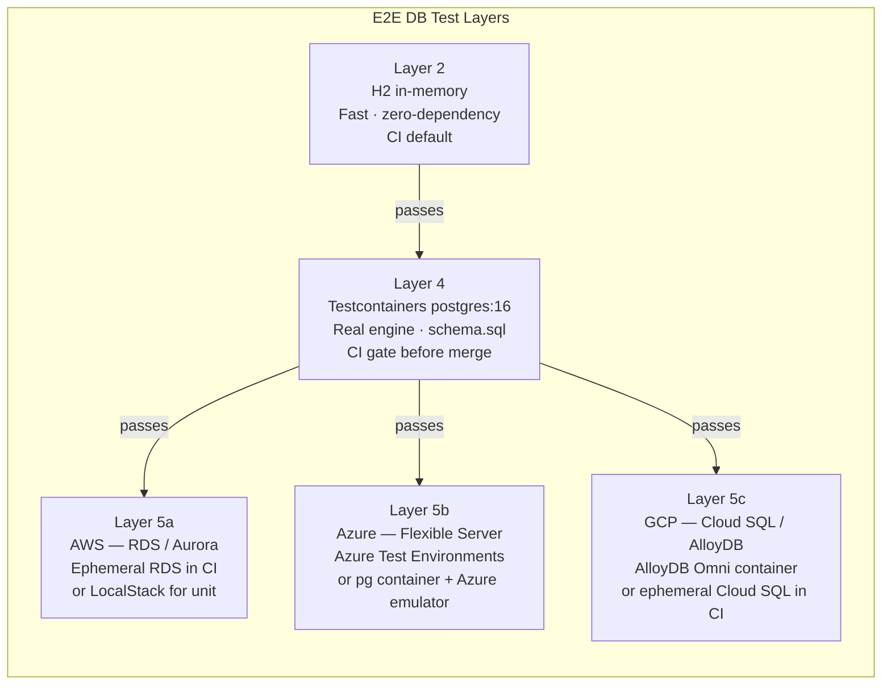

##### Per-Cloud E2E Test Approach

| Cloud | Service | Local Emulation | CI/CD Integration | Key Test Scenarios |
|---|---|---|---|---|
| **AWS** | RDS for PostgreSQL | `org.testcontainers:postgresql` (postgres:16 image) — identical wire protocol | GitHub Actions + `aws-actions/configure-aws-credentials`; spin up ephemeral RDS instance via Terraform, run `@SpringBootTest`, teardown | SSL/TLS connection, IAM DB auth token, Multi-AZ failover probe, schema migration via Flyway |
| **AWS** | Aurora PostgreSQL | `org.testcontainers:postgresql` (postgres:16 image) for unit tests; real Aurora cluster for nightly E2E | Aurora reader endpoint `DataSource` bean test; Serverless v2 cold-start latency assertion; `pg_cancel_backend` zero-downtime patch simulation | Reader/writer endpoint split, Aurora Global Database replication lag |
| **Azure** | Flexible Server | `org.testcontainers:postgresql` + `azure-identity` SDK for token-based auth simulation | Azure DevOps pipeline or GitHub Actions + `azure/login`; ARM/Bicep template deploys ephemeral Flexible Server | Zone-redundant HA failover, Azure AD token authentication with `passwordless` JDBC, VNet service endpoint connectivity |
| **Azure** | Cosmos DB for PostgreSQL (Citus) | `org.testcontainers:postgresql` against standard pg image (Citus extension not available locally without Docker image) | `citusdata/citus` Docker image in Testcontainers for distributed table tests | Citus `create_distributed_table()` DDL, shard rebalance, coordinator + worker node topology, collocated JOIN performance |
| **GCP** | Cloud SQL for PostgreSQL | `org.testcontainers:postgresql` for unit; Cloud SQL Auth Proxy sidecar in CI | GitHub Actions + `google-github-actions/auth`; `gcloud sql instances create` ephemeral instance; Cloud SQL Auth Proxy as service in workflow | Unix socket via Auth Proxy, Workload Identity federation, `pg_hba.conf` SSL enforcement, Read Replica lag |
| **GCP** | AlloyDB for PostgreSQL | `google/alloydb-omni` Docker image in Testcontainers — provides AlloyDB engine locally | GCP Cloud Build + ephemeral AlloyDB cluster; AlloyDB Auth Proxy connector JAR (`alloydb-jdbc-connector`) | `pgvector` ANN index behaviour, columnar engine scan vs row scan, no-downtime major version upgrade simulation, BigQuery federated query |

##### Testcontainers Configuration Template (Layer 4 → Layer 5)

```java
// src/test/java/.../config/PostgresContainerConfig.java
@TestConfiguration
public class PostgresContainerConfig {

    // Layer 4 — standard postgres:16  (used by default in CI)
    @Bean
    @ConditionalOnProperty(name = "test.db.engine", havingValue = "postgres", matchIfMissing = true)
    public PostgreSQLContainer<?> postgresContainer() {
        return new PostgreSQLContainer<>("postgres:16")
            .withDatabaseName("catalog")
            .withUsername("user")
            .withPassword("pass")
            .withInitScript("schema.sql");   // same DDL used in production
    }

    // Layer 5c — AlloyDB Omni  (activated with -Dtest.db.engine=alloydb)
    @Bean
    @ConditionalOnProperty(name = "test.db.engine", havingValue = "alloydb")
    public PostgreSQLContainer<?> alloydbOmniContainer() {
        return new PostgreSQLContainer<>("google/alloydb-omni:latest")
            .withDatabaseName("catalog")
            .withUsername("user")
            .withPassword("pass")
            .withInitScript("schema.sql");
    }

    // Dynamic property injection — overrides spring.datasource.url at test runtime
    @DynamicPropertySource
    static void overrideDatasource(DynamicPropertyRegistry registry) {
        // Container URL injected automatically by @ServiceConnection (Spring Boot 3.1+)
        // or manually: registry.add("spring.datasource.url", container::getJdbcUrl)
    }
}
```

```java
// src/test/java/.../integration/MultiCloudPostgresIT.java
@SpringBootTest
@ActiveProfiles("integration")
@Testcontainers
class MultiCloudPostgresIT {

    @Container
    @ServiceConnection                         // Spring Boot 3.1+ auto-wires DataSource
    static PostgreSQLContainer<?> postgres =
        new PostgreSQLContainer<>("postgres:16")   // swap to alloydb-omni for GCP tier
            .withInitScript("schema.sql");

    @Autowired CourseRepo courseRepo;
    @Autowired DepartmentRepo departmentRepo;

    @Test
    @DisplayName("schema.sql DDL creates all six tables correctly")
    void allTablesExist() {
        // Verifies DDL runs clean against the real engine (not H2 approximation)
        assertThat(courseRepo.count()).isNotNegative();
        assertThat(departmentRepo.count()).isNotNegative();
    }

    @Test
    @DisplayName("JPQL text block deep-path query executes against real PostgreSQL")
    void deepPathJpqlQuery() {
        // findByDepartmentChairMemberLastName uses a complex join path
        // H2 MODE=PostgreSQL approximates it; real pg validates the SQL plan
        var results = courseRepo.findByDepartmentChairMemberLastName("Smith");
        assertThat(results).isNotNull();
    }

    @Test
    @DisplayName("Actuator readiness probe reports UP with real DataSource")
    void actuatorReadiness(@Autowired TestRestTemplate http) {
        var response = http.getForEntity("/actuator/health/readiness", String.class);
        assertThat(response.getStatusCode()).isEqualTo(HttpStatus.OK);
        assertThat(response.getBody()).contains("\"status\":\"UP\"");
    }
}
```

##### CI/CD Pipeline — Multi-Cloud DB Test Stage

```
Pipeline Stages
    │
    ├─▶ 1. Unit Tests (L1)             → always  · H2 · <30 s
    │
    ├─▶ 2. Integration Tests (L2)      → always  · H2 · ~2 min
    │
    ├─▶ 3. Testcontainers Gate (L4)    → on PR   · postgres:16 · ~4 min
    │       ↓ passes
    ├─▶ 4a. AWS E2E (L5a)              → nightly · ephemeral RDS · ~15 min
    │         SPRING_PROFILES=aws-rds
    │         DB URL from Secrets Manager
    │
    ├─▶ 4b. Azure E2E (L5b)            → nightly · ephemeral Flexible Server · ~15 min
    │         SPRING_PROFILES=azure-flexsrv
    │         passwordless JDBC + Azure AD token
    │
    └─▶ 4c. GCP E2E (L5c)              → nightly · AlloyDB Omni container · ~10 min
              SPRING_PROFILES=gcp-alloydb
              alloydb-jdbc-connector
```

---

## 5. Spring Cloud — Distributed System Coordination Layer

> **Principal Architect Note:**  
> Spring Boot builds one service perfectly. Spring Cloud makes many services work together reliably. This section covers every coordination concern — configuration, discovery, routing, load balancing, and fault tolerance — and maps each Spring Cloud component to its AWS-native, Azure-native, and GCP-native equivalent. The goal: understand when to use the Spring Cloud abstraction versus delegating to a cloud-managed service.

---

### 5.0 Mental Model — The Two-Layer Architecture

```
┌──────────────────────────────────────────────────────────────────────┐
│  Spring Cloud  — Distributed System Coordination Layer               │
│                                                                      │
│  ┌──────────────┐  ┌──────────────┐  ┌──────────────┐               │
│  │ Config Server│  │  API Gateway │  │   Service    │               │
│  │ Centralised  │  │  Edge Router │  │  Discovery   │               │
│  │ config pull  │  │  Rate limit  │  │  Eureka /    │               │
│  │ @RefreshScope│  │  Auth/AuthZ  │  │  Cloud Map   │               │
│  └──────────────┘  └──────────────┘  └──────────────┘               │
│                                                                      │
│  ┌──────────────┐  ┌──────────────┐                                  │
│  │ Circuit      │  │ Client-Side  │                                  │
│  │ Breaker      │  │ Load Balancer│                                  │
│  │ Resilience4j │  │ Round-robin  │                                  │
│  │ @CircuitBreak│  │ @LoadBalanced│                                  │
│  └──────────────┘  └──────────────┘                                  │
│                                                                      │
│  ┌────────────────────────────────────────────────────────────────┐  │
│  │  Spring Boot  — Individual Service Platform                    │  │
│  │  Auto-config · Tomcat · Actuator · Starters · Virtual Threads  │  │
│  │  ┌──────────────────────────────────────────────────────────┐  │  │
│  │  │  Business Application Code                               │  │  │
│  │  │  Web Layer · Service Layer · Repository · Domain         │  │  │
│  │  └──────────────────────────────────────────────────────────┘  │  │
│  └────────────────────────────────────────────────────────────────┘  │
└──────────────────────────────────────────────────────────────────────┘
```

**Think of it like a school district:**
- **Spring Boot** = one school building (runs perfectly on its own — teachers, classrooms, cafeteria).
- **Spring Cloud** = the district office (coordinates all schools — transfers student records between schools, routes buses, manages the central supply warehouse, shuts a school if it's on fire).

---

### 5.1 Spring Cloud Components — Full Interaction Map

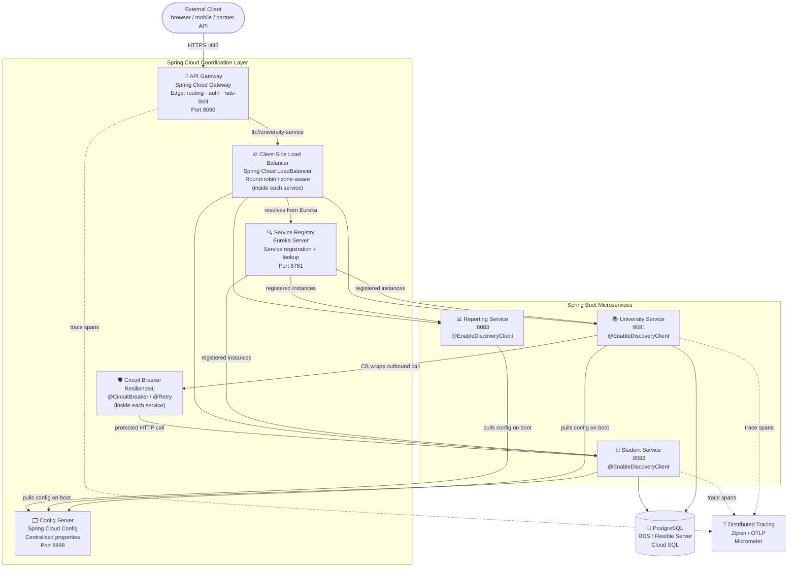

---

### 5.2 Config Server — Centralised Configuration Management

> **Problem it solves:** In a microservices system with 10+ services and 3+ environments (dev/staging/prod), managing `application.properties` per service per environment becomes unmanageable. Config Server provides a single source of truth for all configuration, backed by Git.

#### 5.2a — How It Works

```
Startup sequence for each microservice:

1. Service container starts
2. Spring Boot reads bootstrap.yml / spring.config.import
3. Calls Config Server at http://config-svc:8888/{service-name}/{profile}
4. Config Server fetches from Git (or S3 / Azure Repos / Vault)
5. Returns merged properties to the service
6. Service continues booting with resolved properties
7. @RefreshScope beans can pick up changes via /actuator/refresh POST
   (or Spring Cloud Bus broadcasts the refresh to all instances)
```

#### 5.2b — Spring Cloud Config Server Setup

```java
// config-server/src/main/java/ConfigServerApplication.java
@SpringBootApplication
@EnableConfigServer   // ← the only annotation needed; Spring Boot does the rest
public class ConfigServerApplication {
    public static void main(String[] args) {
        SpringApplication.run(ConfigServerApplication.class, args);
    }
}
```

```yaml
# config-server/src/main/resources/application.yml
server:
  port: 8888

spring:
  cloud:
    config:
      server:
        git:
          uri: https://github.com/your-org/config-repo   # Git-backed config store
          default-label: main
          search-paths: '{application}'   # subfolder per service name
          # For private repo: username + password or SSH key via Secrets Manager
          clone-on-start: true   # fail fast — don't boot if config repo unreachable
```

```yaml
# In each microservice: spring.config.import pulls from Config Server
# university-service/src/main/resources/application.yml
spring:
  application:
    name: university-service         # Config Server uses this to find /university-service/{profile}
  config:
    import: optional:configserver:http://config-svc:8888
    # "optional:" means app still boots if Config Server is temporarily unavailable
    # Remove "optional:" in production for fail-fast behaviour
  profiles:
    active: prod   # → fetches university-service-prod.yml from Git repo
```

```java
// @RefreshScope — bean is rebuilt when /actuator/refresh is called
// Without @RefreshScope, the bean caches the property value from startup forever
@RefreshScope
@Service
public class UniversityService {

    @Value("${university.max-enrollment-per-course:30}")
    private int maxEnrollmentPerCourse;   // picks up new value after refresh

    // ...
}
```

#### 5.2c — Config Layers (Precedence Low → High)

```
1. Config Server Git repo defaults (application.yml)         ← lowest priority
2. Config Server Git repo service-specific (university-service.yml)
3. Config Server Git repo profile-specific (university-service-prod.yml)
4. K8s ConfigMap (env vars in pod spec)
5. K8s Secret (SPRING_DATASOURCE_PASSWORD, etc.)             ← highest priority
```

**Principal best practice:** Secrets (passwords, API keys) must **never** be in the Git-backed Config Server. Use K8s Secrets (sourced from AWS Secrets Manager / Azure Key Vault / GCP Secret Manager via CSI driver) for credentials. Config Server handles feature flags, pool sizes, log levels, and timeouts only.

#### 5.2d — AWS-Native Alternative: AWS AppConfig / Parameter Store

| Spring Cloud Config | AWS AppConfig | AWS Parameter Store (SSM) |
|---|---|---|
| Pull on boot via HTTP | Push/poll via SDK | Pull on boot via `awspring` |
| Git-backed | S3 / internal store | Tree-structured `/app/prod/db.url` |
| `@RefreshScope` + Bus | Deployment strategies (Canary, Linear) | No built-in rollout |
| Self-hosted container | Fully managed serverless | Fully managed serverless |
| **Best for:** multi-cloud portability | **Best for:** feature flags with rollout control | **Best for:** simple key-value config + secrets |

```yaml
# Replacing Spring Cloud Config with AWS Parameter Store (awspring library)
# pom.xml: io.awspring.cloud:spring-cloud-aws-starter-parameter-store
spring:
  config:
    import: aws-parameterstore:/config/university-service/
  cloud:
    aws:
      region:
        static: us-east-1
# SSM path /config/university-service/university.max-enrollment-per-course = 30
```

| Spring Cloud Config | Azure App Configuration | GCP Secret Manager |
|---|---|---|
| Git-backed HTTP pull | Managed key-value store with labels | Versioned secrets store |
| `@RefreshScope` for live reload | Native Spring Boot integration via `azure-spring-cloud-starter-appconfiguration` | `spring-cloud-gcp-starter-secretmanager` |
| **Best for:** multi-cloud, Git-as-source-of-truth | **Best for:** Azure-native apps with feature management | **Best for:** secret rotation on GCP |

---

### 5.3 Service Discovery — Registration and Lookup

> **Problem it solves:** In K8s or dynamic cloud environments, pod IPs change with every deployment. Hard-coding `http://10.0.1.45:8081` breaks on the next deploy. Service Discovery lets services find each other by **logical name**, not IP.

#### 5.3a — How Eureka Works

```
Boot sequence:
  Service A starts
    └─▶ @EnableDiscoveryClient registers with Eureka:
          POST /eureka/apps/UNIVERSITY-SERVICE
          { ipAddr: "10.0.3.12", port: 8081, healthCheckUrl: "/actuator/health" }

Heartbeat loop (every 30s):
  Service A → PUT /eureka/apps/UNIVERSITY-SERVICE/10.0.3.12
  Eureka marks instance UP

Service B calls Service A:
  Service B asks Eureka: GET /eureka/apps/UNIVERSITY-SERVICE
  Eureka returns: [ {ip: 10.0.3.12, port: 8081}, {ip: 10.0.3.15, port: 8081} ]
  Spring Cloud LoadBalancer picks one (round-robin)
  Service B makes HTTP call to chosen instance

Failure detection:
  If Eureka receives no heartbeat for 90s → instance marked DOWN
  LoadBalancer stops routing to it
```

#### 5.3b — Spring Cloud Eureka Setup

```java
// eureka-server/src/main/java/EurekaServerApplication.java
@SpringBootApplication
@EnableEurekaServer
public class EurekaServerApplication {
    public static void main(String[] args) {
        SpringApplication.run(EurekaServerApplication.class, args);
    }
}
```

```yaml
# eureka-server/src/main/resources/application.yml
server:
  port: 8761

eureka:
  instance:
    hostname: eureka-server
  client:
    register-with-eureka: false   # server doesn't register with itself
    fetch-registry: false         # server doesn't cache the registry locally
  server:
    enable-self-preservation: false   # disable in dev; enable in prod
    # Self-preservation: if 15% of heartbeats are lost, Eureka stops evicting
    # instances (assumes network partition, not real failures)
```

```yaml
# Each microservice: registers itself with Eureka
# university-service/src/main/resources/application.yml
eureka:
  client:
    service-url:
      defaultZone: http://eureka-server:8761/eureka
  instance:
    prefer-ip-address: true        # register with pod IP, not hostname
    lease-renewal-interval-in-seconds: 10   # heartbeat interval (default 30)
    lease-expiration-duration-in-seconds: 30 # eviction threshold (default 90)
    health-check-url-path: /actuator/health  # Eureka uses this for UP/DOWN status
```

```java
// In university-service — calling student-service by logical name via @LoadBalanced
@Configuration
public class AppConfig {

    // @LoadBalanced — Spring Cloud LoadBalancer intercepts this RestClient
    // and resolves "student-service" to a real IP from Eureka
    @Bean
    @LoadBalanced
    RestClient.Builder loadBalancedRestClientBuilder() {
        return RestClient.builder();
    }
}

@Service
public class UniversityService {

    private final RestClient restClient;

    public UniversityService(RestClient.Builder builder) {
        // "http://student-service" — "student-service" is the Eureka service name
        // NOT a real hostname. Spring Cloud LoadBalancer resolves it.
        this.restClient = builder.baseUrl("http://student-service").build();
    }

    public StudentDTO getStudent(int id) {
        return restClient.get()
                .uri("/api/students/{id}", id)
                .retrieve()
                .body(StudentDTO.class);
    }
}
```

#### 5.3c — AWS-Native Alternative: AWS Cloud Map

| Spring Cloud Eureka | AWS Cloud Map | K8s DNS (CoreDNS) |
|---|---|---|
| Self-hosted Java process | Fully managed serverless | Built into every K8s cluster |
| HTTP heartbeat every 30s | Route 53 health checks | Service object ClusterIP |
| Eureka dashboard at :8761 | AWS Console / CLI | `kubectl get svc` |
| Works in any environment | AWS-only | K8s-only |
| Custom eviction logic | TTL-based (DNS or API) | kube-proxy rules |
| **Best for:** cross-cloud, non-K8s | **Best for:** AWS-native ECS/EKS mix | **Best for:** K8s-only deployments |

**Principal recommendation:** In a pure Kubernetes deployment (EKS / AKS / GKE), use **K8s DNS** (`student-service.default.svc.cluster.local`) for service-to-service calls — CoreDNS is built in and requires zero setup. Eureka adds operational complexity that K8s DNS already solves. Use Eureka only for hybrid cloud or non-K8s deployments.

| Concern | AWS | Azure | GCP |
|---|---|---|---|
| **Service registry** | AWS Cloud Map | Azure Service Fabric (legacy) / AKS CoreDNS | GCP Service Directory |
| **DNS-based discovery** | Route 53 Private Hosted Zones | Azure Private DNS | Cloud DNS |
| **K8s native** | EKS CoreDNS | AKS CoreDNS | GKE CoreDNS |

---

### 5.4 Load Balancers — Client-Side, Application, and Network

> **Problem it solves:** Traffic must be distributed across multiple service instances to prevent overload and provide HA. Load balancing happens at multiple layers: inside service code (client-side), at the HTTP layer (L7/application), and at the TCP layer (L4/network).

#### 5.4a — Three Types of Load Balancer

```
L7 APPLICATION LOAD BALANCER (ALB / Application Gateway / GCP HTTPS LB)
━━━━━━━━━━━━━━━━━━━━━━━━━━━━━━━━━━━━━━━━━━━━━━━━━━━━━━━━━━━━━━━━━━━━━
  HTTP/HTTPS + WebSocket aware
  Routes by: URL path, hostname, HTTP headers, query params, cookies
  Terminates TLS — unwraps HTTPS, forwards plain HTTP to pods
  Sticky sessions (session affinity)
  WAF integration
  Used for: web apps, REST APIs, microservices

  AWS  → Application Load Balancer (ALB)
  Azure → Application Gateway (with WAF v2)
  GCP  → HTTPS External Application Load Balancer

L4 NETWORK LOAD BALANCER (NLB / Azure LB Standard / GCP TCP Proxy)
━━━━━━━━━━━━━━━━━━━━━━━━━━━━━━━━━━━━━━━━━━━━━━━━━━━━━━━━━━━━━━━━━━━━━
  TCP/UDP aware — passes raw bytes through
  No TLS termination — passes encrypted traffic to backend (TLS passthrough)
  Ultra-low latency (microseconds vs milliseconds for ALB)
  Static Elastic IP address (ALB has dynamic IPs)
  Used for: gRPC, databases, gaming, VoIP, high-throughput APIs

  AWS  → Network Load Balancer (NLB)
  Azure → Azure Standard Load Balancer
  GCP  → TCP/SSL Proxy Load Balancer

CLIENT-SIDE LOAD BALANCER (Spring Cloud LoadBalancer / Ribbon)
━━━━━━━━━━━━━━━━━━━━━━━━━━━━━━━━━━━━━━━━━━━━━━━━━━━━━━━━━━━━━━━━━━━━━
  Lives INSIDE the calling service (no separate infrastructure)
  Queries service registry (Eureka / Cloud Map / K8s DNS)
  Picks an instance using a strategy (round-robin / zone-aware / random)
  Used for: service-to-service calls within the cluster
  Advantage: no additional network hop vs external LB
  Disadvantage: each caller must implement it

  Spring Cloud → Spring Cloud LoadBalancer (replaces deprecated Ribbon)
```

#### 5.4b — Spring Cloud LoadBalancer — Deep Dive

```java
// Default behaviour: Spring Cloud LoadBalancer intercepts requests
// via ReactorLoadBalancerExchangeFilterFunction when RestClient is @LoadBalanced

// Round-robin (default): cycles through all healthy instances
// Instance 1: request 1, 3, 5 ...
// Instance 2: request 2, 4, 6 ...

// Custom: zone-aware load balancing (prefers instances in same AZ/zone)
// Reduces cross-AZ data transfer costs on AWS (~$0.02/GB between AZs)
@Configuration
public class LoadBalancerConfig {

    @Bean
    public ServiceInstanceListSupplier serviceInstanceListSupplier(
            ConfigurableApplicationContext ctx) {
        return ServiceInstanceListSupplier
                .builder()
                .withDiscoveryClient()                // pull from Eureka/Cloud Map
                .withZonePreference()                  // prefer same AZ
                .withHealthChecks()                    // skip DOWN instances
                .withCaching()                         // cache 35s (avoids hammering Eureka)
                .build(ctx);
    }
}
```

```yaml
# application.yml — Spring Cloud LoadBalancer tuning
spring:
  cloud:
    loadbalancer:
      cache:
        enabled: true
        ttl: 35s           # how long instance list is cached locally
        capacity: 256      # max number of service entries in cache
      health-check:
        initial-delay: 0
        interval: 25s      # re-check instance health interval
      retry:
        enabled: true      # retry on different instance if current fails
        max-retries-on-next-service-instance: 2
        retry-on-all-operations: false   # only retry GET/safe methods
        retryable-status-codes: 503, 504
```

#### 5.4c — AWS Load Balancer Comparison

| Type | AWS Service | Spring / K8s Integration | Use Case |
|---|---|---|---|
| **Client-side** | Spring Cloud LoadBalancer (inside pod) | `@LoadBalanced` RestClient | Service-to-service calls within EKS |
| **Application (L7)** | **ALB** — Application Load Balancer | AWS Load Balancer Controller (`ingress.kubernetes.io/scheme: internet-facing`) | External HTTPS to EKS pods; path-based routing |
| **Network (L4)** | **NLB** — Network Load Balancer | AWS Load Balancer Controller (`service.beta.kubernetes.io/aws-load-balancer-type: external`) | TLS passthrough; gRPC; static IP requirement |
| **Global (CDN + LB)** | **CloudFront + ALB** | CloudFront distribution in front of ALB | Global latency reduction; DDoS protection |
| **Internal (VPC-only)** | **ALB internal** | `ingress.kubernetes.io/scheme: internal` | Service mesh entry; private microservice APIs |

```yaml
# EKS: expose university-service via ALB using AWS Load Balancer Controller
apiVersion: networking.k8s.io/v1
kind: Ingress
metadata:
  name: university-ingress
  annotations:
    kubernetes.io/ingress.class: alb
    alb.ingress.kubernetes.io/scheme: internet-facing       # public ALB
    alb.ingress.kubernetes.io/target-type: ip               # route to pod IPs directly
    alb.ingress.kubernetes.io/certificate-arn: arn:aws:acm:us-east-1:123:certificate/abc
    alb.ingress.kubernetes.io/listen-ports: '[{"HTTPS":443}]'
    alb.ingress.kubernetes.io/healthcheck-path: /actuator/health/readiness
    alb.ingress.kubernetes.io/wafv2-acl-arn: arn:aws:wafv2:...   # WAF integration
spec:
  rules:
    - http:
        paths:
          - path: /api/courses
            pathType: Prefix
            backend:
              service: { name: university-service, port: { number: 8080 } }
          - path: /api/students
            pathType: Prefix
            backend:
              service: { name: student-service, port: { number: 8080 } }
```

#### 5.4d — Azure and GCP Load Balancer Equivalents

| Concern | AWS | Azure | GCP |
|---|---|---|---|
| **L7 / Application LB** | ALB | Application Gateway (WAF v2) | HTTPS External LB |
| **L4 / Network LB** | NLB | Azure Standard Load Balancer | TCP/SSL Proxy LB |
| **Global CDN + LB** | CloudFront + ALB | Azure Front Door (Premium) | Cloud CDN + External LB |
| **Internal L7** | AWS ALB (internal) | Internal Application Gateway | Internal Load Balancer |
| **Service mesh** | AWS App Mesh / Istio | Open Service Mesh / Istio | Anthos Service Mesh / Istio |
| **K8s ingress controller** | AWS LBC (alb/nlb) | AGIC (Application Gateway) | GCE Ingress Controller |
| **Spring annotation / annotation** | `@LoadBalanced` RestClient | `@LoadBalanced` RestClient | `@LoadBalanced` RestClient |

```yaml
# AKS: expose via Azure Application Gateway Ingress Controller (AGIC)
apiVersion: networking.k8s.io/v1
kind: Ingress
metadata:
  name: university-ingress
  annotations:
    kubernetes.io/ingress.class: azure/application-gateway
    appgw.ingress.kubernetes.io/ssl-redirect: "true"
    appgw.ingress.kubernetes.io/connection-draining: "true"
    appgw.ingress.kubernetes.io/connection-draining-timeout: "30"
spec:
  tls:
    - hosts: [ "university.example.com" ]
      secretName: university-tls-secret
  rules:
    - host: university.example.com
      http:
        paths:
          - path: /api/
            pathType: Prefix
            backend:
              service: { name: university-service, port: { number: 8080 } }
```

---

### 5.5 API Gateway — Edge Routing, Auth, and Rate Limiting

> **Problem it solves:** Without a gateway, every microservice must implement auth, rate limiting, CORS, SSL termination, request logging, and API versioning independently. The API Gateway is a single entry point that handles all cross-cutting concerns once, for all services.

#### 5.5a — Spring Cloud Gateway Architecture

```
Client → HTTPS :443 → Spring Cloud Gateway
                          │
                          ├─ Route matching (path, header, method, host)
                          ├─ Global filters (auth token validation, request logging, CORS)
                          ├─ Per-route filters (rate limit, retry, circuit breaker, rewrite path)
                          └─ lb://university-service  → LoadBalancer → Eureka → Pod IP
```

**Think of it like an airport security checkpoint:**  
All passengers (requests) must pass through security (auth/rate-limit) once, regardless of which gate (service) they're heading to. Each gate (service) doesn't run its own security — it trusts that the checkpoint already handled it.

#### 5.5b — Spring Cloud Gateway Configuration

```yaml
# gateway-service/src/main/resources/application.yml
server:
  port: 8080   # single external port for all services

spring:
  cloud:
    gateway:
      # Global default filters applied to EVERY route
      default-filters:
        - name: RequestRateLimiter
          args:
            redis-rate-limiter.replenishRate: 100    # tokens added per second
            redis-rate-limiter.burstCapacity: 200    # max burst size
            key-resolver: "#{@ipKeyResolver}"        # rate-limit by client IP
        - AddResponseHeader=X-Response-Time, "{time}"
        - DedupeResponseHeader=Access-Control-Allow-Origin

      routes:
        # Route 1 — university service
        - id: university-service
          uri: lb://university-service    # lb:// = Spring Cloud LoadBalancer
          predicates:
            - Path=/api/courses/**        # matches /api/courses and any subpath
            - Method=GET,POST,PUT,DELETE
          filters:
            - name: CircuitBreaker
              args:
                name: university-cb
                fallbackUri: forward:/fallback/university
            - name: Retry
              args:
                retries: 2
                statuses: SERVICE_UNAVAILABLE, GATEWAY_TIMEOUT
                methods: GET
                backoff:
                  firstBackoff: 50ms
                  maxBackoff: 500ms
            - RewritePath=/api/courses/(?<remaining>.*), /api/courses/${remaining}
            - AddRequestHeader=X-Source-Gateway, spring-cloud-gateway

        # Route 2 — student service (protected: JWT required)
        - id: student-service
          uri: lb://student-service
          predicates:
            - Path=/api/students/**
          filters:
            - name: JwtAuthentication    # custom GlobalFilter validates Bearer token
            - name: RequestRateLimiter
              args:
                redis-rate-limiter.replenishRate: 50
                redis-rate-limiter.burstCapacity: 100

        # Route 3 — Actuator health (public, no auth)
        - id: health-check
          uri: lb://university-service
          predicates:
            - Path=/health
          filters:
            - RewritePath=/health, /actuator/health
```

```java
// Custom GlobalFilter — JWT validation applied to every route
// except /health and /actuator/**
@Component
public class JwtAuthenticationFilter implements GlobalFilter, Ordered {

    @Override
    public Mono<Void> filter(ServerWebExchange exchange, GatewayFilterChain chain) {
        String path = exchange.getRequest().getPath().value();

        // Skip auth for public paths
        if (path.startsWith("/health") || path.startsWith("/actuator")) {
            return chain.filter(exchange);
        }

        String authHeader = exchange.getRequest()
                .getHeaders().getFirst(HttpHeaders.AUTHORIZATION);

        if (authHeader == null || !authHeader.startsWith("Bearer ")) {
            exchange.getResponse().setStatusCode(HttpStatus.UNAUTHORIZED);
            return exchange.getResponse().setComplete();
        }

        // Validate JWT (verify signature, expiry, claims)
        String token = authHeader.substring(7);
        if (!jwtService.isValid(token)) {
            exchange.getResponse().setStatusCode(HttpStatus.FORBIDDEN);
            return exchange.getResponse().setComplete();
        }

        // Add decoded claims as downstream headers for microservices
        String userId = jwtService.extractUserId(token);
        ServerHttpRequest mutatedRequest = exchange.getRequest().mutate()
                .header("X-Authenticated-User", userId)
                .build();

        return chain.filter(exchange.mutate().request(mutatedRequest).build());
    }

    @Override
    public int getOrder() { return -100; }   // run before all other filters
}
```

#### 5.5c — AWS API Gateway vs Spring Cloud Gateway

| Feature | Spring Cloud Gateway | AWS API Gateway (REST) | AWS API Gateway (HTTP) | Amazon API Gateway + AppSync |
|---|---|---|---|---|
| **Protocol** | HTTP/1.1 · HTTP/2 · WebSocket | HTTP/1.1 · WebSocket | HTTP/1.1 · HTTP/2 | GraphQL |
| **Hosting** | Self-hosted container (EKS pod) | Fully managed serverless | Fully managed serverless (50% cheaper than REST) | Fully managed serverless |
| **Latency overhead** | < 1ms (in-cluster) | ~6–10ms (API calls to AWS endpoint) | ~3–5ms | Variable |
| **Rate limiting** | Via Redis `RequestRateLimiter` filter | Built-in usage plans + API keys | Built-in throttling per route | Built-in per-connection limits |
| **Auth / AuthN** | Custom `GlobalFilter` or Spring Security | Cognito Authorizer · Lambda Authorizer · IAM · JWT | JWT Authorizer · Lambda Authorizer | Cognito · API keys |
| **Request transformation** | `RewritePath`, `AddRequestHeader`, `ModifyRequestBody` | Mapping templates (VTL) | Parameter mapping | Resolvers |
| **Circuit breaker** | Resilience4j built-in filter | Not built-in — handled by backend or ALB | Not built-in | Not built-in |
| **WebSocket support** | ✅ | ✅ (REST mode) | ❌ | ✅ (subscriptions) |
| **Cost model** | Fixed (pod compute) | Pay per request ($3.50/million) | Pay per request ($1.00/million) | Pay per request |
| **VPC private routing** | Native (in-cluster) | VPC Link to NLB | VPC Link to NLB/ALB | VPC routing available |
| **Multi-cloud portable** | ✅ | ❌ AWS-only | ❌ AWS-only | ❌ AWS-only |
| **Best for** | Multi-cloud · on-prem · fine-grained routing control | Serverless backends (Lambda) · public APIs | Low-cost HTTP proxy to backend services | GraphQL frontend |

```
                       ┌──────────────────────────────────────────┐
                       │          API Gateway Decision             │
                       └──────────────────────────────────────────┘
                                          │
                     ┌────────────────────┼────────────────────┐
                     │                    │                    │
              Multi-cloud?       AWS serverless?      GraphQL needed?
              On-prem K8s?       Lambda backends?
                     │                    │                    │
                     ▼                    ▼                    ▼
          Spring Cloud Gateway    AWS API Gateway HTTP    AWS AppSync
          (in EKS pod)            or REST API             (GraphQL)
```

#### 5.5d — Azure API Management vs GCP Cloud Endpoints / Apigee

| Feature | Spring Cloud Gateway | Azure API Management | GCP Cloud Endpoints | GCP Apigee |
|---|---|---|---|---|
| **Auth** | Custom filter | OAuth2 / JWT policy | JWT / API key | OAuth2 / JWT / mTLS |
| **Rate limiting** | Redis `RequestRateLimiter` | Policy-based quotas | `x-google-quota` extension | Adaptive quotas |
| **Developer portal** | None (DIY) | ✅ Built-in portal | ❌ | ✅ Full lifecycle portal |
| **Analytics** | Micrometer / Prometheus | Azure Monitor built-in | Cloud Monitoring | Apigee Analytics suite |
| **Caching** | Spring Cache on backend | Response caching policy | Cloud CDN | Apigee cache policy |
| **Multi-cloud** | ✅ | ❌ Azure-only | ❌ GCP-only | ✅ (Apigee hybrid) |
| **Platform** | Self-hosted pod | Managed PaaS | Managed serverless (OpenAPI-driven) | Managed PaaS or hybrid |
| **Best for** | K8s-native routing | Azure APIs with developer portal | GCP gRPC services | Enterprise-grade full API lifecycle |

---

### 5.6 Circuit Breaker — Fault Tolerance and Resilience

> **Problem it solves:** In a chain of microservices, one slow or failing service can block all threads in every upstream caller, causing a cascade failure that takes down the entire system. The circuit breaker detects the failure and "opens" — immediately returning a fallback response instead of waiting for the timeout.

#### 5.6a — Circuit Breaker State Machine

```
                    failure rate > threshold
CLOSED ─────────────────────────────────────────────► OPEN
(normal)                                             (failing fast)
  ▲                                                       │
  │                                                       │ after waitDurationInOpenState
  │                                                       ▼
  │                                               HALF-OPEN
  │                                           (probe: allow N calls)
  │                                                       │
  │  probe calls succeed                                  │  probe calls fail
  └───────────────────────────────────────────────────────┘ ──────────► OPEN

CLOSED   → all calls go through; success/failure tracked in sliding window
OPEN     → all calls immediately fail; fallback returned
HALF-OPEN → limited calls through to test if service recovered
```

**Think of it like a circuit breaker in your house:**  
When a short circuit (service failure) is detected, the breaker trips (OPEN) — no more current flows to that circuit. After a cooldown (waitDuration), it halfway flips back (HALF-OPEN) to test if it's safe. If the next test passes, it fully resets (CLOSED).

#### 5.6b — Resilience4j Configuration

```xml
<!-- pom.xml -->
<dependency>
    <groupId>org.springframework.cloud</groupId>
    <artifactId>spring-cloud-starter-circuitbreaker-resilience4j</artifactId>
</dependency>
```

```yaml
# application.yml — Resilience4j tuning
resilience4j:
  circuitbreaker:
    instances:
      student-service-cb:                       # name used in @CircuitBreaker
        slidingWindowType: COUNT_BASED           # COUNT_BASED or TIME_BASED
        slidingWindowSize: 10                    # last 10 calls evaluated
        minimumNumberOfCalls: 5                  # need at least 5 calls before evaluation
        failureRateThreshold: 50                 # > 50% failures → OPEN
        slowCallRateThreshold: 80                # > 80% calls slow → also triggers OPEN
        slowCallDurationThreshold: 2000ms        # calls > 2s counted as "slow"
        waitDurationInOpenState: 30s             # stay OPEN 30s before trying HALF-OPEN
        permittedNumberOfCallsInHalfOpenState: 3 # 3 probe calls in HALF-OPEN
        automaticTransitionFromOpenToHalfOpenEnabled: true

  retry:
    instances:
      student-service-retry:
        maxAttempts: 3                          # total attempts (1 original + 2 retries)
        waitDuration: 200ms                     # wait between retries
        enableExponentialBackoff: true
        exponentialBackoffMultiplier: 2         # 200ms → 400ms → 800ms
        retryExceptions:
          - java.io.IOException
          - java.util.concurrent.TimeoutException
        ignoreExceptions:
          - com.example.university.web.CourseNotFoundException  # 404 = don't retry

  bulkhead:
    instances:
      student-service-bulkhead:
        maxConcurrentCalls: 25                  # max parallel calls to student-service
        maxWaitDuration: 100ms                  # wait up to 100ms for a slot; else reject

  timelimiter:
    instances:
      student-service-tl:
        timeoutDuration: 3s                     # call must complete within 3s
        cancelRunningFuture: true
```

```java
// UniversityService.java — combining Circuit Breaker + Retry + Bulkhead + TimeLimiter
@Service
public class UniversityService {

    private final RestClient restClient;

    /**
     * Calls student-service with full fault tolerance stack:
     *
     * TimeLimiter  — cancel if > 3s
     *   └── Bulkhead — reject if > 25 concurrent calls
     *       └── CircuitBreaker — open if > 50% fail
     *           └── Retry — retry up to 3 times on IOException
     *               └── actual HTTP call to student-service
     *
     * Order matters: Retry wraps the HTTP call; CircuitBreaker wraps Retry;
     * Bulkhead wraps CircuitBreaker; TimeLimiter wraps Bulkhead.
     */
    @TimeLimiter(name = "student-service-tl")
    @Bulkhead(name = "student-service-bulkhead", type = Bulkhead.Type.SEMAPHORE)
    @CircuitBreaker(name = "student-service-cb", fallbackMethod = "getStudentFallback")
    @Retry(name = "student-service-retry")
    public StudentDTO getStudent(int id) {
        return restClient.get()
                .uri("/api/students/{id}", id)
                .retrieve()
                .body(StudentDTO.class);
    }

    /**
     * Fallback method — called when Circuit Breaker is OPEN or all retries exhausted.
     * Method signature must match the guarded method + accept Throwable as last param.
     *
     * Principal rule: Always return a degraded-but-valid response.
     * Never throw from a fallback — that defeats the purpose.
     */
    private StudentDTO getStudentFallback(int id, Throwable ex) {
        log.warn("Student service unavailable for id={}, returning stub. Cause: {}",
                id, ex.getMessage());
        // Return a safe stub — caller can still serve the request in degraded mode
        return new StudentDTO(id, "Unavailable", "Unavailable", -1);
    }
}
```

#### 5.6c — Circuit Breaker Metrics via Actuator

```yaml
# Expose Resilience4j metrics through Spring Boot Actuator
management:
  endpoints:
    web:
      exposure:
        include: health, metrics, circuitbreakers, circuitbreakerevents
  health:
    circuitbreakers:
      enabled: true   # /actuator/health shows each CB state (CLOSED/OPEN/HALF_OPEN)

# GET /actuator/health response:
# {
#   "status": "UP",
#   "components": {
#     "circuitBreakers": {
#       "status": "UP",
#       "details": {
#         "student-service-cb": { "status": "CIRCUIT_CLOSED", "failureRate": "10.0%" }
#       }
#     }
#   }
# }
```

```
# GET /actuator/metrics/resilience4j.circuitbreaker.state
{
  "name": "resilience4j.circuitbreaker.state",
  "measurements": [{ "statistic": "VALUE", "value": 0.0 }],   # 0=CLOSED, 1=OPEN, 2=HALF_OPEN
  "availableTags": [
    { "tag": "name", "values": ["student-service-cb"] },
    { "tag": "state", "values": ["closed"] }
  ]
}
```

#### 5.6d — AWS-Native Fault Tolerance Equivalents

| Spring / Resilience4j | AWS Native | Azure Native | GCP Native |
|---|---|---|---|
| **Circuit Breaker** | AWS App Mesh (Envoy proxy) retry/circuit breaker policy | Azure APIM circuit breaker policy | Cloud Service Mesh (Envoy) |
| **Retry** | ALB target group stickiness + error retry | Azure APIM retry policy | Cloud Load Balancing backend retry |
| **Bulkhead** | ECS task CPU/memory limits; ALB connection draining | Azure Container Apps scaling rules | GKE resource limits + HPA |
| **Rate limiter** | API Gateway usage plans; ALB request count | APIM rate-limit policy | Cloud Armor rate limiting |
| **Timeout** | ALB idle timeout; Lambda timeout; SDK `ClientConfiguration` | APIM timeout policy | Cloud LB backend timeout |
| **Fallback** | Lambda Dead Letter Queue; SQS for async; EventBridge | Azure Service Bus fallback queue | Cloud Pub/Sub dead letter |

**Principal recommendation:** In K8s with a service mesh (Istio / Envoy), **circuit breaking and retries can be configured at the mesh layer** (`VirtualService`, `DestinationRule`) without any application code changes. This is the recommended production pattern for K8s-native deployments:

```yaml
# Istio DestinationRule — circuit breaker at mesh level (no Java code changes)
apiVersion: networking.istio.io/v1alpha3
kind: DestinationRule
metadata:
  name: student-service-cb
spec:
  host: student-service
  trafficPolicy:
    outlierDetection:
      consecutiveGatewayErrors: 5      # 5 consecutive 5xx → eject instance
      consecutive5xxErrors: 5
      interval: 30s                    # evaluation window
      baseEjectionTime: 30s            # minimum ejection duration
      maxEjectionPercent: 50           # never eject more than 50% of pool
    connectionPool:
      http:
        http1MaxPendingRequests: 100   # bulkhead: queue depth
        http2MaxRequests: 1000         # max active requests
```

---

### 5.7 Distributed Tracing — Request Journey Across Services

> **Problem it solves:** When a request fails in a system of 10 microservices, finding which service caused the failure requires correlating logs from all 10. Distributed tracing assigns a single `traceId` to the original request that propagates through every service call, making end-to-end request journeys visible.

#### 5.7a — Spring Boot 3 Micrometer Tracing Setup

```xml
<!-- pom.xml — Micrometer Tracing (replaces Spring Cloud Sleuth in Boot 3) -->
<dependency>
    <groupId>io.micrometer</groupId>
    <artifactId>micrometer-tracing-bridge-otel</artifactId>   <!-- OpenTelemetry bridge -->
</dependency>
<dependency>
    <groupId>io.opentelemetry</groupId>
    <artifactId>opentelemetry-exporter-otlp</artifactId>      <!-- sends to OTLP endpoint -->
</dependency>
```

```yaml
management:
  tracing:
    sampling:
      probability: 1.0    # 100% sampling in dev; use 0.1 (10%) in prod
  otlp:
    tracing:
      endpoint: http://otel-collector:4318/v1/traces  # → Zipkin / Jaeger / X-Ray / Azure Monitor
```

```
Request trace: GET /api/courses/filter → university-service → student-service
━━━━━━━━━━━━━━━━━━━━━━━━━━━━━━━━━━━━━━━━━━━━━━━━━━━━━━━━━━━━━━━━━━━━━━
traceId: 4b7c9e2a3f1d8a6b

  [gateway     ] span: 4b7c9e2a  0ms─────────────────────────────────100ms
  [univ-service] span: 8a3d1c9f    5ms─────────────────────────80ms
  [student-svc ] span: 2e6b4a8d        20ms──────────────50ms
  [db query    ] span: 9f1c3b7e              25ms────40ms

Each span contains:
  serviceName, spanId, parentSpanId, traceId, startTime, endTime, status, HTTP method/path
```

| Tracing Backend | AWS | Azure | GCP |
|---|---|---|---|
| **Managed** | AWS X-Ray | Azure Monitor Application Insights | Cloud Trace |
| **Open-source / self-hosted** | Zipkin / Jaeger on EKS | Zipkin / Jaeger on AKS | Zipkin / Jaeger on GKE |
| **Standard** | OpenTelemetry (OTLP) → X-Ray OTLP endpoint | OpenTelemetry (OTLP) → Azure Monitor | OpenTelemetry (OTLP) → Cloud Trace |

---

### 5.8 Principal Recommendation Matrix — Spring Cloud vs Cloud-Native

> **Key principle:** Spring Cloud components are infrastructure code you own and operate. Cloud-native managed services offload that operational burden at higher per-unit cost. Choose based on multi-cloud portability requirements, team operational maturity, and total cost of ownership.

| Concern | Spring Cloud (self-managed) | AWS Native | Azure Native | GCP Native | Recommendation |
|---|---|---|---|---|---|
| **Config Management** | Config Server (Git-backed) | AppConfig + SSM Parameter Store | Azure App Configuration | Secret Manager + Firestore | **AWS/Azure/GCP native** for pure cloud play; Spring Cloud Config for multi-cloud or on-prem K8s |
| **Service Discovery** | Eureka Server | Cloud Map | AKS CoreDNS / Service Fabric | Service Directory / GKE CoreDNS | **K8s DNS** inside clusters; Spring Eureka only for hybrid non-K8s |
| **Client-Side LB** | Spring Cloud LoadBalancer | Part of AWS SDK (not client-side) | Built into Azure SDK | Built into Cloud SDK | **Spring Cloud LB** for service-to-service inside K8s; delegate to cloud LB for ingress |
| **L7 API Gateway** | Spring Cloud Gateway | AWS API Gateway HTTP / REST | Azure API Management | GCP Apigee / Cloud Endpoints | **Spring Cloud Gateway** for complex routing in K8s; **cloud-native gateway** for serverless backends |
| **L4 Network LB** | Not applicable | NLB  | Azure Standard LB | TCP/SSL Proxy LB | Always use **cloud-native NLB** — no Spring equivalent |
| **Circuit Breaker** | Resilience4j | App Mesh / Istio (mesh layer) | APIM policy / Istio | Cloud Service Mesh / Istio | **Resilience4j** for library-level control; **Istio** for mesh-level (no code change) |
| **Rate Limiting** | Spring Cloud Gateway filter + Redis | API Gateway usage plans | APIM rate-limit policy | Cloud Armor | Spring Cloud for in-cluster; cloud-native for public API edge |
| **Distributed Tracing** | Micrometer + OTLP | AWS X-Ray | Azure Monitor / App Insights | Cloud Trace | **OpenTelemetry (OTLP)** — portable to all three clouds and self-hosted |
| **Auth at edge** | Spring Security OAuth2 in Gateway | Cognito Authorizer | Azure AD B2C | GCP Identity Platform | Spring Security for fine-grained; cloud-native IdP for managed SSO |

---

### 5.9 Full Architecture — Spring Cloud on AWS EKS

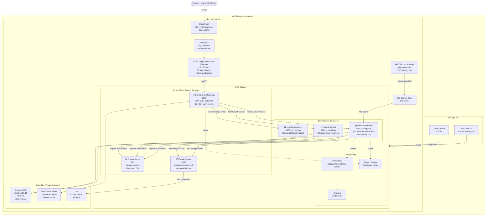

---

### 5.10 Cross-Cutting Best Practices

1. **One gateway, many services.** All external traffic enters through a single Spring Cloud Gateway or cloud-native API gateway. Services must not expose ports directly to the internet. Use K8s `ClusterIP` (not `LoadBalancer` or `NodePort`) for all internal services.

2. **Config Server must be the first service up.** In Docker Compose and K8s, use `depends_on` / init containers to ensure Config Server is healthy before any business service starts. Use `spring.config.import: optional:configserver:...` during development for tolerant startup; remove `optional:` in production for fail-fast.

3. **Never put secrets in Config Server's Git repo.** Config Server handles feature flags, pool sizes, timeouts, and log levels. Credentials go into AWS Secrets Manager / Azure Key Vault / GCP Secret Manager, injected as K8s Secrets via CSI driver. Violating this exposes production credentials in Git history permanently.

4. **Circuit breakers need real thresholds.** Default Resilience4j settings (`slidingWindowSize: 100`) are too large for most services. Set `minimumNumberOfCalls:5`, `slidingWindowSize:10`, `waitDurationInOpenState:30s` and tune from there based on Actuator `/actuator/metrics/resilience4j.circuitbreaker.*` data.

5. **Fallback = degraded, not broken.** A circuit breaker fallback should return a safe, partial response (stub data, cached result, empty list with a `Retry-After` header) — never throw an exception. The caller should be able to serve the request in a degraded state.

6. **Zone-aware load balancing cuts cloud costs.** AWS charges ~$0.02/GB for cross-AZ traffic. Configure `withZonePreference()` in `ServiceInstanceListSupplier` so services prefer instances in their own AZ. Same applies on Azure (paired regions) and GCP (zones).

7. **K8s DNS supersedes Eureka inside a cluster.** Inside EKS/AKS/GKE, every `Service` object is automatically resolvable via CoreDNS as `service-name.namespace.svc.cluster.local`. Use Eureka only for environments where K8s DNS is unavailable (hybrid cloud, bare-metal, non-K8s VMs).

8. **Spring Cloud Gateway is reactive (WebFlux).** It runs on Project Reactor, not Spring MVC. Do not mix blocking code in Gateway filters. Use `Mono<Void>` / `Flux<T>` only. If your Gateway logic is complex, validate it with a `WebTestClient` integration test, not `MockMvc`.

9. **`@RefreshScope` has a startup lag.** After calling `/actuator/refresh`, beans annotated `@RefreshScope` are reconstructed on the next access, not immediately. In a multi-pod deployment, call `/actuator/refresh` on every pod or use **Spring Cloud Bus** (backed by Redis or RabbitMQ) to broadcast the refresh event to all instances simultaneously.

10. **Distributed tracing sampling in production.** Use `management.tracing.sampling.probability=0.01` (1%) in production to prevent trace overhead. Use `1.0` in staging and development. For specific high-value traces (payment flows, auth), use a custom `Sampler` to force 100% sampling for those paths only.

---

*Generated 2026-03-04 · Principal architect analysis of `university-modern` (Java 17/21 + Spring Boot 3.3.5 · Spring Cloud · AWS EKS/RDS/Aurora · Azure AKS/Flexible Server/Cosmos DB for PostgreSQL · GCP GKE/Cloud SQL/AlloyDB)*
