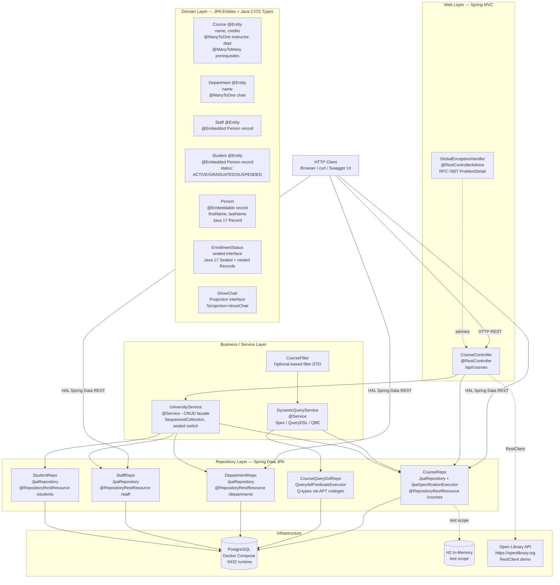
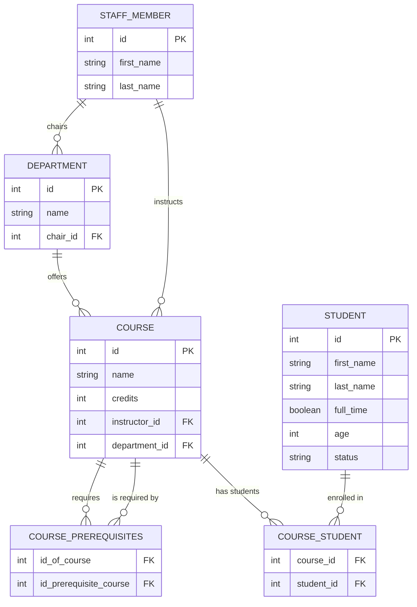
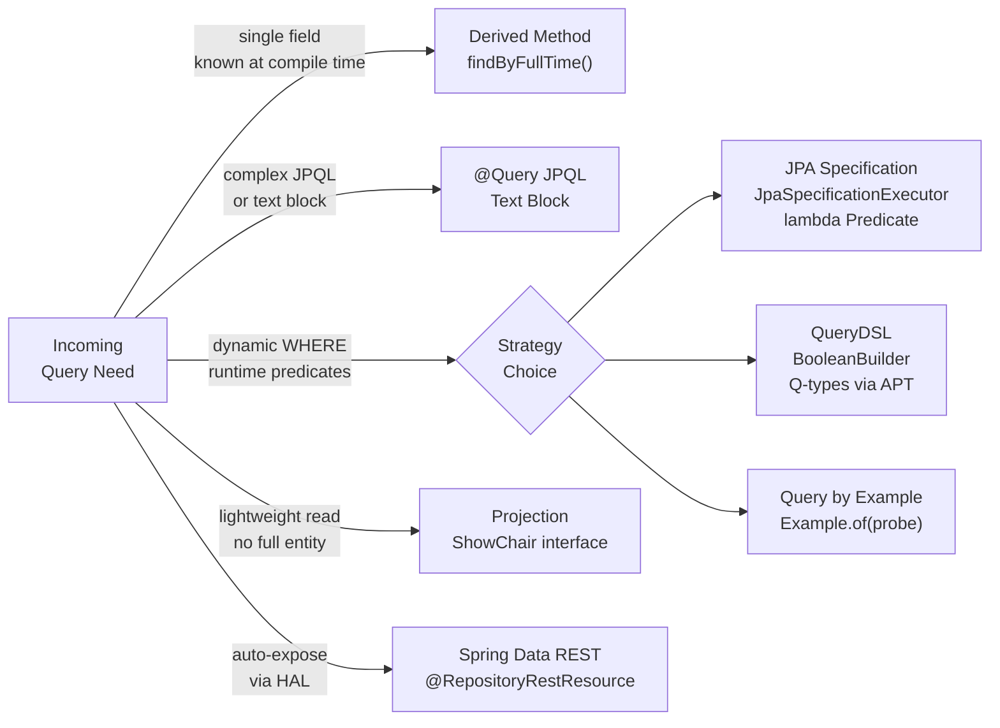
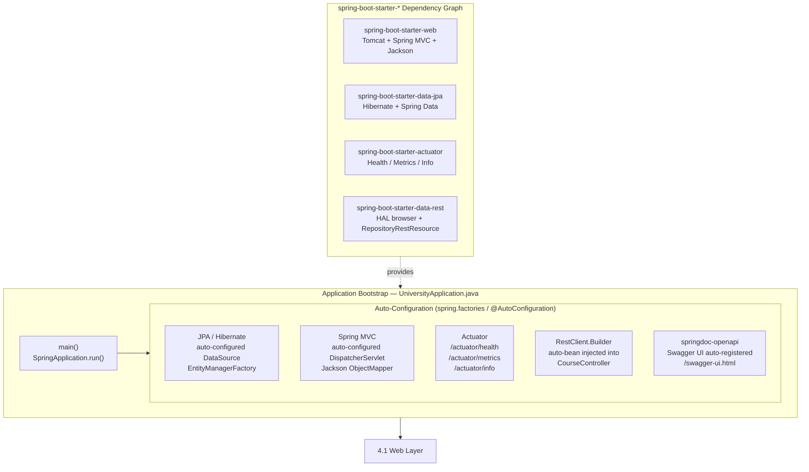
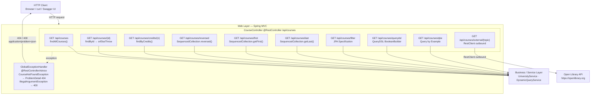
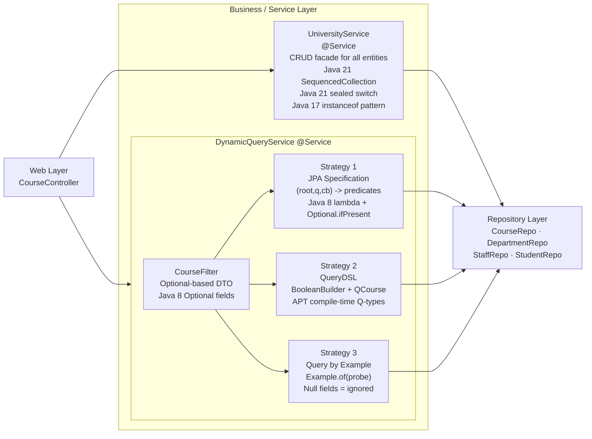
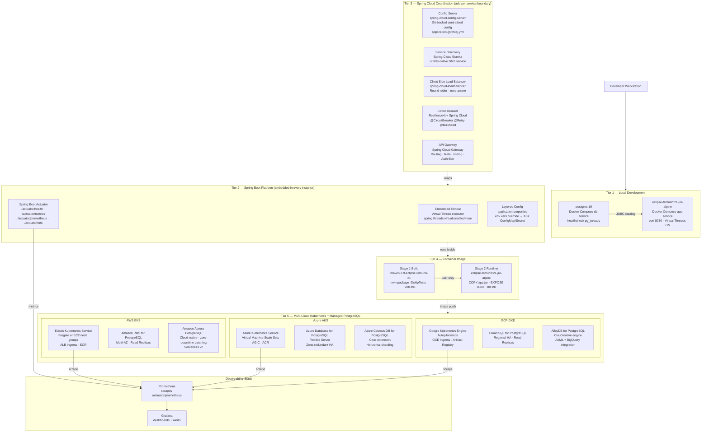
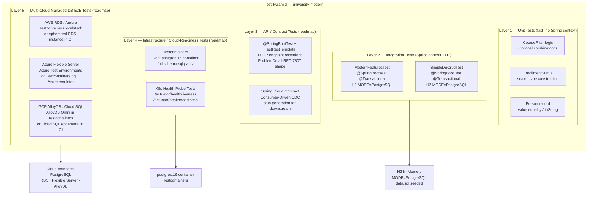
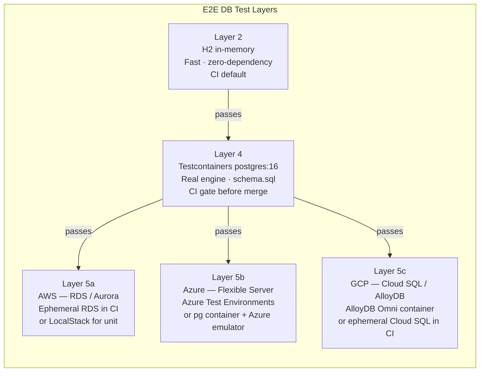

# University Modern — Architecture Reference

> **Module:** `university-modern` · Spring Boot 3.2+ · Java 17/21 · PostgreSQL  
> Principal architect view: layer structure, entity model, query strategies, and design decisions.

---

## 1. Overall System Architecture

Five vertical layers communicate top-to-bottom. Dashed arrows indicate cross-cutting or optional paths.



---

## 2. Domain Entity Relationships



---

## 3. Query Strategy Decision Tree



---

## 4. Layer Summary Tables

> End-to-end layer breakdown of `university-modern`.  
> Each section follows: **Role & Design Decisions** → **Mermaid component diagram** → **Detailed tables** → **Code / comparison reference**.  
> Ordered top-to-bottom: **Bootstrap → Web → Business → Repository → Domain → Infrastructure → Test**.

---

### 4.0 Application Bootstrap

> **Role:** Application entry point — wires the entire Spring container, activates auto-configuration, starts the embedded web server, and registers all beans declared across the other layers.  
> **Pattern:** Convention-over-configuration (`@SpringBootApplication` = `@Configuration` + `@EnableAutoConfiguration` + `@ComponentScan`). The bootstrap layer is intentionally thin — it owns zero business logic.  
> **Key Features:** Auto-configuration · Starter dependency management · Embedded Apache Tomcat (virtual-thread mode) · Spring Boot Actuator (health / metrics / info) · `RestClient.Builder` auto-bean · `springdoc-openapi` Swagger UI auto-registration.



#### 4.0a — `@SpringBootApplication` Decomposition

| Meta-annotation | What it activates | Practical effect in this project |
|---|---|---|
| `@Configuration` | Marks the class as a bean-definition source | `@Bean` methods here are added to the Spring context |
| `@EnableAutoConfiguration` | Scans `META-INF/spring/org.springframework.boot.autoconfigure.AutoConfiguration.imports` | Configures DataSource, Hibernate, Tomcat, Jackson, Actuator without any XML |
| `@ComponentScan` | Scans `com.example.university` and all sub-packages | Discovers `@RestController`, `@Service`, `@Repository`, `@RestControllerAdvice` automatically |

#### 4.0b — Spring Boot vs Spring Cloud Responsibility Split

> **Mental model:** Spring Boot builds the **individual service**. Spring Cloud coordinates **many services talking to each other**.

```
┌──────────────────────────────────────────────────────────┐
│  Spring Cloud  — Distributed System Coordination Layer   │
│  Circuit Breaker · Config Server · Service Discovery     │
│  Client-Side Load Balancer · API Gateway                 │
│  ┌────────────────────────────────────────────────────┐  │
│  │  Spring Boot  — Individual Service Platform Layer  │  │
│  │  Auto-configuration · Embedded Tomcat · Actuator   │  │
│  │  Starter dependencies · Virtual Threads            │  │
│  │  ┌──────────────────────────────────────────────┐  │  │
│  │  │  Business Application Code                   │  │  │
│  │  │  Web · Service · Repository · Domain         │  │  │
│  │  └──────────────────────────────────────────────┘  │  │
│  └────────────────────────────────────────────────────┘  │
└──────────────────────────────────────────────────────────┘
```

#### 4.0c — Actuator Endpoints Reference

| Endpoint | HTTP | Output | Used in K8s |
|---|---|---|---|
| `/actuator/health` | `GET` | `{"status":"UP"}` + component details | **Liveness probe** + **Readiness probe** |
| `/actuator/health/liveness` | `GET` | JVM alive | `livenessProbe.httpGet.path` |
| `/actuator/health/readiness` | `GET` | DB connection + dependencies ready | `readinessProbe.httpGet.path` |
| `/actuator/metrics` | `GET` | Micrometer metric names | Scraped by Prometheus via `/actuator/prometheus` |
| `/actuator/info` | `GET` | App version, build info | Deployment dashboards |
| `/actuator/env` | `GET` | All resolved property sources | Configuration debugging |

---

### 4.1 Web Layer

> **Role:** HTTP boundary — translate incoming HTTP requests into domain operations and serialise results back to HTTP payloads.  
> **Pattern:** Thin controller (zero business logic); delegates all orchestration to `UniversityService` and `DynamicQueryService`; cross-cutting error handling via `@RestControllerAdvice`.  
> **Key Features:** `@RestController` · `@RestControllerAdvice` · Spring Boot 3.2+ `RestClient` · `ProblemDetail` RFC-7807 · Java 21 `SequencedCollection` return type.



#### 4.1a — Endpoint Catalog

| HTTP | Path | Handler Method | Delegates To | Returns | Java / Spring Feature |
|---|---|---|---|---|---|
| `GET` | `/api/courses` | `getAllCourses()` | `UniversityService.findAllCourses()` | `List<Course>` | — |
| `GET` | `/api/courses/{id}` | `getCourseById()` | `CourseRepo.findById().orElseThrow()` | `Course` | Throws `CourseNotFoundException` → ProblemDetail 404 |
| `GET` | `/api/courses/credits/{n}` | `getCoursesByCredits()` | `CourseRepo.findByCredits()` | `List<Course>` | JPQL text block `@Query` |
| `GET` | `/api/courses/reversed` | `getCoursesReversed()` | `UniversityService.findCoursesReversed()` | `SequencedCollection<Course>` | **Java 21** `List.reversed()` — non-destructive reversed view |
| `GET` | `/api/courses/first` | `getFirstCourse()` | `UniversityService.findFirstCourse()` | `Course` | **Java 21** `List.getFirst()` — self-documenting |
| `GET` | `/api/courses/last` | `getLastCourse()` | `UniversityService.findLastCourse()` | `Course` | **Java 21** `List.getLast()` |
| `GET` | `/api/courses/filter` | `getFilteredCourses()` | `DynamicQueryService.filterBySpecification()` | `List<Course>` | JPA `Specification` lambda predicate |
| `GET` | `/api/courses/querydsl` | `getQueryDslCourses()` | `DynamicQueryService.filterByQueryDsl()` | `List<Course>` | QueryDSL `BooleanBuilder` + `QCourse` APT types |
| `GET` | `/api/courses/qbe` | `getQbeCourses()` | `DynamicQueryService.filterByExample()` | `List<Course>` | `Example.of(probe)` Query by Example |
| `GET` | `/api/courses/external/{topic}` | `getExternalLibraryInfo()` | `RestClient` → `openlibrary.org` | `String` (raw JSON) | **Spring Boot 3.2+** `RestClient` replaces `RestTemplate` |

#### 4.1b — Exception → ProblemDetail Mapping

```
CourseNotFoundException (id)
    ↓  caught by GlobalExceptionHandler
    ↓  ProblemDetail.forStatusAndDetail(404, "Course with ID {id} was not found.")
    ↓  .setType(URI.create("https://api.university.example/errors/course-not-found"))
    ↓  .setProperty("timestamp", Instant.now())
    ↓  .setProperty("path", request.getRequestURI())

HTTP/1.1 404 Not Found
Content-Type: application/problem+json

{
  "type":      "https://api.university.example/errors/course-not-found",
  "title":     "Course Not Found",
  "status":    404,
  "detail":    "Course with ID 99 was not found.",
  "timestamp": "2026-03-04T10:00:00Z",
  "path":      "/api/courses/99"
}
```

#### 4.1c — Design Decisions

| Decision | Choice Made | Reason |
|---|---|---|
| Error serialisation | RFC-7807 `ProblemDetail` | Industry-standard `application/problem+json` — any client knows the schema |
| Outbound HTTP | `RestClient` (not `RestTemplate`) | Fluent, immutable, Spring Boot 3.2+ recommended replacement for `RestTemplate` |
| Controller responsibility | Zero business logic | All branching lives in `UniversityService` / `DynamicQueryService`; controller is a thin adapter |
| Ordered collection return type | `SequencedCollection<Course>` | Signals to callers that element ordering is intentional and part of the API contract |

---

### 4.2 Business / Service Layer

> **Role:** Business logic boundary — orchestrates repository calls, applies domain rules, shields the Web layer from persistence concerns.  
> **Pattern:** Facade (`UniversityService` — single entry point for all CRUD); Strategy pattern (`DynamicQueryService` — three interchangeable query strategies behind one service).  
> **Key Features:** Java 21 `SequencedCollection` (`reversed`, `getFirst`, `getLast`) · Sealed switch with record deconstruction (`describeEnrollment`) · Java 17 `instanceof` pattern matching · `Optional`-based `CourseFilter` DTO.



#### 4.2a — Service Class Catalog

| Class | Annotation | Role | Injects |
|---|---|---|---|
| `UniversityService` | `@Service` | CRUD facade — creates and retrieves all entity types; applies Java 21 `SequencedCollection` and sealed switch logic at the service boundary | `CourseRepo`, `DepartmentRepo`, `StaffRepo`, `StudentRepo` |
| `DynamicQueryService` | `@Service` | Side-by-side demonstration of three dynamic query strategies on `Course`; accepts `CourseFilter` and routes to the selected strategy | `CourseRepo` (Specification + QBE), `CourseQueryDslRepo` (QueryDSL) |
| `CourseFilter` | POJO (no annotation) | Optional-based filter DTO — absent fields (`Optional.empty()`) mean "do not filter on this dimension"; built via fluent `filterBy()` factory | Constructed by controller; consumed by `DynamicQueryService` |

#### 4.2b — Key Method Catalog

| Class | Method | Return Type | Java / Spring Feature |
|---|---|---|---|
| `UniversityService` | `findCoursesReversed()` | `SequencedCollection<Course>` | **Java 21** `List.reversed()` — returns a non-mutating reversed view |
| `UniversityService` | `findFirstCourse()` | `Course` | **Java 21** `List.getFirst()` — replaces opaque `get(0)` |
| `UniversityService` | `findLastCourse()` | `Course` | **Java 21** `List.getLast()` — replaces `get(size - 1)` |
| `UniversityService` | `describeEnrollment(EnrollmentStatus)` | `String` | **Java 21** sealed pattern-matching switch with record deconstruction — no `default` branch needed |
| `UniversityService` | `toEnrollmentStatus(Student, String)` | `EnrollmentStatus` | **Java 17** `instanceof` pattern matching + switch on string |
| `DynamicQueryService` | `filterBySpecification(CourseFilter)` | `List<Course>` | JPA `Specification<Course>` lambda + `Optional.ifPresent()` per predicate |
| `DynamicQueryService` | `filterByQueryDsl(CourseFilter)` | `List<Course>` | QueryDSL `BooleanBuilder` + APT-generated `QCourse` — type-safe field references |
| `DynamicQueryService` | `filterByExample(CourseFilter)` | `List<Course>` | Spring Data `Example.of(probe)` — null fields excluded automatically |
| `DynamicQueryService` | `describeFilter(Object)` | `String` | **Java 17** `instanceof` pattern matching — `if (filterObject instanceof CourseFilter cf)` |

#### 4.2c — Query Strategy Comparison

| Attribute | Specification (Strategy 1) | QueryDSL (Strategy 2) | QBE (Strategy 3) |
|---|---|---|---|
| **Type safety** | Field names as Strings — typos caught at runtime | Compile-time `QCourse` Q-types — typos caught at compile time | Java object fields — refactoring-safe |
| **Null / absent handling** | `Optional.ifPresent()` per predicate | Manual `BooleanBuilder.and()` conditions | Probe object — null fields are automatically excluded |
| **Predicate composition** | `criteriaBuilder.and(array)` | `BooleanBuilder.and(pred)` — chainable | Single `Example.of(probe)` — not composable |
| **IDE auto-complete** | No — String field names | Full — `QCourse.course.credits.eq(3)` | Partial — uses entity class fields |
| **Setup cost** | Zero — built into `JpaSpecificationExecutor` | Requires QueryDSL APT Maven plugin + compile step | Zero — built into `JpaRepository` |
| **Best for** | Simple to moderate dynamic WHERE clauses | Complex, large-scale, enterprise-grade dynamic filtering | Exact-match lookups on entity fields |

#### 4.2d — Java 21 Sealed Switch (live code)

```java
// UniversityService.describeEnrollment() — zero-boilerplate exhaustive switch
// Sealed interface guarantees compiler checks ALL 3 types are handled (no default needed)
public String describeEnrollment(EnrollmentStatus status) {
    return switch (status) {
        case EnrollmentStatus.Active    s -> "Currently enrolled in semester: " + s.semester();
        case EnrollmentStatus.Graduated s -> "Graduated in " + s.graduationYear();
        case EnrollmentStatus.Suspended s -> "Suspended — reason: " + s.reason();
        // No 'default' — compiler verified all permitted types are covered
    };
}
```

---

### 4.3 Repository Layer

> **Role:** Data access boundary — abstracts all database interactions behind typed Spring Data interfaces; owns every query strategy from simple CRUD to complex dynamic predicates.  
> **Pattern:** One interface per aggregate root; dual-repo pattern for `Course` (Specification executor + QueryDSL executor); `@RepositoryRestResource` for zero-code HAL endpoint generation.  
> **Key Features:** `JpaRepository` · `JpaSpecificationExecutor` · `QuerydslPredicateExecutor` · JPQL text blocks (Java 17) · `@RepositoryRestResource` HAL · `ShowChair` projection.


#### 4.3a — Repository Interface Reference

| Interface | Entity | Extends | HAL Path | Spring Data Extras |
|---|---|---|---|---|
| `CourseRepo` | `Course` | `JpaRepository` + `JpaSpecificationExecutor` | `/courses` | `@RepositoryRestResource`; JPQL text block queries; Specification; QBE |
| `CourseQueryDslRepo` | `Course` | `JpaRepository` + `QuerydslPredicateExecutor` | Internal only | QueryDSL `BooleanBuilder` + APT-generated `QCourse`, `QStaff`, `QDepartment` |
| `DepartmentRepo` | `Department` | `JpaRepository` | `/departments` | `@RepositoryRestResource`; `?projection=showChair` |
| `StaffRepo` | `Staff` | `JpaRepository` | `/staff` | `@RepositoryRestResource`; JPQL `@Query` with `@Param` |
| `StudentRepo` | `Student` | `JpaRepository` | `/students` | `@RepositoryRestResource`; derived methods + JPQL text blocks |

#### 4.3b — Query Method Catalog

| Repository | Method | Mechanism | Generated / Written SQL Shape |
|---|---|---|---|
| `CourseRepo` | `findByName(name)` | Derived method | `WHERE c.name = ?` |
| `CourseRepo` | `findByCredits(n)` | JPQL text block `@Query` | `WHERE c.credits = :credits ORDER BY c.name ASC` |
| `CourseRepo` | `findByPrerequisites(course)` | Derived method | `JOIN course_prerequisites WHERE prerequisite_id = ?` |
| `CourseRepo` | `findByDepartmentChairMemberLastName(chair)` | JPQL text block — deep path navigation | `WHERE c.department.chair.member.lastName = :chair` |
| `CourseRepo` | `findCoursesWithMoreThan(n)` | JPQL text block | `WHERE c.credits > :n ORDER BY credits DESC` |
| `StaffRepo` | `findByMemberLastName(name)` | JPQL `@Query` + `@Param` | `WHERE s.member.lastName = :lastName` |
| `StudentRepo` | `findByFullTime(bool)` | Derived method | `WHERE full_time = ?` |
| `StudentRepo` | `findYoungerThan(age)` | JPQL text block | `WHERE s.age < :age ORDER BY s.age ASC` |
| `StudentRepo` | `findByStatus(status)` | JPQL text block | `WHERE s.status = :status` |

#### 4.3c — Spring Data REST HAL Quick Reference

```
GET  /courses                          → Page<Course>  (includes _links.self, _links.next)
GET  /courses/{id}                     → Course        (_links.self, _links.instructor, _links.department)
POST /courses         {JSON body}      → 201 Created
PUT  /courses/{id}    {JSON body}      → 200 OK
DELETE /courses/{id}                   → 204 No Content

GET  /departments?projection=showChair → [{ "chairName": "FirstName LastName" }, ...]
GET  /staff                            → Page<Staff>
GET  /students                         → Page<Student>
```

---

### 4.4 Domain Layer

> **Role:** Business model boundary — defines what the system knows about; canonical source of truth for entity identity, structure, constraints, and type hierarchies.  
> **Pattern:** Rich domain model with modern Java types: value objects as Records (zero boilerplate), closed type taxonomies as Sealed Interfaces (compiler-enforced), computed views as Projection interfaces.  
> **Key Features:** `@Embeddable record Person` (Java 17) · `sealed interface EnrollmentStatus` (Java 17) · nested `record` permits (`Active`, `Graduated`, `Suspended`) · `@Projection ShowChair` with SpEL.


#### 4.4a — Entity Field Catalog

| Entity | Table | PK | Key Fields | Relationships | Modern Java Feature |
|---|---|---|---|---|---|
| `Person` | — (embedded) | — | `firstName`, `lastName` | Embedded in `Staff.member`, `Student.attendee` | **Java 17 `record`** — compiler generates constructor, accessors (not `getX()` — `x()`!), `equals`, `hashCode`, `toString` |
| `Staff` | `staff_member` | `Integer id` | `@Embedded Person member` | Referenced by `Department.chair`, `Course.instructor` | Uses `Person` Java 17 record; columns `first_name` / `last_name` live in `staff_member` row |
| `Department` | `department` | `Integer id` | `name`, `@ManyToOne Staff chair` | Offers many `Course`; projected by `ShowChair` | SpEL `#{target.chair.member.firstName()}` calls record accessor directly |
| `Course` | `course` | `Integer id` | `name`, `credits`, `instructor`, `department` | `@ManyToOne` Staff + Department; `@ManyToMany EAGER` self-referential prerequisites | Self-referential M:N via `course_prerequisites(id_of_course, id_prerequisite_course)` |
| `Student` | `student` | `Integer id` | `@Embedded Person`, `fullTime`, `age`, `status` | `@ManyToMany Course` via `course_student` | `status` stored as string (`ACTIVE` / `GRADUATED` / `SUSPENDED`); converted to sealed type in service layer |
| `EnrollmentStatus` | — (in-memory only) | — | `Active(semester)`, `Graduated(year)`, `Suspended(reason)` | Mapped from `Student.status` at service layer | **Java 17 sealed interface** + nested records — enables exhaustive Java 21 switch without `default` |
| `ShowChair` | — (projection) | — | `getChairName()` SpEL expression | `@Projection(name="showChair", types=Department.class)` | Spring Data REST projection — adds virtual computed field; activate with `?projection=showChair` |

#### 4.4b — Entity Relationship Matrix

| From | Cardinality | To | Storage | Notes |
|---|---|---|---|---|
| `Staff` | 1:1 embed | `Person` | `@Embedded` — columns inline in `staff_member` | `first_name`, `last_name` in same row as staff id |
| `Student` | 1:1 embed | `Person` | `@Embedded` — columns inline in `student` | Same inline strategy as Staff |
| `Department` | N:1 | `Staff` (chair) | `chair_id FK` in `department` | One staff member may chair multiple departments |
| `Course` | N:1 | `Staff` (instructor) | `instructor_id FK` in `course` | One staff member may instruct many courses |
| `Course` | N:1 | `Department` | `department_id FK` in `course` | Department offers many courses |
| `Course` | M:N (self) | `Course` (prerequisites) | `course_prerequisites` join table | `id_of_course` + `id_prerequisite_course`; `EAGER` fetch |
| `Student` | M:N | `Course` | `course_student` join table | `course_id` + `student_id` |

#### 4.4c — EnrollmentStatus Sealed Type Hierarchy

```
sealed interface EnrollmentStatus
    permits Active, Graduated, Suspended

    record Active(String semester)         → "ACTIVE"   DB string
    record Graduated(int graduationYear)   → "GRADUATED" DB string
    record Suspended(String reason)        → "SUSPENDED" DB string

Usage in Java 21 sealed switch (exhaustive — no default):
    case EnrollmentStatus.Active    s -> "Enrolled in: " + s.semester()
    case EnrollmentStatus.Graduated s -> "Graduated in " + s.graduationYear()
    case EnrollmentStatus.Suspended s -> "Suspended: "   + s.reason()
```

---

### 4.5 Infrastructure

> **Role:** Runtime boundary — provides every platform capability required to run, scale, observe, and operate `university-modern` across local development, CI/CD, and production multi-cloud Kubernetes environments.  
> **Pattern:** Five progressive tiers: **Local Dev** (Docker Compose) → **Spring Boot Platform** (embedded server + Actuator) → **Spring Cloud Coordination** (Config / Discovery / Load Balancer / Circuit Breaker) → **Container Runtime** (Docker image) → **Multi-Cloud Kubernetes** (AWS EKS · Azure AKS · GCP GKE).  
> **Key Features:** Spring Boot Actuator K8s health probes · Spring Cloud Config (centralised config) · Spring Cloud Service Discovery (Eureka / K8s service) · Spring Cloud LoadBalancer (client-side) · Resilience4j Circuit Breaker · Multi-stage Dockerfile (~80 MB Alpine JRE 21) · Kubernetes `Deployment`, `Service`, `ConfigMap`, `HorizontalPodAutoscaler` · Micrometer → Prometheus → Grafana observability stack.



#### 4.5a — Infrastructure Tier Reference

| Tier | Technology | Scope | Purpose |
|---|---|---|---|
| Local Dev | Docker Compose (`compose.yaml`) | Developer workstation | Zero-install full-stack: `docker compose up` starts PostgreSQL + app with health-check ordering |
| Spring Boot Platform | Embedded Tomcat · Actuator · Virtual Threads | Every runtime instance | Auto-configures web server, datasource, Jackson, health probes; single JAR deployment unit |
| Spring Cloud Config | `spring-cloud-config-server` | Centralized config service | Git-backed `application-{env}.yml` delivered to all services at startup; eliminates per-pod config drift |
| Spring Cloud Discovery | Eureka Server / K8s DNS | Service registry | Services register on startup; clients discover peers without hard-coded URLs |
| Spring Cloud LoadBalancer | `spring-cloud-loadbalancer` | Client (in-process) | Round-robin or weighted client-side LB replacing deprecated Ribbon; integrates with `RestClient` |
| Resilience4j Circuit Breaker | `spring-cloud-circuitbreaker-resilience4j` | Client (in-process) | `@CircuitBreaker` + `@Retry` + `@Bulkhead` on `RestClient` calls; prevents cascade failure |
| Spring Cloud Gateway | `spring-cloud-gateway` | Edge / API Gateway | Single ingress: routing, rate limiting, JWT auth filter, CORS; replaces Zuul |
| Container Image | Multi-stage Dockerfile | CI/CD + K8s | Stage 1 ~700 MB build discarded; Stage 2 ~80 MB JRE Alpine shipped; push to ECR / ACR / Artifact Registry |
| AWS EKS | Elastic Kubernetes Service | AWS production | Fargate serverless nodes or EC2 node groups; RDS Aurora PostgreSQL; ALB Ingress Controller |
| Azure AKS | Azure Kubernetes Service | Azure production | Azure CNI networking; Azure Database for PostgreSQL Flexible Server; Azure Container Registry |
| GCP GKE | Google Kubernetes Engine | GCP production | Autopilot mode; Cloud SQL PostgreSQL; Artifact Registry; GKE Ingress (GCE LB) |
| Observability | Micrometer → Prometheus → Grafana | All environments | Actuator exposes `/actuator/prometheus`; Prometheus scrapes; Grafana visualises JVM, HTTP, DB pool metrics |

#### 4.5b — Spring Cloud Component Map

> Each Spring Cloud component maps to a **distributed system problem**. The table below shows the problem, the Spring Cloud solution, and the configuration hook.

| Distributed Problem | Spring Cloud Solution | Key Annotation / Class | Config Property |
|---|---|---|---|
| **Centralised configuration** | Spring Cloud Config Server | `@EnableConfigServer` on config-server app; `@RefreshScope` on consuming beans | `spring.config.import=configserver:http://config:8888` |
| **Service discovery — registration** | Eureka Server + `@EnableDiscoveryClient` | `@EnableEurekaServer` / `@EnableDiscoveryClient` | `eureka.client.service-url.defaultZone=http://eureka:8761/eureka` |
| **Service discovery — lookup** | Spring Cloud LoadBalancer | `@LoadBalanced RestClient.Builder` | `spring.cloud.loadbalancer.ribbon.enabled=false` |
| **Client-side load balancing** | `ReactorLoadBalancerExchangeFilterFunction` | Injected into `RestClient` builder | Round-robin default; custom `ServiceInstanceListSupplier` for zone-aware |
| **Circuit breaker / fault tolerance** | Resilience4j via Spring Cloud CircuitBreaker | `@CircuitBreaker(name="extApi", fallbackMethod="fallback")` | `resilience4j.circuitbreaker.instances.extApi.slidingWindowSize=10` |
| **Retry** | Resilience4j Retry | `@Retry(name="extApi")` | `resilience4j.retry.instances.extApi.maxAttempts=3` |
| **Bulkhead (concurrency limit)** | Resilience4j Bulkhead | `@Bulkhead(name="extApi", type=SEMAPHORE)` | `resilience4j.bulkhead.instances.extApi.maxConcurrentCalls=25` |
| **API Gateway / edge routing** | Spring Cloud Gateway | `RouteLocator` bean or `application.yml` routes | `spring.cloud.gateway.routes[0].uri=lb://university-service` |
| **Distributed tracing** | Micrometer Tracing + Zipkin / OTLP | Auto-instrumented via Spring Boot Actuator | `management.tracing.sampling.probability=1.0` |

#### 4.5c — Docker Compose Start-up Order (Local Dev)

```
docker compose up
    │
    ├─▶ db (postgres:16)
    │       POSTGRES_USER=user  POSTGRES_PASSWORD=pass  POSTGRES_DB=catalog
    │       volume: schema.sql → /docker-entrypoint-initdb.d/
    │       healthcheck: pg_isready -U user -d catalog  interval:10s  retries:5
    │       ↓  healthcheck passes
    │
    └─▶ app (eclipse-temurin:21-jre-alpine)
            depends_on: db  condition: service_healthy
            SPRING_DATASOURCE_URL=jdbc:postgresql://db:5432/catalog
            SPRING_THREADS_VIRTUAL_ENABLED=true
            ↓  listening
            http://localhost:8080              (REST API)
            http://localhost:8080/swagger-ui.html
            http://localhost:8080/actuator/health
```

#### 4.5d — Multi-Cloud Kubernetes Deployment Pattern

> The same OCI image is deployed to all three clouds. Only the `StorageClass`, managed database endpoint, and ingress class differ. All other K8s manifests are identical.

```yaml
# kubernetes/deployment.yaml  (cloud-agnostic)
apiVersion: apps/v1
kind: Deployment
metadata:
  name: university-modern
spec:
  replicas: 3
  selector:
    matchLabels: { app: university-modern }
  template:
    metadata:
      labels: { app: university-modern }
      annotations:
        prometheus.io/scrape: "true"
        prometheus.io/path: /actuator/prometheus
        prometheus.io/port:  "8080"
    spec:
      containers:
        - name: university-modern
          image: <REGISTRY>/university-modern:latest   # ECR / ACR / Artifact Registry
          ports: [{ containerPort: 8080 }]
          env:
            - name: SPRING_DATASOURCE_URL
              valueFrom: { secretKeyRef: { name: db-secret, key: url } }
            - name: SPRING_THREADS_VIRTUAL_ENABLED
              valueFrom: { configMapKeyRef: { name: app-config, key: virtualThreads } }
          livenessProbe:
            httpGet: { path: /actuator/health/liveness, port: 8080 }
            initialDelaySeconds: 30  periodSeconds: 10
          readinessProbe:
            httpGet: { path: /actuator/health/readiness, port: 8080 }
            initialDelaySeconds: 20  periodSeconds: 5
---
apiVersion: autoscaling/v2
kind: HorizontalPodAutoscaler
metadata:
  name: university-modern-hpa
spec:
  scaleTargetRef: { apiVersion: apps/v1, kind: Deployment, name: university-modern }
  minReplicas: 2
  maxReplicas: 20
  metrics:
    - type: Resource
      resource: { name: cpu, target: { type: Utilization, averageUtilization: 70 } }
```

#### 4.5e — Cloud-Specific Differences

| Concern | AWS EKS | Azure AKS | GCP GKE |
|---|---|---|---|
| **Managed K8s control plane** | EKS (managed) | AKS (managed) | GKE Autopilot (fully managed) |
| **Node group / compute** | EC2 Auto Scaling Groups or Fargate | Virtual Machine Scale Sets | Spot / Standard node pools or Autopilot |
| **Standard PostgreSQL service** | **Amazon RDS for PostgreSQL** — Multi-AZ, Read Replicas, IAM auth, DMS migration | **Azure Database for PostgreSQL — Flexible Server** — Zone-redundant HA, Azure AD auth, VNet endpoints | **Cloud SQL for PostgreSQL** — Regional HA, Read Replicas, BigQuery federation |
| **Cloud-native PostgreSQL engine** | **Amazon Aurora (PostgreSQL-compatible)** — 6-way replication, Serverless v2, zero-downtime patching, Global Database | **Azure Cosmos DB for PostgreSQL** — Citus extension for horizontal sharding, distributed tables, columnar storage | **AlloyDB for PostgreSQL** — Google-built engine, 4× faster analytics, AI/ML integration, no-downtime major upgrades |
| **PostgreSQL HA mechanism** | Multi-AZ: synchronous standby in separate AZ; automatic failover < 30 s | Zone-redundant: synchronous standby in paired zone; automatic failover < 120 s | Regional: primary + secondary zone; automatic failover via Cloud SQL HA |
| **PostgreSQL key integrations** | AWS IAM DB auth, AWS DMS schema migration, Aurora zero-downtime patching | Azure AD authentication, VNet service endpoints, Azure Kubernetes Service pod identity | Vertex AI / BigQuery analytics, AlloyDB Omni (on-prem), Kubernetes Engine Workload Identity |
| **Container registry** | Amazon ECR | Azure Container Registry (ACR) | GCP Artifact Registry |
| **Ingress / load balancer** | AWS Load Balancer Controller (ALB) | Application Gateway Ingress Controller (AGIC) | GCE Ingress (Google Cloud LB) |
| **Secrets management** | AWS Secrets Manager + CSI driver | Azure Key Vault + CSI driver | GCP Secret Manager + Workload Identity |
| **Cluster autoscaler** | Karpenter | Cluster Autoscaler | GKE Node Auto-Provisioning |
| **Service mesh (optional)** | AWS App Mesh / Istio | Open Service Mesh / Istio | Anthos Service Mesh / Istio |
| **Observability** | CloudWatch Container Insights | Azure Monitor + Container Insights | Cloud Monitoring + Cloud Logging |
| **Spring Cloud Config source** | S3-backed Git / CodeCommit | Azure Repos Git | Cloud Source Repositories |

#### 4.5f — Spring Boot Platform Configuration Properties

| Property | Local Dev | K8s (all clouds) | Effect |
|---|---|---|---|
| `spring.threads.virtual.enabled` | `true` | `true` | Replaces Tomcat platform thread pool with Java 21 virtual threads — handles high concurrency with minimal memory overhead |
| `spring.mvc.problemdetails.enabled` | `true` | `true` | Serialises `@ExceptionHandler` returns as RFC-7807 `application/problem+json` |
| `spring.jpa.hibernate.ddl-auto` | `none` | `none` | Schema managed by `schema.sql` / Flyway migration; never auto-drop in production |
| `spring.datasource.url` | `jdbc:postgresql://localhost:5432/catalog` | Injected from K8s Secret | Transparent datasource switch per environment |
| `management.endpoints.web.exposure.include` | `*` | `health,info,prometheus` | Expose all Actuator endpoints locally; restrict to safe set in K8s |
| `management.health.livenessstate.enabled` | `true` | `true` | Enables `/actuator/health/liveness` for K8s `livenessProbe` |
| `management.health.readinessstate.enabled` | `true` | `true` | Enables `/actuator/health/readiness` for K8s `readinessProbe` |
| `spring.config.import` | _(not set)_ | `configserver:http://config-svc:8888` | Pull centralised config from Spring Cloud Config Server at startup |

#### 4.5g — Multi-Cloud Managed PostgreSQL Deep Dive

> **Architect's note:** PostgreSQL's open-source portability is the single biggest multi-cloud enabler — the JDBC driver, Spring Data JPA, and Hibernate dialect are identical across all three clouds. Only the connection URL, SSL certificate, and authentication mechanism change per environment.

##### Service Tier Comparison

| Feature | AWS | Azure | GCP |
|---|---|---|---|
| **Primary Service** | Amazon RDS for PostgreSQL | Azure Database for PostgreSQL — Flexible Server | Cloud SQL for PostgreSQL |
| **Cloud-Native Engine** | Amazon Aurora (PostgreSQL-compatible) | Azure Cosmos DB for PostgreSQL *(Citus extension — horizontal scaling)* | AlloyDB for PostgreSQL |
| **High Availability** | Multi-AZ deployments — synchronous standby, automatic failover | Zone-redundant or zonal HA — automatic failover with standby replica | Regional instances — primary + secondary zone, automatic failover |
| **Key Integrations** | AWS IAM DB auth · AWS DMS · Aurora zero-downtime patching · Aurora Global Database | Azure AD authentication · VNet service endpoints · Azure Kubernetes Service pod identity | Vertex AI / ML services · BigQuery federation · AlloyDB Omni · Workload Identity |
| **Horizontal scaling** | Aurora Parallel Query + read replicas | Cosmos DB for PostgreSQL (Citus) — coordinator + worker nodes | AlloyDB — read pool instances; Cloud Spanner (separate product) |
| **Serverless / auto-pause** | Aurora Serverless v2 — scales to zero | Flexible Server — burstable SKU | AlloyDB — no auto-pause; Cloud SQL — no auto-pause |
| **Max storage (auto-grow)** | 64 TB (RDS) / 128 TB (Aurora) | 32 TB (Flexible Server) | 64 TB (Cloud SQL) / unlimited (AlloyDB) |
| **pgvector support** | ✅ RDS + Aurora | ✅ Flexible Server | ✅ AlloyDB (optimised) |
| **Major version upgrade** | In-place upgrade (RDS) / Aurora: blue/green | In-place upgrade + read replica promotion | AlloyDB: no-downtime major upgrade; Cloud SQL: in-place |

##### Portability Strategy — Spring Boot `application.properties` per Environment

```properties
# ── Local / CI (Docker Compose postgres:16) ────────────────────────────────
spring.datasource.url=jdbc:postgresql://localhost:5432/catalog
spring.datasource.username=user
spring.datasource.password=pass

# ── AWS RDS for PostgreSQL ──────────────────────────────────────────────────
# spring.datasource.url=jdbc:postgresql://university.xxxx.us-east-1.rds.amazonaws.com:5432/catalog
# spring.datasource.username=${DB_USER}          # from Secrets Manager
# spring.datasource.password=${DB_PASSWORD}      # from Secrets Manager
# spring.datasource.hikari.ssl=true

# ── AWS Aurora (PostgreSQL-compatible) ─────────────────────────────────────
# spring.datasource.url=jdbc:postgresql://university-cluster.cluster-xxxx.us-east-1.rds.amazonaws.com:5432/catalog
# # Writer endpoint ↑ for writes; use reader endpoint for read-only DataSource

# ── Azure Database for PostgreSQL — Flexible Server ────────────────────────
# spring.datasource.url=jdbc:postgresql://university.postgres.database.azure.com:5432/catalog?sslmode=require
# spring.datasource.username=appuser@university  # Azure AD token or password
# spring.datasource.password=${AZURE_DB_PASSWORD}

# ── Azure Cosmos DB for PostgreSQL (Citus) ─────────────────────────────────
# spring.datasource.url=jdbc:postgresql://c.university.postgres.cosmos.azure.com:5432/citus?sslmode=require
# # Coordinator node endpoint — Citus distributes queries to worker nodes transparently

# ── GCP Cloud SQL for PostgreSQL ────────────────────────────────────────────
# spring.datasource.url=jdbc:postgresql:///catalog?cloudSqlInstance=project:region:instance&socketFactory=com.google.cloud.sql.postgres.SocketFactory
# spring.datasource.username=${DB_USER}           # from GCP Secret Manager
# spring.datasource.password=${DB_PASSWORD}

# ── GCP AlloyDB for PostgreSQL ──────────────────────────────────────────────
# spring.datasource.url=jdbc:postgresql://10.x.x.x:5432/catalog?sslmode=require
# # Primary IP via VPC peering; use AlloyDB Auth Proxy for Cloud-native auth
# # Same JDBC driver — alloydb-jdbc-connector can replace Auth Proxy for K8s
```

##### Selection Guidance

| Decision Driver | Recommended Service | Reason |
|---|---|---|
| **AWS-primary, need max performance** | Aurora PostgreSQL | 6-way replication, Serverless v2, Global Database for multi-region writes |
| **AWS-primary, cost-sensitive / standard workload** | RDS for PostgreSQL | Simpler operations, lower cost, still enterprise-grade HA |
| **Azure-primary, standard OLTP** | Flexible Server | Zone-redundant HA, Azure AD SSO, direct AKS pod identity integration |
| **Azure-primary, need horizontal scale-out** | Cosmos DB for PostgreSQL (Citus) | Distribute tables across shards; scale writes beyond single-node limits |
| **GCP-primary, analytics + AI/ML** | AlloyDB | 4× faster analytical queries, pgvector optimised for AI embeddings, BigQuery federation |
| **GCP-primary, standard workload** | Cloud SQL for PostgreSQL | Simpler ops, Cloud SQL Auth Proxy, native GKE Workload Identity |
| **Multi-cloud portability (all three)** | Standard PostgreSQL tier on each cloud | All three use identical open-source pg engine — same schema, same SQL, same JDBC driver; only DSN changes |
| **AI / Vector Search** | AlloyDB (GCP) · pgvector on RDS/Aurora (AWS) · pgvector on Flexible Server (Azure) | All support `pgvector`; AlloyDB has hardware-accelerated ANN index |

---

### 4.6 Test Layer

> **Role:** Multi-level quality gate — verifies Java language features, Spring Data integrations, API contracts, and production readiness across the full testing pyramid from fast unit tests to slow infrastructure integration tests.  
> **Pattern:** JUnit 5 `@Nested` for cohesive feature grouping · `@SpringBootTest` full context (not sliced) for end-to-end integration · `@Transactional` auto-rollback for test isolation · Testcontainers (roadmap) for real PostgreSQL parity in CI · Spring Cloud Contract (roadmap) for consumer-driven API contracts.  
> **Key Features:** H2 in-memory (`MODE=PostgreSQL`) for zero-dependency unit speed · `data.sql` seed (11 staff, 3 departments, 13 courses, students) · Each `@Nested` group maps to one Java 17/21 language feature · Actuator health probe testable via `TestRestTemplate` · K8s readiness verified by `/actuator/health/readiness` assertions.



#### 4.6a — Test Class Summary

| Class | Annotation | Database | Seed Data | Scope |
|---|---|---|---|---|
| `ModernFeaturesTest` | `@SpringBootTest` `@Transactional` | H2 in-memory | `data.sql` (11 staff, 3 depts, 13 courses) | Modern Java 17/21 language feature verification — all assertions run through the full Spring application context |
| `SimpleDBCrudTest` | `@SpringBootTest` `@Transactional` | H2 in-memory | `data.sql` | JPA CRUD lifecycle — create / read / update / delete for every entity type; enrollment status string → sealed type transitions |

#### 4.6b — `@Nested` Test Group Catalog (`ModernFeaturesTest`)

| Nested Class | Language Feature | Key Assertions |
|---|---|---|
| `RecordTests` | **Java 17 `record Person`** | Accessor names match component names (`firstName()` not `getFirstName()`); two records with identical values are equal (`p1.equals(p2) → true`); `toString()` follows `Person[firstName=…]` format; record persists and reloads correctly via JPA |
| `SealedInterfaceTests` | **Java 17 `sealed interface EnrollmentStatus`** | All three permitted types (`Active`, `Graduated`, `Suspended`) instantiate correctly; `toEnrollmentStatus()` converts DB strings `ACTIVE`, `GRADUATED`, `SUSPENDED` to corresponding sealed record types |
| `PatternMatchingTests` | **Java 17 `instanceof` pattern matching** | `describeFilter(CourseFilter)` returns a string listing active filter dimensions; `describeFilter(SomeOtherObject)` returns the fallback "Unknown filter type" path — no `ClassCastException` |
| `SequencedCollectionTests` | **Java 21 `SequencedCollection`** | `findCoursesReversed()` is non-null; `findFirstCourse()` returns the alphabetically first course; `findLastCourse()` returns the alphabetically last; calling `reversed()` does not mutate the original list |
| `SealedSwitchTests` | **Java 21 sealed switch with record deconstruction** | `describeEnrollment(new Active("Spring 2026"))` contains the semester; `describeEnrollment(new Graduated(2024))` contains the year; `describeEnrollment(new Suspended("Policy violation"))` contains the reason; all three results are distinct non-empty strings |

#### 4.6c — Feature Coverage Matrix

| Java Feature | Verified By | Assertion Style |
|---|---|---|
| `record` — accessor naming convention | `RecordTests` | `assertThat(p.firstName()).isEqualTo("Jane")` |
| `record` — value-based equality | `RecordTests` | `assertThat(p1).isEqualTo(p2)` for same-field instances |
| `record` — JPA persistence round-trip | `RecordTests` | Save entity → `findById` → assert embedded record fields |
| `sealed interface` — permit types instantiate | `SealedInterfaceTests` | Direct `new Active(...)`, `new Graduated(...)`, `new Suspended(...)` |
| `sealed interface` — DB string conversion | `SealedInterfaceTests` | `toEnrollmentStatus()` returns correct sealed subtype per string |
| `instanceof` pattern matching | `PatternMatchingTests` | Return string differs between `CourseFilter` and non-`CourseFilter` input |
| `SequencedCollection.reversed()` | `SequencedCollectionTests` | Non-null; original list unmodified after call |
| `SequencedCollection.getFirst()` | `SequencedCollectionTests` | Alphabetically first course name |
| `SequencedCollection.getLast()` | `SequencedCollectionTests` | Alphabetically last course name |
| Sealed switch record deconstruct | `SealedSwitchTests` | Three distinct non-empty strings, each containing the record component value |

#### 4.6d — Cloud-Readiness Test Extensions (Layer 4 Roadmap)

> These test patterns are the next recommended additions to bring the test suite to production / cloud-deployment grade.

| Test Pattern | Tool | What to Test | Cloud Relevance |
|---|---|---|---|
| Real PostgreSQL integration | `org.testcontainers:postgresql` | `schema.sql` DDL correctness; index coverage; full SQL compatibility vs H2 | Eliminates H2 dialect gaps before deploying to RDS / Cloud SQL / Flexible Server |
| K8s Liveness probe | `TestRestTemplate` + `@SpringBootTest(webEnvironment=RANDOM_PORT)` | `GET /actuator/health/liveness` returns `{"status":"UP"}` | Validates K8s `livenessProbe` config before Deployment rollout |
| K8s Readiness probe | `TestRestTemplate` | `GET /actuator/health/readiness` returns `{"status":"UP"}` with DataSource component | Validates K8s `readinessProbe`; confirms DB pool is ready before traffic is routed |
| Consumer-Driven Contract | `spring-cloud-starter-contract-verifier` | Provider side generates WireMock stubs; consumer tests run against stubs | Prevents breaking API changes in microservice-to-microservice communication |
| Circuit Breaker fallback | `@SpringBootTest` + mock `RestClient` stub returning 500 | `describeEnrollment()` fallback invoked; Resilience4j state transitions CLOSED → OPEN | Validates fault-tolerance behavior before deploying behind Spring Cloud Gateway |
| Config Server refresh | `@SpringBootTest` + Spring Cloud Config test harness | `@RefreshScope` beans reload on `/actuator/refresh` POST | Ensures zero-downtime config updates work in K8s without pod restart |

#### 4.6e — Multi-Cloud Managed PostgreSQL E2E Testing Strategy (Layer 5 Roadmap)

> **Architect's principle:** The application code is fully portable across all three cloud PostgreSQL services because Spring Data JPA / Hibernate abstracts the wire protocol. The test strategy therefore focuses on validating the **connection, SSL handshake, schema migration, and HA failover behaviour** per cloud — not re-testing business logic.



##### Per-Cloud E2E Test Approach

| Cloud | Service | Local Emulation | CI/CD Integration | Key Test Scenarios |
|---|---|---|---|---|
| **AWS** | RDS for PostgreSQL | `org.testcontainers:postgresql` (postgres:16 image) — identical wire protocol | GitHub Actions + `aws-actions/configure-aws-credentials`; spin up ephemeral RDS instance via Terraform, run `@SpringBootTest`, teardown | SSL/TLS connection, IAM DB auth token, Multi-AZ failover probe, schema migration via Flyway |
| **AWS** | Aurora PostgreSQL | `org.testcontainers:postgresql` (postgres:16 image) for unit tests; real Aurora cluster for nightly E2E | Aurora reader endpoint `DataSource` bean test; Serverless v2 cold-start latency assertion; `pg_cancel_backend` zero-downtime patch simulation | Reader/writer endpoint split, Aurora Global Database replication lag |
| **Azure** | Flexible Server | `org.testcontainers:postgresql` + `azure-identity` SDK for token-based auth simulation | Azure DevOps pipeline or GitHub Actions + `azure/login`; ARM/Bicep template deploys ephemeral Flexible Server | Zone-redundant HA failover, Azure AD token authentication with `passwordless` JDBC, VNet service endpoint connectivity |
| **Azure** | Cosmos DB for PostgreSQL (Citus) | `org.testcontainers:postgresql` against standard pg image (Citus extension not available locally without Docker image) | `citusdata/citus` Docker image in Testcontainers for distributed table tests | Citus `create_distributed_table()` DDL, shard rebalance, coordinator + worker node topology, collocated JOIN performance |
| **GCP** | Cloud SQL for PostgreSQL | `org.testcontainers:postgresql` for unit; Cloud SQL Auth Proxy sidecar in CI | GitHub Actions + `google-github-actions/auth`; `gcloud sql instances create` ephemeral instance; Cloud SQL Auth Proxy as service in workflow | Unix socket via Auth Proxy, Workload Identity federation, `pg_hba.conf` SSL enforcement, Read Replica lag |
| **GCP** | AlloyDB for PostgreSQL | `google/alloydb-omni` Docker image in Testcontainers — provides AlloyDB engine locally | GCP Cloud Build + ephemeral AlloyDB cluster; AlloyDB Auth Proxy connector JAR (`alloydb-jdbc-connector`) | `pgvector` ANN index behaviour, columnar engine scan vs row scan, no-downtime major version upgrade simulation, BigQuery federated query |

##### Testcontainers Configuration Template (Layer 4 → Layer 5)

```java
// src/test/java/.../config/PostgresContainerConfig.java
@TestConfiguration
public class PostgresContainerConfig {

    // Layer 4 — standard postgres:16  (used by default in CI)
    @Bean
    @ConditionalOnProperty(name = "test.db.engine", havingValue = "postgres", matchIfMissing = true)
    public PostgreSQLContainer<?> postgresContainer() {
        return new PostgreSQLContainer<>("postgres:16")
            .withDatabaseName("catalog")
            .withUsername("user")
            .withPassword("pass")
            .withInitScript("schema.sql");   // same DDL used in production
    }

    // Layer 5c — AlloyDB Omni  (activated with -Dtest.db.engine=alloydb)
    @Bean
    @ConditionalOnProperty(name = "test.db.engine", havingValue = "alloydb")
    public PostgreSQLContainer<?> alloydbOmniContainer() {
        return new PostgreSQLContainer<>("google/alloydb-omni:latest")
            .withDatabaseName("catalog")
            .withUsername("user")
            .withPassword("pass")
            .withInitScript("schema.sql");
    }

    // Dynamic property injection — overrides spring.datasource.url at test runtime
    @DynamicPropertySource
    static void overrideDatasource(DynamicPropertyRegistry registry) {
        // Container URL injected automatically by @ServiceConnection (Spring Boot 3.1+)
        // or manually: registry.add("spring.datasource.url", container::getJdbcUrl)
    }
}
```

```java
// src/test/java/.../integration/MultiCloudPostgresIT.java
@SpringBootTest
@ActiveProfiles("integration")
@Testcontainers
class MultiCloudPostgresIT {

    @Container
    @ServiceConnection                         // Spring Boot 3.1+ auto-wires DataSource
    static PostgreSQLContainer<?> postgres =
        new PostgreSQLContainer<>("postgres:16")   // swap to alloydb-omni for GCP tier
            .withInitScript("schema.sql");

    @Autowired CourseRepo courseRepo;
    @Autowired DepartmentRepo departmentRepo;

    @Test
    @DisplayName("schema.sql DDL creates all six tables correctly")
    void allTablesExist() {
        // Verifies DDL runs clean against the real engine (not H2 approximation)
        assertThat(courseRepo.count()).isNotNegative();
        assertThat(departmentRepo.count()).isNotNegative();
    }

    @Test
    @DisplayName("JPQL text block deep-path query executes against real PostgreSQL")
    void deepPathJpqlQuery() {
        // findByDepartmentChairMemberLastName uses a complex join path
        // H2 MODE=PostgreSQL approximates it; real pg validates the SQL plan
        var results = courseRepo.findByDepartmentChairMemberLastName("Smith");
        assertThat(results).isNotNull();
    }

    @Test
    @DisplayName("Actuator readiness probe reports UP with real DataSource")
    void actuatorReadiness(@Autowired TestRestTemplate http) {
        var response = http.getForEntity("/actuator/health/readiness", String.class);
        assertThat(response.getStatusCode()).isEqualTo(HttpStatus.OK);
        assertThat(response.getBody()).contains("\"status\":\"UP\"");
    }
}
```

##### CI/CD Pipeline — Multi-Cloud DB Test Stage

```
Pipeline Stages
    │
    ├─▶ 1. Unit Tests (L1)             → always  · H2 · <30 s
    │
    ├─▶ 2. Integration Tests (L2)      → always  · H2 · ~2 min
    │
    ├─▶ 3. Testcontainers Gate (L4)    → on PR   · postgres:16 · ~4 min
    │       ↓ passes
    ├─▶ 4a. AWS E2E (L5a)              → nightly · ephemeral RDS · ~15 min
    │         SPRING_PROFILES=aws-rds
    │         DB URL from Secrets Manager
    │
    ├─▶ 4b. Azure E2E (L5b)            → nightly · ephemeral Flexible Server · ~15 min
    │         SPRING_PROFILES=azure-flexsrv
    │         passwordless JDBC + Azure AD token
    │
    └─▶ 4c. GCP E2E (L5c)              → nightly · AlloyDB Omni container · ~10 min
              SPRING_PROFILES=gcp-alloydb
              alloydb-jdbc-connector
```

---

*Generated 2026-03-04 · Principal architect analysis of `university-modern` (Java 17/21 + Spring Boot 3.3.5 · Spring Cloud · AWS EKS/RDS/Aurora · Azure AKS/Flexible Server/Cosmos DB for PostgreSQL · GCP GKE/Cloud SQL/AlloyDB)*
