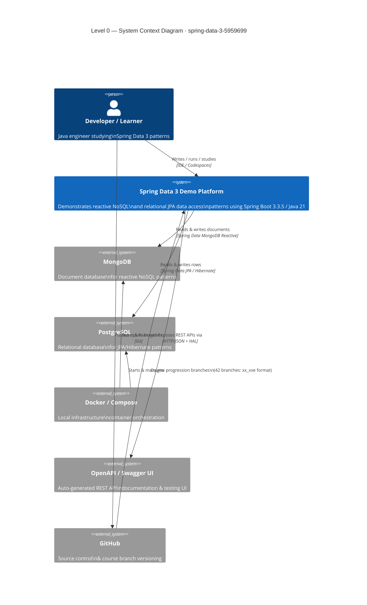
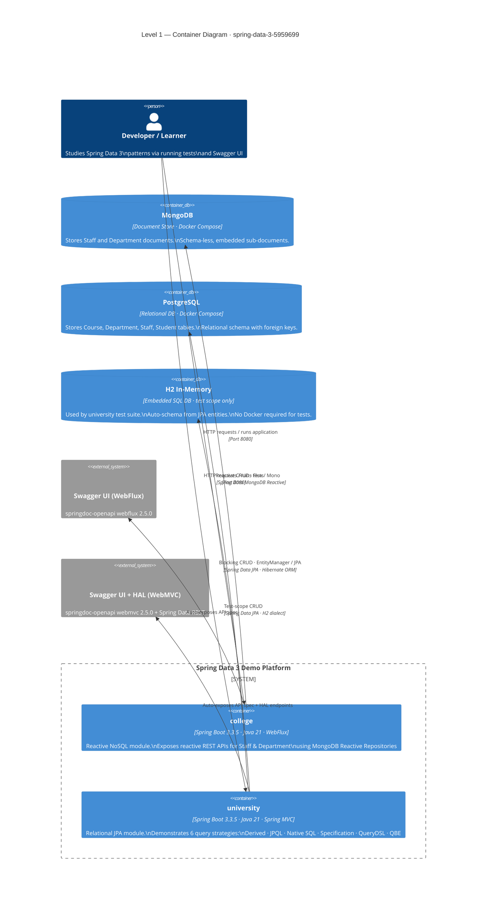
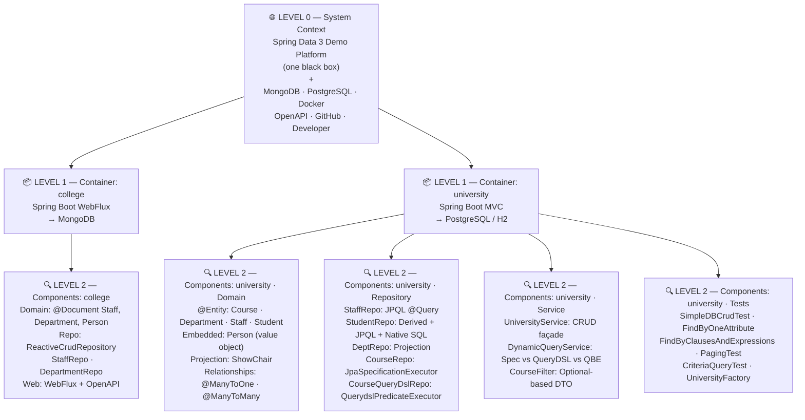

# C4 Architecture Diagrams — `spring-data-3-5959699`

> Multi-level architecture following the **C4 Model** (Context → Container → Component).  
> Each level zooms in from the previous, providing increasing detail about the system.

---

## Diagram Level Map

```
┌─────────────────────────────────────────────────────────────────┐
│  LEVEL 0 — System Context    (Who uses it? What does it touch?) │
│     ↓  zoom in                                                   │
│  LEVEL 1 — Container         (What Spring Boot apps + DBs?)     │
│     ↓  zoom in                                                   │
│  LEVEL 2 — Component         (Layers, repos, services, tests)   │
│             → See ARCHITECTURE_DIAGRAM.md                        │
└─────────────────────────────────────────────────────────────────┘
```

---

## Level 0 — System Context Diagram

> **Scope:** The entire demo platform as a single black box.  
> Shows: who interacts with it, and which external systems it depends on.



### Level 0 — Element Descriptions

| Element | Type | Description |
|---|---|---|
| **Developer / Learner** | Person | Primary user — a Java engineer working through the LinkedIn Learning course or referencing patterns |
| **Spring Data 3 Demo Platform** | System (ours) | Two Spring Boot 3.3.5 / Java 21 applications demonstrating data access patterns |
| **MongoDB** | External System | Document store used by the `college` module; managed via Docker Compose |
| **PostgreSQL** | External System | Relational DB used by the `university` module (runtime); managed via Docker Compose |
| **Docker / Compose** | External System | Infrastructure orchestrator that starts MongoDB and PostgreSQL locally |
| **OpenAPI / Swagger UI** | External System | Auto-generated API documentation exposed by both modules via springdoc-openapi 2.5.0 |
| **GitHub** | External System | Hosts 42 course-progression branches (`06_03e` = chapter 6, lesson 3, end state) |

---

## Level 1 — Container Diagram

> **Scope:** Inside the Spring Data 3 Demo Platform.  
> Shows: the two Spring Boot containers, their databases, and how they relate.



### Level 1 — Container Descriptions

| Container | Technology | Responsibility | Port |
|---|---|---|---|
| **college** | Spring Boot WebFlux + Spring Data MongoDB Reactive | Reactive, non-blocking REST API; demonstrates `ReactiveCrudRepository`, `Flux`/`Mono` return types, MongoDB `@Query` JSON syntax | 8080 |
| **university** | Spring Boot MVC + Spring Data JPA + QueryDSL | Blocking REST API; demonstrates 6 query strategies, Spring Data REST HAL exposure, JPA entity relationships | 8080 |
| **MongoDB** | MongoDB (Docker Compose) | Persists `Staff` and `Department` documents; schema-free, sub-document embedding | 27017 |
| **PostgreSQL** | PostgreSQL (Docker Compose) | Persists `Course`, `Department`, `Staff`, `Student` tables; relational integrity via FK constraints | 5432 |
| **H2 In-Memory** | H2 (test scope) | Lightweight in-memory DB for the `university` test suite; no infrastructure required | — |
| **Swagger UI (WebFlux)** | springdoc-openapi-starter-webflux-ui 2.5.0 | Auto-generated OpenAPI spec UI for `college` module | 8080/swagger-ui |
| **Swagger UI + HAL** | springdoc-openapi-starter-webmvc-ui 2.5.0 + Spring Data REST | Auto-generated OpenAPI spec + HAL browser for `university` module | 8080/swagger-ui |

---

## Level 0 → Level 1 → Level 2 Mapping



### Cross-Level Traceability Table

| Level 0 Element | Level 1 Container | Level 2 Component | Source File(s) |
|---|---|---|---|
| Spring Data 3 Demo Platform | `college` | `CollegeApplication` | `CollegeApplication.java` |
| Spring Data 3 Demo Platform | `university` | `UniversityApplication` | `UniversityApplication.java` |
| MongoDB | `college` → MongoDB | `StaffRepo`, `DepartmentRepo` (ReactiveCrudRepository) | `repo/StaffRepo.java`, `repo/DepartmentRepo.java` |
| MongoDB | `college` → MongoDB | `Staff @Document`, `Department @Document`, `Person` value object | `domain/Staff.java`, `domain/Department.java`, `domain/Person.java` |
| PostgreSQL | `university` → PostgreSQL | `StaffRepo`, `StudentRepo`, `DepartmentRepo`, `CourseRepo`, `CourseQueryDslRepo` | `repo/*.java` |
| PostgreSQL | `university` → PostgreSQL | `Course @Entity`, `Department @Entity`, `Staff @Entity`, `Student @Entity` | `domain/*.java` |
| H2 In-Memory | `university` (test) | All 5 test classes + `UniversityFactory` | `test/dao/*.java` |
| OpenAPI / Swagger UI | `college` Swagger | WebFlux UI via springdoc | `pom.xml` + auto-config |
| OpenAPI / Swagger UI + HAL | `university` Swagger + REST | Spring Data REST `@RepositoryRestResource` on `StaffRepo` | `repo/StaffRepo.java` |
| Docker / Compose | `college` → `compose.yaml` | Docker Compose file starts MongoDB | `college/compose.yaml` |
| Docker / Compose | `university` → `docker-compose.yml` | Docker Compose file starts PostgreSQL; schema from `postgres/schema.sql` | `university/docker-compose.yml` |
| GitHub | All | 42 course branches (`xx_xxe` naming = chapter_lesson_end) | `.git/` |

---

## Architecture Decision Records (Key Choices)

| Decision | Choice | Rationale |
|---|---|---|
| **Two separate modules** | `college` (Reactive) vs `university` (Blocking) | Explicitly contrasts reactive vs. blocking paradigms for educational clarity |
| **ReactiveCrudRepository** in college | Non-blocking `Flux`/`Mono` return types | Demonstrates Project Reactor + MongoDB reactive driver integration |
| **JpaSpecificationExecutor** in university | Inline lambda `Predicate` building | Type-safe dynamic queries without a separate DSL dependency |
| **QueryDSL with APT codegen** | Generated `Q`-types (`QCourse`, `QStudent`, etc.) | Compile-time safe dynamic query composition via `BooleanBuilder` |
| **Query by Example (QBE)** | `Example.of(entity)` | Simplest dynamic query approach — illustrates tradeoff vs. Specification/QueryDSL |
| **Spring Data REST** | `@RepositoryRestResource` on `StaffRepo` | Zero-code HAL-compliant REST endpoint exposure |
| **H2 for tests** | `scope=test` in `pom.xml` | Eliminates Docker dependency in test pipeline; fast in-memory execution |
| **Java 21** | LTS release | Enables future use of Records, Virtual Threads, Sealed Classes |

---

> **See also:**
> - [ARCHITECTURE_DIAGRAM.md](./ARCHITECTURE_DIAGRAM.md) — Full Level 2 component diagrams with all layers  
> - [REPOSITORY_SUMMARY.md](./REPOSITORY_SUMMARY.md) — Tabular summary with architectural observations

*Generated on 2026-03-03 by GitHub Copilot — [LinkedInLearning/spring-data-3-5959699](https://github.com/LinkedInLearning/spring-data-3-5959699)*
