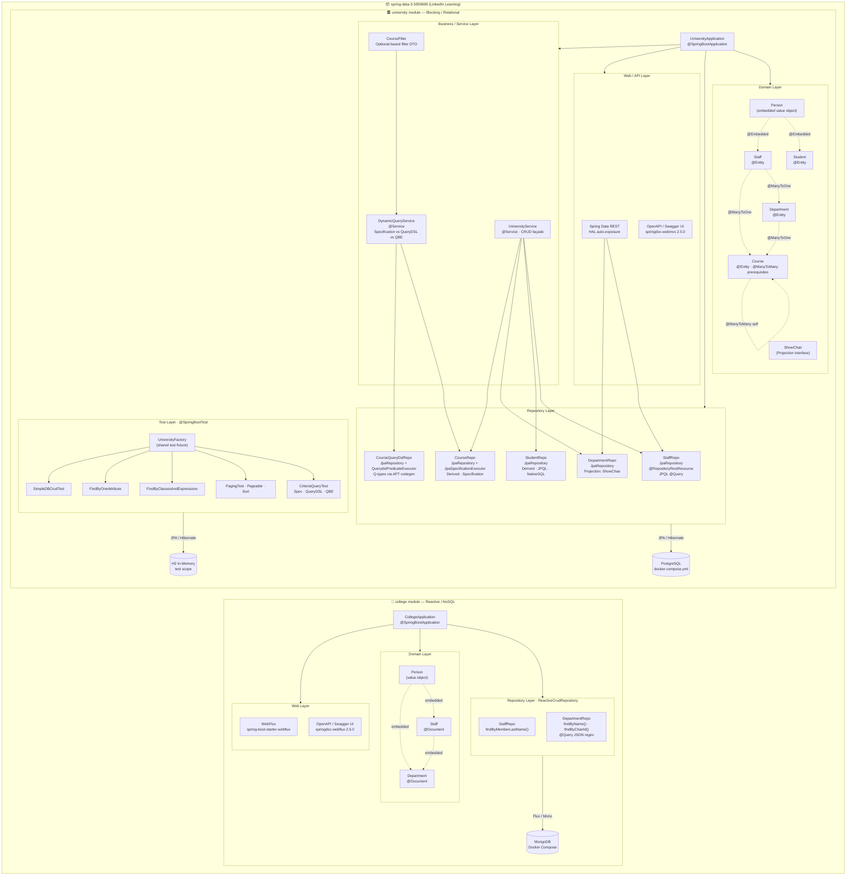
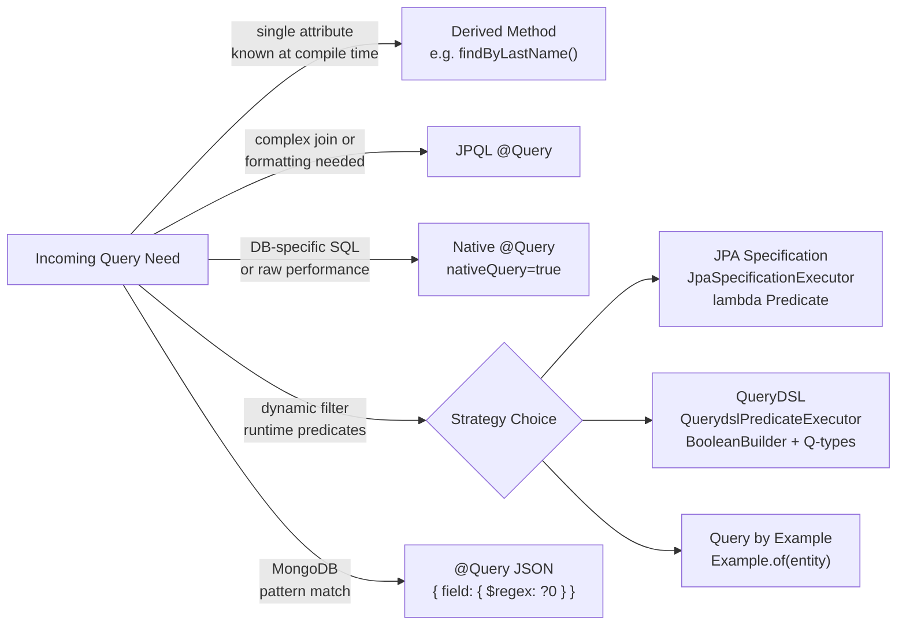

# Overall Architecture Diagram — `spring-data-3-5959699`

> Visual overview of both modules, all layers, relationships, query strategies, and infrastructure.  
> Source: [LinkedInLearning/spring-data-3-5959699](https://github.com/LinkedInLearning/spring-data-3-5959699)

---

---

## Layer Legend

| Layer | college | university |
|---|---|---|
| **Entry Point** | `CollegeApplication` | `UniversityApplication` |
| **Domain** | `@Document` (MongoDB) | `@Entity` (JPA/Jakarta) |
| **Repository** | `ReactiveCrudRepository` | `JpaRepository` + Specification + QueryDSL |
| **Service** | — | `UniversityService`, `DynamicQueryService` |
| **Web/API** | WebFlux + OpenAPI | Spring Data REST + Spring MVC + OpenAPI |
| **Database (runtime)** | MongoDB via Docker Compose | PostgreSQL via Docker Compose |
| **Database (test)** | — | H2 in-memory |
| **Tests** | None | 5 test classes + factory |

## Query Strategy Flow

---

*Generated on 2026-03-03 by GitHub Copilot — architectural analysis of [LinkedInLearning/spring-data-3-5959699](https://github.com/LinkedInLearning/spring-data-3-5959699)*
