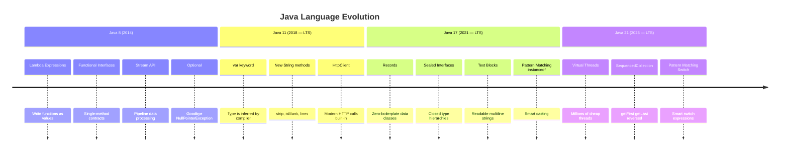
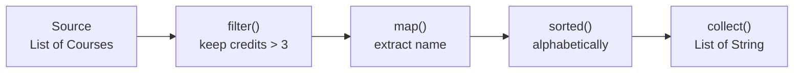
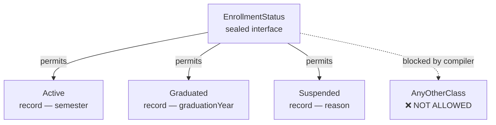
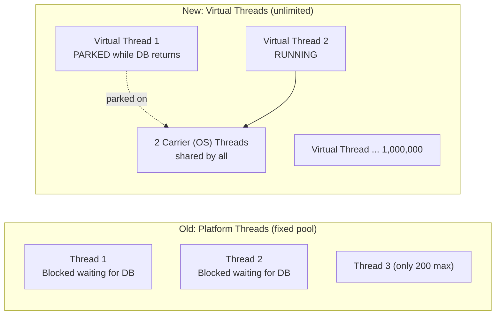
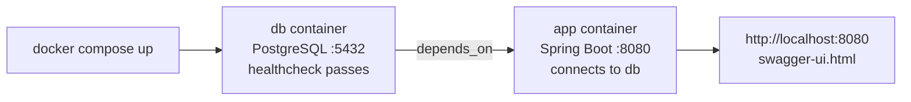
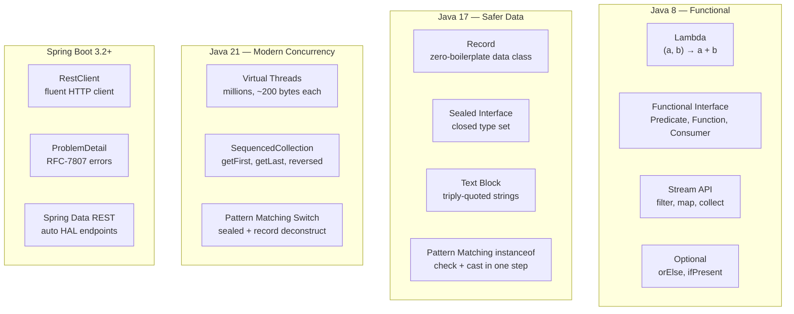

# Java & Spring — Modern Features Guide

> **Who this is for:** Anyone from a curious 8th grader to a working developer.  
> Every feature is explained with a real-world analogy, a "before vs after" code comparison,  
> and a live example from **this exact project** so you can run it yourself.

---

## Table of Contents

| Java Version | Features Covered |
|---|---|
| [Java 8](#java-8-the-big-leap-forward) | Lambda, Functional Interface, Streams, Optional |
| [Java 11](#java-11-cleaner-code-and-microservices-ready) | `var`, String helpers, `HttpClient`, HTTP/2 |
| [Java 17](#java-17-safer-and-more-expressive-code) | Records, Sealed Interfaces, Text Blocks, Pattern Matching `instanceof` |
| [Java 21](#java-21-the-concurrency-revolution) | Virtual Threads, `SequencedCollection`, Pattern Matching Switch |
| [Spring Boot 3.2+](#spring-boot-32-framework-features) | `RestClient`, `ProblemDetail` RFC-7807, Spring Data REST |
| [Docker & Cloud Native](#docker--cloud-native-packaging) | Containers, multi-stage Dockerfile, Docker Compose |

---

## The Big Picture — How Versions Built on Each Other



---

## Java 8 — The Big Leap Forward

> **The big idea:** Before Java 8, writing code was very verbose. Java 8 let you write shorter, cleaner code by treating **functions as values** — like handing someone a recipe card instead of reading the entire recipe out loud every time.

---

### Feature 1: Lambda Expressions 🎯

**Analogy:** Imagine a vending machine. The old way required you to hire a full employee to press one button. A lambda is a sticky note that says "just press button 3" — compact and reusable.

**Before Java 8 (verbose):**
```java
// You had to create a whole anonymous class just to define one comparison
Comparator<String> byLength = new Comparator<String>() {
    @Override
    public int compare(String a, String b) {
        return Integer.compare(a.length(), b.length());
    }
};
```

**After Java 8 (lambda):**
```java
// Same thing in ONE line
Comparator<String> byLength = (a, b) -> Integer.compare(a.length(), b.length());
```

**Anatomy of a lambda:**
```
(a, b)  ->  Integer.compare(a.length(), b.length())
  ↑              ↑
parameters     body (what to do with the parameters)
```

**Live in this project (`DynamicQueryService.java`):**
```java
// A lambda IS a Specification — (root, query, cb) are parameters, the { } block is the body
courseRepo.findAll((root, query, cb) -> {
    List<Predicate> predicates = new ArrayList<>();
    filter.getCredits().ifPresent(c ->          // ← another lambda!
        predicates.add(cb.equal(root.get("credits"), c)));
    return cb.and(predicates.toArray(new Predicate[0]));
});
```

---

### Feature 2: Functional Interfaces 📋

**Analogy:** A functional interface is like a job description with exactly **one job** — "your only job is to press the button." Java 8 has built-in job descriptions: `Runnable` (run something), `Predicate` (test something), `Function` (transform something), `Consumer` (use something).

**The four most important ones:**

```java
// Predicate<T>: takes one thing, returns true or false — "is this a match?"
Predicate<String> isLong = s -> s.length() > 5;
System.out.println(isLong.test("Java"));     // false
System.out.println(isLong.test("Programming")); // true

// Function<T, R>: takes one thing, returns another — "transform this"
Function<String, Integer> strToLen = s -> s.length();
System.out.println(strToLen.apply("Hello")); // 5

// Consumer<T>: takes one thing, returns nothing — "do something with this"
Consumer<String> printer = s -> System.out.println(">> " + s);
printer.accept("Learning Java 8");  // >> Learning Java 8

// Supplier<T>: takes nothing, returns something — "produce a value"
Supplier<String> greeting = () -> "Hello, World!";
System.out.println(greeting.get()); // Hello, World!
```

**Live in this project — `CourseFilter.java`:**
```java
// Optional.ifPresent() takes a Consumer<T> — runs the lambda only if value exists
filter.getDepartment().ifPresent(d ->      // Consumer: d → add predicate
    parts.add("department='" + d.getName() + "'"));
```

---

### Feature 3: Stream API 🌊

**Analogy:** Imagine a water pipe with filters. You pour water in one end (a list of data), attach filters along the pipe (operations like filter/map/sort), and collect clean water at the end (the result). Each filter only processes what passes through — nothing is wasted.



**Key stream operations:**

```java
List<Course> courses = courseRepo.findAll();

// filter() — keep only matching elements
List<Course> hardCourses = courses.stream()
    .filter(c -> c.getCredits() > 3)        // keep only 4+ credit courses
    .collect(Collectors.toList());

// map() — transform each element into something else
List<String> names = courses.stream()
    .map(Course::getName)                   // Course → String (method reference)
    .collect(Collectors.toList());

// sorted() — sort by a rule
List<Course> sorted = courses.stream()
    .sorted(Comparator.comparing(Course::getCredits).reversed())
    .collect(Collectors.toList());

// forEach() — do something with each element (terminal, produces nothing)
courses.stream()
    .filter(c -> c.getCredits() >= 3)
    .forEach(c -> System.out.println(c.getName()));

// count() — how many match?
long totalHard = courses.stream()
    .filter(c -> c.getCredits() > 3)
    .count();

// findFirst() — get the first match
Optional<Course> first = courses.stream()
    .filter(c -> c.getName().startsWith("English"))
    .findFirst();
```

**Two categories of operations:**

| Category | Examples | Returns | Notes |
|---|---|---|---|
| **Intermediate** (lazy) | `filter()`, `map()`, `sorted()`, `distinct()`, `limit()` | Another Stream | Nothing happens until a terminal runs |
| **Terminal** (eager) | `collect()`, `count()`, `forEach()`, `findFirst()`, `anyMatch()` | A value or void | Triggers the whole pipeline |

---

### Feature 4: Optional — Goodbye NullPointerException 📦

**Analogy:** `Optional` is like a gift box. The box might have something inside, or it might be empty. Before Optional, you'd open the box without checking and get cut when it was empty (NullPointerException). Optional forces you to check first.

```java
// Old way — NullPointerException waiting to happen
String name = user.getAddress().getCity().toUpperCase(); // 💥 if any is null

// New way with Optional — safe chain
String city = Optional.ofNullable(user)
    .map(User::getAddress)
    .map(Address::getCity)
    .map(String::toUpperCase)
    .orElse("UNKNOWN");           // safe default if anything was null
```

**Live in this project — `CourseFilter.java`:**
```java
// Fields are Optional — empty means "don't filter by this"
private Optional<Department> department = Optional.empty();
private Optional<Integer>    credits    = Optional.empty();
private Optional<Staff>      instructor = Optional.empty();

// Usage — only add to the query if the value is present
filter.getCredits().ifPresent(c ->          // ifPresent: runs only if credits is set
    predicates.add(cb.equal(root.get("credits"), c)));

// orElse — give a default if the Optional is empty
Integer credits = filter.getCredits().orElse(null);
```

| Optional method | What it does |
|---|---|
| `Optional.of(x)` | Wraps `x` — throws if `x` is null |
| `Optional.ofNullable(x)` | Wraps `x` — empty if `x` is null |
| `Optional.empty()` | An empty box |
| `.isPresent()` | Is there something inside? |
| `.get()` | Get the value (throws if empty — use sparingly) |
| `.orElse(default)` | Get the value, or a default |
| `.ifPresent(lambda)` | Run a lambda only if value exists |
| `.map(function)` | Transform the value if present |

---

## Java 11 — Cleaner Code and Microservices-Ready

> **The big idea:** Java 11 cleaned up everyday annoyances — fewer words to type, better strings, and a built-in HTTP client good enough for microservice calls.

---

### Feature 5: `var` — Type Inference 🔍

**Analogy:** Instead of saying "I am putting a bright red apple in the basket," you can say "I'm putting *it* in the basket." The compiler already knows it's an apple because it can see what you're doing.

```java
// Before var (Java 10 and earlier)
List<String>                 names     = new ArrayList<>();
Map<String, List<Integer>>   scores    = new HashMap<>();
UniversityService            service   = new UniversityService(...);

// After var — compiler infers the type from the right side
var names   = new ArrayList<String>();          // type: ArrayList<String>
var scores  = new HashMap<String, List<Integer>>();
var service = new UniversityService(...);
```

> **Rule:** `var` only works for **local variables** (inside methods). You still need explicit types for method parameters and return types.

**Live in this project (`DynamicQueryService.java`):**
```java
// var infers ArrayList<String>
var parts = new ArrayList<String>();
```

---

### Feature 6: New String Methods 🧵

**Analogy:** Java 11 added useful tools to the String toolbox that should have been there all along.

```java
// isBlank() — true if empty or only whitespace (better than isEmpty())
"   ".isBlank()   // → true
"Hi".isBlank()    // → false

// strip() — removes leading & trailing whitespace (Unicode-aware, better than trim())
"  hello  ".strip()       // → "hello"
"  hello  ".stripLeading() // → "hello  "
"  hello  ".stripTrailing() // → "  hello"

// lines() — split a multiline string into a Stream of lines
"line1\nline2\nline3".lines()
    .forEach(System.out::println);

// repeat() — repeat a string N times
"ha".repeat(3)   // → "hahaha"

// You can chain these
String input = "  Welcome to Java 11.  ";
input.strip().toLowerCase().replace(".", "!"); // → "welcome to java 11!"
```

---

### Feature 7: `HttpClient` — Built-in HTTP Calls 🌐

> **Context for microservices:** In a microservice architecture, services talk to each other over HTTP. Java 11 added `HttpClient` so you no longer need a third-party library just to make an HTTP call.

**Analogy:** Before Java 11, making an HTTP call was like building your own phone to make a phone call. Java 11 gave you a phone.

```java
// Java 11 HttpClient — send an HTTP GET request
HttpClient client = HttpClient.newHttpClient();

HttpRequest request = HttpRequest.newBuilder()
    .uri(URI.create("https://openlibrary.org/search.json?title=Java"))
    .GET()
    .header("Accept", "application/json")
    .build();

HttpResponse<String> response = client.send(request,
    HttpResponse.BodyHandlers.ofString());

System.out.println("Status: " + response.statusCode()); // 200
System.out.println("Body: "   + response.body());       // raw JSON
```

**Live in this project — Spring Boot 3.2+ `RestClient` (the modern evolution):**
```java
// Spring's RestClient (Spring Boot 3.2+) is the fluent upgrade over both
// Java 11 HttpClient and the old RestTemplate
private final RestClient restClient = restClientBuilder
    .baseUrl("https://openlibrary.org")
    .build();

// Usage in CourseController.getExternalLibraryInfo()
return restClient.get()
    .uri("/search.json?title={topic}&limit=1", topic)
    .retrieve()
    .body(String.class);
```

| Feature | Java 11 `HttpClient` | Spring `RestClient` (Boot 3.2+) |
|---|---|---|
| Sync call | `client.send(req, handler)` | `.retrieve().body(Type.class)` |
| Async call | `client.sendAsync(req, handler)` | `.retrieve().toMono(Type.class)` |
| JSON deserialization | Manual (use Jackson) | Auto (Spring Boot configures Jackson) |
| Base URL | Repeat per request | Set once in builder |
| Error handling | Manual status check | `onStatus()` hooks |

---

## Java 17 — Safer and More Expressive Code

> **The big idea:** Java 17 gave us tools to say exactly what we mean about our data — and to prevent misuse at compile time rather than at runtime.

---

### Feature 8: Records — Zero-Boilerplate Data Classes 🗂️

**Analogy:** Before records, creating a simple "name tag" (a class that just holds a first and last name) required 30+ lines: constructor, getters, `equals()`, `hashCode()`, `toString()`. A Java record does all that in **one line**.

**Before records:**
```java
// 40 lines of boilerplate for a simple value object
public class Person {
    private final String firstName;
    private final String lastName;

    public Person(String firstName, String lastName) {
        this.firstName = firstName;
        this.lastName  = lastName;
    }
    public String getFirstName() { return firstName; }
    public String getLastName()  { return lastName; }

    @Override
    public boolean equals(Object o) {
        if (this == o) return true;
        if (!(o instanceof Person p)) return false;
        return Objects.equals(firstName, p.firstName) &&
               Objects.equals(lastName,  p.lastName);
    }
    @Override
    public int hashCode() { return Objects.hash(firstName, lastName); }
    @Override
    public String toString() {
        return "Person[firstName=" + firstName + ", lastName=" + lastName + "]";
    }
}
```

**After records (Java 17):**
```java
// ONE line replaces all 40 lines above — compiler generates everything
public record Person(String firstName, String lastName) {}
```

**What the compiler auto-generates for you:**

| Generated item | What it does | In the old class |
|---|---|---|
| Constructor | `new Person("Jane", "Doe")` | 6 lines |
| Accessors | `p.firstName()` · `p.lastName()` | 2 getter methods |
| `equals()` | Two `Person` objects are equal if all fields are equal | 8 lines |
| `hashCode()` | Consistent hash based on field values | 3 lines |
| `toString()` | `Person[firstName=Jane, lastName=Doe]` | 5 lines |

**Live in this project — `Person.java`:**
```java
@Embeddable  // tells JPA: embed these columns into the owning table
public record Person(
    @Column(name = "first_name") String firstName,
    @Column(name = "last_name")  String lastName
) {}

// Usage — accessor methods match the record component name exactly
Person p = new Person("Rosalind", "Franklin");
p.firstName();  // → "Rosalind"  (NOT getFirstName()!)
p.lastName();   // → "Franklin"

// Equality is value-based automatically
Person p1 = new Person("Alan", "Turing");
Person p2 = new Person("Alan", "Turing");
p1.equals(p2); // → true  (same values = equal, even though different objects)
```

---

### Feature 9: Sealed Interfaces — Closed Type Hierarchies 🔒

**Analogy:** A normal interface is like an "open club" — anyone can join. A sealed interface is a **VIP club** — only the types you name in `permits` can implement it. The bouncer (compiler) rejects everyone else.

**Why does this matter?** When you know every possible type, the compiler can check that a `switch` handles all of them — no forgotten cases, no hidden bugs.

**Before sealed interfaces:**
```java
interface Shape {}
class Circle    implements Shape { double radius; }
class Rectangle implements Shape { double w, h; }
class Triangle  implements Shape { double a, b, c; }
// Anyone could also write: class Star implements Shape { ... }
// There is no way to prevent it or guarantee all types are handled
```

**After Java 17 sealed interfaces:**
```java
// Only these three are allowed — the compiler enforces it
public sealed interface Shape
    permits Shape.Circle, Shape.Rectangle, Shape.Triangle {

    record Circle(double radius)             implements Shape {}
    record Rectangle(double width, double height) implements Shape {}
    record Triangle(double a, double b, double c) implements Shape {}
}
```

**Live in this project — `EnrollmentStatus.java`:**
```java
// A student can ONLY be in one of these 3 states — no others allowed
public sealed interface EnrollmentStatus
    permits EnrollmentStatus.Active,
            EnrollmentStatus.Graduated,
            EnrollmentStatus.Suspended {

    record Active(String semester)       implements EnrollmentStatus {}
    record Graduated(int graduationYear) implements EnrollmentStatus {}
    record Suspended(String reason)      implements EnrollmentStatus {}
}
```



---

### Feature 10: Text Blocks — Readable Multi-line Strings 📝

**Analogy:** Before text blocks, writing a multi-line SQL query in Java was like reading a sentence where\nevery line end\nhad a backslash\nand quotes. Text blocks let you just write it normally.

**Before text blocks:**
```java
@Query("SELECT c " +
       "FROM   Course c " +
       "WHERE  c.credits = :credits " +
       "ORDER  BY c.name ASC")
List<Course> findByCredits(int credits);
```

**After Java 17 text blocks:**
```java
// Reads exactly like real JPQL — no plus signs, no escaped quotes
@Query("""
        SELECT c
        FROM   Course c
        WHERE  c.credits = :credits
        ORDER  BY c.name ASC
        """)
List<Course> findByCredits(int credits);
```

**Live in this project — `CourseRepo.java`, `StudentRepo.java`:**
```java
// StudentRepo.java — text block keeps the query readable
@Query("""
        SELECT s
        FROM   Student s
        WHERE  s.age < :age
        ORDER  BY s.age ASC
        """)
List<Student> findYoungerThan(int age);

// More complex — nested path traversal in JPQL
@Query("""
        SELECT c
        FROM   Course c
        WHERE  c.department.chair.member.lastName = :chair
        """)
List<Course> findByDepartmentChairMemberLastName(String chair);
```

**Text blocks also work perfectly for JSON:**
```java
String json = """
        {
            "name": "Java Programming",
            "credits": 4,
            "department": "Natural Sciences"
        }
        """;
```

---

### Feature 11: Pattern Matching for `instanceof` 🎯

**Analogy:** Old Java was like a security guard who checks your ID, then makes you show it again to get into the building. Pattern matching checks your ID and walks you straight in — one step.

**Before Java 17:**
```java
// Two-step: check the type, THEN cast (redundant!)
if (filterObject instanceof CourseFilter) {
    CourseFilter cf = (CourseFilter) filterObject;  // ← why cast again?
    System.out.println(cf.getCredits());
}
```

**After Java 17:**
```java
// One step: check AND bind in the same expression
if (filterObject instanceof CourseFilter cf) {
    // 'cf' is already a CourseFilter — no separate cast needed
    System.out.println(cf.getCredits());
}
```

**Live in this project — `DynamicQueryService.java`:**
```java
public String describeFilter(Object filterObject) {
    // Java 17: if it IS a CourseFilter, bind it to 'cf' automatically
    if (filterObject instanceof CourseFilter cf) {
        var parts = new ArrayList<String>();
        cf.getDepartment().ifPresent(d -> parts.add("department='" + d.getName() + "'"));
        cf.getCredits().ifPresent(c    -> parts.add("credits=" + c));
        return parts.isEmpty() ? "(no active filters)" : String.join(", ", parts);
    }
    // Not a CourseFilter — safe fallback
    return "Unknown filter type: " + filterObject.getClass().getSimpleName();
}
```

---

## Java 21 — The Concurrency Revolution

> **The big idea:** Java 21 solved two long-standing problems: handling massive user load cheaply (Virtual Threads) and making complex switch logic safe and expressive (Pattern Matching Switch).

---

### Feature 12: Virtual Threads — Handle Millions of Users 🧵

**Analogy:**  
- **Old way (Platform threads):** Imagine a restaurant with exactly 200 waiters. Each waiter serves one table at a time. If a customer takes 5 minutes to decide, the waiter stands there waiting — doing nothing.  
- **Virtual threads:** The same restaurant, but now each waiter can serve multiple tables. While one customer thinks, the waiter goes and helps another table. The total number of customers served explodes.



**How cheap are virtual threads?**

| Metric | Platform Thread | Virtual Thread |
|---|---|---|
| Memory per thread | ~1 MB stack | ~200 bytes |
| Max practical count | ~2,000 | Millions |
| Creation time | Expensive | Near-free |
| Blocking I/O | Wastes the OS thread | Parks virtual thread; OS thread freed |

**Enabling virtual threads in this project — `application.properties`:**
```properties
# ONE LINE — Spring Boot 3.2+ replaces the Tomcat thread pool with virtual threads
spring.threads.virtual.enabled=true
```

That single line means: every HTTP request to your app now runs on its own virtual thread. If you get 50,000 simultaneous requests, that's 50,000 virtual threads — no problem. With platform threads, you'd be stuck at ~200 concurrent requests before users start seeing slowdowns.

**Verify virtual threads are active (in test code):**
```java
Thread.ofVirtual().start(() -> {
    System.out.println("Is virtual: " + Thread.currentThread().isVirtual()); // → true
});
```

---

### Feature 13: `SequencedCollection` — Ordered Collections 📋

**Analogy:** Before Java 21, getting the first item in a list was `list.get(0)` — which looks like a mystery number. Getting the last item was `list.get(list.size() - 1)` — awkward. Java 21 added cleaner methods that say exactly what you mean.

**The three new operations:**

```java
List<String> courses = List.of("Anthropology", "Chemistry", "Java Programming");

// Java 21 — readable first/last access
courses.getFirst();    // → "Anthropology"       (was: courses.get(0))
courses.getLast();     // → "Java Programming"   (was: courses.get(courses.size()-1))
courses.reversed();    // → ["Java Programming", "Chemistry", "Anthropology"]
                       //    (was: Collections.reverse(copy) — mutated the list!)
```

**Key difference: `reversed()` does NOT mutate the original:**
```java
List<Course> original = courseRepo.findAll();    // [A, B, C, D, E]
var reversed = original.reversed();              // view: [E, D, C, B, A]
// original is still [A, B, C, D, E] — unchanged!
```

**Live in this project — `UniversityService.java`:**
```java
// findCoursesReversed() — returns a reversed view without mutating
public SequencedCollection<Course> findCoursesReversed() {
    List<Course> all = courseRepo.findAll();
    return all.reversed();   // Java 21 — non-destructive reversed view
}

// findFirstCourse() — uses getFirst() instead of get(0)
public Course findFirstCourse() {
    List<Course> sorted = courseRepo.findAll(Sort.by("name"));
    return sorted.getFirst(); // Java 21 — self-documenting
}

// findLastCourse() — uses getLast() instead of get(size-1)
public Course findLastCourse() {
    List<Course> sorted = courseRepo.findAll(Sort.by("name"));
    return sorted.getLast();  // Java 21 — self-documenting
}
```

---

### Feature 14: Pattern Matching Switch — Smart Switch on Types 🔀

**Analogy:** Old switch could only match exact values, like "if the number is exactly 3." Pattern matching switch can match shapes: "if it's a circle, use `π × r²`; if it's a rectangle, use `w × h`." It matches the TYPE and unpacks the data in one step.

**The combination: Sealed interface + Records + Pattern Matching Switch = compiler-enforced safety:**

```java
// Because EnrollmentStatus is sealed (only 3 types possible),
// the switch is EXHAUSTIVE — no default branch needed!
// Adding a 4th type to the sealed interface would cause a COMPILE ERROR here.
public String describeEnrollment(EnrollmentStatus status) {
    return switch (status) {
        //                           ↓ record component is destructured automatically
        case EnrollmentStatus.Active    s -> "Enrolled in semester: " + s.semester();
        case EnrollmentStatus.Graduated s -> "Graduated in " + s.graduationYear();
        case EnrollmentStatus.Suspended s -> "Suspended — reason: " + s.reason();
        // No 'default' needed — compiler verified all 3 cases are covered
    };
}
```

**Before Java 21 (the old way):**
```java
// Wordy, fragile, easy to forget a case
public String describeEnrollment(EnrollmentStatus status) {
    if (status instanceof EnrollmentStatus.Active) {
        EnrollmentStatus.Active active = (EnrollmentStatus.Active) status;  // redundant cast
        return "Enrolled in semester: " + active.semester();
    } else if (status instanceof EnrollmentStatus.Graduated) {
        EnrollmentStatus.Graduated grad = (EnrollmentStatus.Graduated) status;
        return "Graduated in " + grad.graduationYear();
    } else if (status instanceof EnrollmentStatus.Suspended) {
        EnrollmentStatus.Suspended sus = (EnrollmentStatus.Suspended) status;
        return "Suspended — " + sus.reason();
    } else {
        throw new IllegalStateException("Forgot a case!");  // easy to hit at runtime
    }
}
```

**Live in this project — `UniversityService.java`:**
```java
// The full method — notice how compact and readable it is
public String describeEnrollment(EnrollmentStatus status) {
    return switch (status) {
        case EnrollmentStatus.Active    s -> "Currently enrolled in semester: " + s.semester();
        case EnrollmentStatus.Graduated s -> "Graduated in " + s.graduationYear();
        case EnrollmentStatus.Suspended s -> "Suspended — reason: " + s.reason();
    };
}
```

**Try it via the live API:**
```bash
# The /api/courses endpoints use UniversityService which uses describeEnrollment internally
# When the app is running:
curl http://localhost:8080/api/courses
```

---

## Spring Boot 3.2+ — Framework Features

---

### Feature 15: `RestClient` — Fluent HTTP Calls 📡

**Analogy:** The old `RestTemplate` (from Spring 3) was like a fax machine — functional but clunky. `RestClient` is like a modern chat app — clean, readable, chainable.

**Old way (`RestTemplate`):**
```java
RestTemplate rt = new RestTemplate();
String result = rt.getForObject(
    "https://openlibrary.org/search.json?title={topic}&limit=1",
    String.class,
    topic
);
```

**New way (`RestClient`, Spring Boot 3.2+):**
```java
// Set up once (in constructor)
private final RestClient restClient = restClientBuilder
    .baseUrl("https://openlibrary.org")
    .build();

// Use anywhere — chainable, readable
String result = restClient.get()
    .uri("/search.json?title={topic}&limit=1", topic)
    .retrieve()
    .body(String.class);
```

**Live in this project — `CourseController.java`:**
```java
// Try it:  GET /api/courses/external/Java
@GetMapping("/external/{topic}")
public String getExternalLibraryInfo(@PathVariable String topic) {
    return restClient.get()
            .uri("/search.json?title={topic}&limit=1", topic)
            .retrieve()
            .body(String.class);
}
```

**Test it yourself:**
```bash
curl http://localhost:8080/api/courses/external/Java
```

---

### Feature 16: `ProblemDetail` — RFC 7807 Structured Errors 🚨

**Analogy:** Before ProblemDetail, every API returned errors in its own format — like every restaurant writing the bill in a different language. RFC 7807 standardises the format so every client knows what to expect.

**Old error response (inconsistent):**
```json
{ "error": "Not found", "code": 404 }
```

**New RFC 7807 `ProblemDetail` response (standardised):**
```json
{
  "type":      "https://api.university.example/errors/course-not-found",
  "title":     "Course Not Found",
  "status":    404,
  "detail":    "Course with ID 99 was not found.",
  "timestamp": "2026-03-03T10:30:00Z",
  "path":      "/api/courses/99"
}
```

**Live in this project — `GlobalExceptionHandler.java`:**
```java
@RestControllerAdvice  // watches ALL controllers
public class GlobalExceptionHandler {

    @ExceptionHandler(CourseNotFoundException.class)
    public ProblemDetail handleCourseNotFound(CourseNotFoundException ex,
                                               HttpServletRequest request) {
        ProblemDetail problem = ProblemDetail
            .forStatusAndDetail(HttpStatus.NOT_FOUND, ex.getMessage());

        problem.setTitle("Course Not Found");
        problem.setType(URI.create("https://api.university.example/errors/course-not-found"));
        problem.setProperty("timestamp", Instant.now().toString());
        problem.setProperty("path",      request.getRequestURI());
        return problem;
    }
}
```

**Enable in `application.properties`:**
```properties
spring.mvc.problemdetails.enabled=true
```

**Test it yourself:**
```bash
curl http://localhost:8080/api/courses/99999
# Returns JSON with type, title, status, detail — not an HTML error page
```

---

### Feature 17: Spring Data REST — Auto-HAL Endpoints 🤖

**Analogy:** Normally you'd write a controller to expose database data over HTTP. Spring Data REST skips that — one annotation and your database is instantly accessible as a REST API, complete with navigation links.

```java
// CourseRepo.java — add ONE annotation
@RepositoryRestResource(collectionResourceRel = "courses", path = "courses")
public interface CourseRepo extends JpaRepository<Course, Integer> {}
```

That one annotation creates:
- `GET  /courses`         → list all courses (with pagination links)
- `GET  /courses/{id}`    → get one course
- `POST /courses`         → create a course
- `PUT  /courses/{id}`    → replace a course
- `DELETE /courses/{id}`  → delete a course

**The response format is HAL (Hypertext Application Language):**
```json
{
  "_embedded": {
    "courses": [
      { "id": 31, "name": "English 101", "credits": 3,
        "_links": { "self": { "href": "http://localhost:8080/courses/31" } }
      }
    ]
  },
  "_links": {
    "self":  { "href": "http://localhost:8080/courses" },
    "next":  { "href": "http://localhost:8080/courses?page=1" }
  }
}
```

**Test it yourself:**
```bash
curl http://localhost:8080/courses
curl http://localhost:8080/staff
curl "http://localhost:8080/departments?projection=showChair"
```

---

## Docker & Cloud Native Packaging

---

### Feature 18: Dockerfile — Packaging the App 📦

**Analogy:** Imagine you cooked a meal and want to ship it to a friend. A Dockerfile is the recipe for packaging the meal (your app) into a sealed container that contains everything needed — no "it works on my machine" problems.

**This project's Dockerfile uses a two-stage build:**

```dockerfile
# ── Stage 1: Build ────────────────────────────────────────────────────────────
# Use the full JDK + Maven image to compile the code into a JAR
FROM maven:3.9-eclipse-temurin-21 AS builder
WORKDIR /app
COPY pom.xml .
RUN mvn dependency:go-offline -q          # pre-download dependencies (cached layer)
COPY src ./src
RUN mvn package -DskipTests -q            # compile + package into a fat JAR

# ── Stage 2: Run ──────────────────────────────────────────────────────────────
# Use a TINY JRE-only image — no compiler, no Maven, no source code
FROM eclipse-temurin:21-jre-alpine        # alpine = minimal Linux (~5 MB)
WORKDIR /app
COPY --from=builder /app/target/*.jar app.jar   # copy ONLY the JAR
EXPOSE 8080
ENTRYPOINT ["java", "-jar", "app.jar"]
```

**Why two stages?**

| Stage 1 image | Stage 2 image |
|---|---|
| ~700 MB (JDK + Maven) | ~80 MB (JRE only) |
| Has full compiler | Only what's needed to run |
| Used during build | Used in production |

**The resulting image is small, secure, and ships everything the app needs.**

---

### Feature 19: Docker Compose — The Full Stack in One Command 🐳

**Analogy:** Running a full application is like running a restaurant — you need the kitchen (database), the dining room (app), and someone to start everything in the right order. Docker Compose is the restaurant manager.

**`compose.yaml` in this project:**
```yaml
services:

  db:                               # ← The kitchen (PostgreSQL)
    image: postgres:16
    environment:
      POSTGRES_USER: user
      POSTGRES_PASSWORD: pass
      POSTGRES_DB: catalog
    ports: ["5432:5432"]
    volumes:
      - ./postgres/schema.sql:/docker-entrypoint-initdb.d/schema.sql
    healthcheck:
      test: ["CMD-SHELL", "pg_isready -U user -d catalog"]
      interval: 10s                 # check every 10 seconds
      retries: 5

  app:                              # ← The dining room (Spring Boot)
    build: .                        # build from Dockerfile
    ports: ["8080:8080"]
    depends_on:
      db:
        condition: service_healthy  # wait for DB health check to pass first
```



**Commands:**
```bash
docker compose up --build     # build image + start everything
docker compose up db -d       # start only the database (background)
docker compose ps             # check status of all services
docker compose logs -f app    # follow live logs from the app
docker compose down           # stop everything
docker compose down -v        # stop everything AND wipe all data
```

---

## Feature Comparison Cheat Sheet



| Feature | Java Version | Complexity | Benefit |
|---|---|---|---|
| Lambda | 8 | ⭐ | Replace anonymous classes with one-liners |
| Functional Interface | 8 | ⭐⭐ | Standardised function contracts |
| Stream API | 8 | ⭐⭐ | Declarative data pipeline processing |
| Optional | 8 | ⭐ | Eliminate null pointer exceptions |
| `var` | 11 | ⭐ | Less typing, compiler infers types |
| Text Blocks | 17 | ⭐ | Readable multi-line strings (SQL, JSON) |
| Records | 17 | ⭐ | Replace 40-line boilerplate with 1 line |
| Sealed Interfaces | 17 | ⭐⭐ | Compiler-enforced type hierarchies |
| Pattern Matching `instanceof` | 17 | ⭐ | Check + cast in one expression |
| Virtual Threads | 21 | ⭐ (one config line) | Handle millions of concurrent users |
| `SequencedCollection` | 21 | ⭐ | Readable getFirst / getLast / reversed |
| Pattern Matching Switch | 21 | ⭐⭐ | Exhaustive switch with record deconstruct |
| `RestClient` | Spring Boot 3.2+ | ⭐ | Fluent, readable HTTP client |
| `ProblemDetail` | Spring Boot 3.2+ | ⭐⭐ | RFC-standard error responses |
| Spring Data REST | Spring Boot | ⭐ | Auto-generate REST API from repository |

---

## Try Every Feature Right Now

Start the app, then run these commands in order to see every feature live:

```bash
# Start the database
docker compose up db -d

# Start the app
./mvnw spring-boot:run
```

```bash
# Feature 13 — SequencedCollection reversed (Java 21)
curl http://localhost:8080/api/courses/reversed

# Feature 13 — SequencedCollection getFirst (Java 21)
curl http://localhost:8080/api/courses/first

# Feature 14 — Pattern Matching Switch via business logic
# (UniversityService.describeEnrollment runs during the test suite)

# Feature 16 — ProblemDetail RFC-7807 (try a missing course)
curl http://localhost:8080/api/courses/99999

# Feature 15 — RestClient calling an external API (Java networking)
curl http://localhost:8080/api/courses/external/Java

# Feature 17 — Spring Data REST auto HAL endpoints
curl http://localhost:8080/courses
curl http://localhost:8080/staff
curl "http://localhost:8080/departments?projection=showChair"

# Run the test suite — verifies ALL Java 17/21 features automatically
./mvnw test
```

---

*Written as of 2026-03-03 · `university-modern` with Spring Boot 3.3.5 · Java 21*
