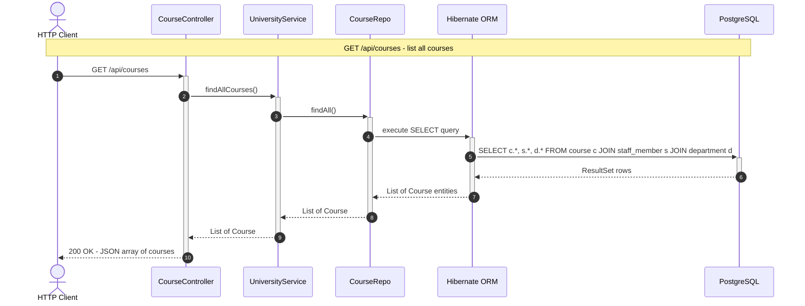
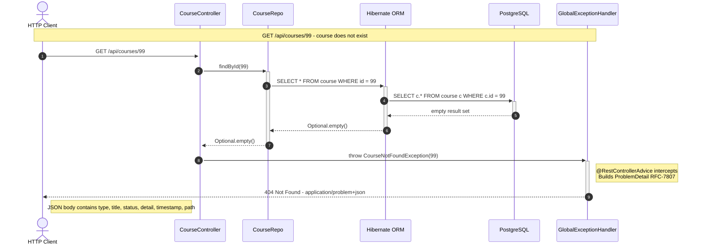
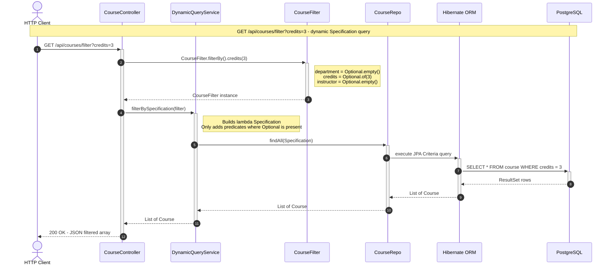
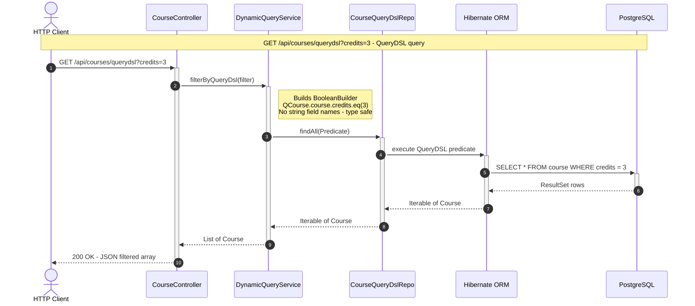
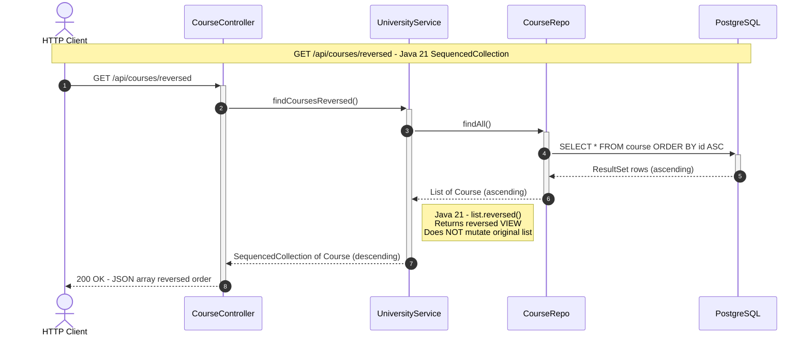

# University Modern — Sequence Diagrams

> **Module:** `university-modern` · Spring Boot 3.2+ · Java 17/21  
> End-to-end request flows from HTTP client through all application layers to PostgreSQL.

---

## Diagram Index

| # | Flow | Entry Point | Key Feature |
|---|---|---|---|
| 1 | [List all courses](#flow-1-list-all-courses) | `GET /api/courses` | Service → Repo → DB happy path |
| 2 | [Get course by ID — not found](#flow-2-get-course-by-id--404-problemdetail) | `GET /api/courses/{id}` | RFC-7807 ProblemDetail error response |
| 3 | [Dynamic filter — Specification](#flow-3-dynamic-filter--jpa-specification) | `GET /api/courses/filter` | `CourseFilter` → JPA Specification |
| 4 | [Dynamic filter — QueryDSL](#flow-4-dynamic-filter--querydsl) | `GET /api/courses/querydsl` | `BooleanBuilder` + Q-types |
| 5 | [SequencedCollection reversed](#flow-5-sequencedcollection--reversed-courses) | `GET /api/courses/reversed` | Java 21 `List.reversed()` |

---

## Flow 1: List All Courses

> **Stack:** `CourseController` → `UniversityService` → `CourseRepo` → Hibernate → PostgreSQL  
> **Characteristic:** Blocking, thread-per-request (Spring MVC / Tomcat). Simple happy-path CRUD read.



### Flow 1 — Layer Call Chain

```
HTTP Client
    │ GET /api/courses
    ▼
CourseController  (@RestController — Spring MVC Tomcat thread)
    │ findAllCourses()
    ▼
UniversityService  (@Service — CRUD facade)
    │ findAll()
    ▼
CourseRepo  (JpaRepository<Course, Integer>)
    │ Spring Data generates SELECT JPQL
    ▼
Hibernate ORM  (JPA Provider — translates JPQL → SQL)
    │ JDBC blocking call
    ▼
PostgreSQL  (Docker Compose :5432)
    │ ResultSet
    ▼
List<Course>  serialised to JSON → 200 OK
```

---

## Flow 2: Get Course by ID — 404 ProblemDetail

> **Feature:** Spring Boot 3.2+ `ProblemDetail` (RFC 7807).  
> `CourseNotFoundException` is thrown by the controller, caught by `@RestControllerAdvice`, and serialised to a structured `application/problem+json` response.



### Flow 2 — ProblemDetail Response Shape

```json
HTTP/1.1 404 Not Found
Content-Type: application/problem+json

{
  "type":      "https://api.university.example/errors/course-not-found",
  "title":     "Course Not Found",
  "status":    404,
  "detail":    "Course with ID 99 was not found.",
  "timestamp": "2026-03-03T10:30:00Z",
  "path":      "/api/courses/99"
}
```

### Flow 2 — Layer Call Chain

```
HTTP Client
    │ GET /api/courses/99
    ▼
CourseController
    │ courseRepo.findById(99).orElseThrow(() -> new CourseNotFoundException(99))
    ▼
CourseRepo → Hibernate → PostgreSQL
    │ Optional.empty() returned
    ▼
CourseController throws CourseNotFoundException
    ▼
GlobalExceptionHandler  (@RestControllerAdvice intercepts)
    │ ProblemDetail.forStatusAndDetail(404, msg)
    ▼
HTTP 404 application/problem+json → Client
```

---

## Flow 3: Dynamic Filter — JPA Specification

> **Feature:** `JpaSpecificationExecutor` + lambda `Specification` predicate.  
> `DynamicQueryService.filterBySpecification()` builds a WHERE clause from a `CourseFilter` at runtime — only conditions with non-empty `Optional` values are added.



### Flow 3 — Specification Lambda (Simplified)

```java
courseRepo.findAll((root, query, cb) -> {
    List<Predicate> predicates = new ArrayList<>();
    filter.getCredits().ifPresent(c ->
        predicates.add(cb.equal(root.get("credits"), c)));
    return cb.and(predicates.toArray(new Predicate[0]));
});
// SQL: WHERE credits = 3
```

---

## Flow 4: Dynamic Filter — QueryDSL

> **Feature:** `QuerydslPredicateExecutor` + APT-generated `QCourse` Q-types.  
> `DynamicQueryService.filterByQueryDsl()` uses type-safe `BooleanBuilder` — no string field names, full IDE auto-complete.



### Flow 3 vs Flow 4 — Strategy Comparison

| Attribute | JPA Specification (Flow 3) | QueryDSL (Flow 4) |
|---|---|---|
| **Type safety** | Field names as strings — typos cause runtime errors | APT-generated `QCourse` — typos caught at compile time |
| **IDE support** | No auto-complete for field names | Full auto-complete on `QCourse.course.*` |
| **Compose predicates** | `criteriaBuilder.and(list)` | `BooleanBuilder.and(predicate)` |
| **Null handling** | Manual `ifPresent` pattern | Manual `BooleanBuilder` conditions |
| **Setup cost** | None — built into Spring Data JPA | Requires QueryDSL APT plugin + compile step |
| **Best for** | Simple to moderate dynamic queries | Complex, large-scale dynamic query construction |

---

## Flow 5: SequencedCollection — Reversed Courses

> **Feature:** Java 21 `SequencedCollection.reversed()`.  
> `findCoursesReversed()` returns courses in last-to-first order without mutating the original list — a non-destructive reversed view.



### Java 21 SequencedCollection API Quick Reference

| Old API (pre-Java 21) | New API (Java 21) | Behaviour |
|---|---|---|
| `list.get(0)` | `list.getFirst()` | First element |
| `list.get(list.size() - 1)` | `list.getLast()` | Last element |
| `Collections.reverse(list)` — mutates | `list.reversed()` — non-destructive | Reversed view |
| No equivalent | `list.addFirst(e)` / `list.addLast(e)` | Add to ends |

---

*Generated 2026-03-03 · Principal architect analysis of `university-modern` (Java 17/21 + Spring Boot 3.2+)*
