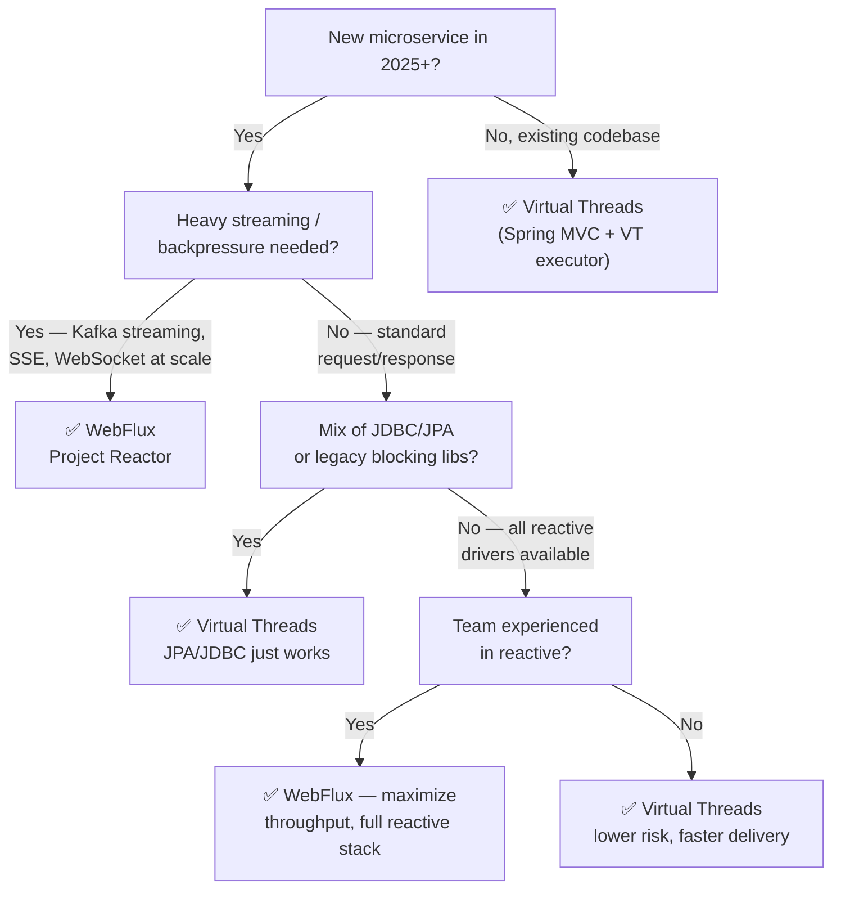

# WebFlux (Project Reactor) vs Java 21 Virtual Threads — Principal Architect Comparison

> **Context:** The `college` module in [spring-data-3-5959699](https://github.com/LinkedInLearning/spring-data-3-5959699) uses **WebFlux + Spring Data MongoDB Reactive**.  
> This document compares that choice against **Java 21 Virtual Threads** to guide architectural decisions in real-world microservices.

---

## TL;DR

| | WebFlux / Project Reactor | Java 21 Virtual Threads (JEP 444) |
|---|---|---|
| **Concurrency model** | Cooperative, event-loop, non-blocking | Preemptive, thread-per-request, blocking-style code |
| **Programming model** | Reactive (`Mono<T>`, `Flux<T>`, operators) | Imperative (looks like classic Java) |
| **Blocking I/O** | Forbidden on event loop threads | Fine — JVM parks the virtual thread, OS thread is freed |
| **Learning curve** | High (reactive operators, backpressure, debugging) | Near-zero for existing Java developers |
| **Throughput ceiling** | Very high (few OS threads serve millions of requests) | Very high — same ceiling via cheap thread parking |
| **Latency** | Lower at extreme scale | Slightly higher under extreme contention |

---

## 1. Concurrency Architecture

```
WebFlux (Reactor)
─────────────────
 Request →  Event Loop Thread (Netty)
               │
               └─ Non-blocking I/O call → callback chain (Mono/Flux operators)
                  No thread is blocked. Same thread handles next request.

 OS Threads:  ~2× CPU cores  (tiny fixed pool)
 Requests handled concurrently:  Millions (async pipeline)


Virtual Threads (JEP 444)
──────────────────────────
 Request →  Virtual Thread (JVM-managed, cheap: ~200 bytes stack)
               │
               └─ Blocking I/O call → JVM parks virtual thread
                  Carrier OS thread is RELEASED to run another virtual thread

 OS Threads:  ~2× CPU cores (carrier thread pool)
 Virtual Threads:  Millions (heap-allocated, on demand)
```

**Verdict:** Both achieve high concurrency — but through fundamentally different mechanisms. Reactor eliminates blocking. Virtual Threads embrace blocking and make it free.

---

## 2. Programming Model Complexity

```java
// ❌ WebFlux — reactive chain for a simple save + notify
public Mono<Order> placeOrder(OrderRequest req) {
    return validateOrder(req)                          // Mono<Void>
        .then(inventoryClient.reserve(req.itemId()))   // Mono<Inventory>
        .flatMap(inv -> orderRepo.save(toOrder(req)))  // Mono<Order>
        .flatMap(order ->
            notificationService.send(order.id())       // Mono<Void>
                .thenReturn(order))
        .onErrorMap(InventoryException.class,
                    e -> new OrderException(e.getMessage()));
}

// ✅ Virtual Threads — identical logic, imperative style
public Order placeOrder(OrderRequest req) {            // plain blocking method
    validateOrder(req);                                // throws on failure
    Inventory inv = inventoryClient.reserve(req.itemId());  // blocks — fine!
    Order order   = orderRepo.save(toOrder(req));           // blocks — fine!
    notificationService.send(order.id());                   // blocks — fine!
    return order;
}
```

**WebFlux cost:** Every developer must understand `flatMap` vs `map`, `switchIfEmpty`, `zip`, `mergeWith`, `publishOn`/`subscribeOn`, error operator chains, and context propagation. Stack traces become meaningless.

**Virtual Thread gain:** Zero new concepts. Existing Spring MVC, JDBC, JPA, `RestTemplate` code all works. Exception stack traces are readable.

---

## 3. Backpressure

```
WebFlux:
  Publisher → signals demand downstream via Subscription.request(n)
  Consumer controls the flow rate
  Critical for: streaming large datasets, SSE, WebSocket, file processing
  Example: reading 10M records from DB → stream to client without OOM

Virtual Threads:
  No built-in backpressure — you still need explicit mechanisms:
    - Bounded queues (BlockingQueue)
    - Semaphores
    - Rate limiters
  Risk: if producer is faster than consumer, heap blows up
```

**Winner: WebFlux** when true backpressure is required (streaming pipelines, reactive Kafka, R2DBC streaming).

---

## 4. Thread-Local & Context Propagation

| Concern | WebFlux | Virtual Threads |
|---|---|---|
| `ThreadLocal` (MDC, security context) | Broken by default — context switches across operators | Works perfectly — each virtual thread has its own `ThreadLocal` |
| Spring Security context | Must use `ReactiveSecurityContextHolder` | Classic `SecurityContextHolder` works |
| MDC logging | Must manually propagate via `contextWrite` | MDC works as-is |
| Tracing (OpenTelemetry) | Complex reactor hooks needed | Works out of the box |

**Winner: Virtual Threads** — eliminates an entire category of production bugs.

---

## 5. Database / I/O Compatibility

| Integration | WebFlux Compatible? | Virtual Threads Compatible? |
|---|---|---|
| **JDBC / JPA / Hibernate** | No — blocking drivers block Netty threads | Yes — blocking is free |
| **R2DBC** | Yes (native reactive) | Works but adds complexity for zero gain |
| **MongoDB Reactive** | Yes (`ReactiveMongoRepository`) | Works via sync driver; reactive is overkill |
| **Redis (Lettuce reactive)** | Yes | Sync Lettuce works fine |
| **Kafka (reactive)** | Yes (Reactor Kafka) | Sync Kafka consumer works fine |
| **HTTP client** | `WebClient` (reactive) | `RestClient` / `RestTemplate` (blocking) |
| **Spring MVC** | No | Yes — runs on virtual thread executor |
| **Spring WebFlux** | Yes | Yes — can use both |

> **Critical insight for `university` module:** JPA + `JpaRepository` is incompatible with WebFlux reactive pipelines.  
> This is exactly why the two modules exist separately in this repo.  
> Virtual Threads solve this completely — JPA runs on virtual threads without any code changes.

---

## 6. Performance Profile

```
Requests/Second vs Concurrency (conceptual)

     Throughput
        │
        │          WebFlux ──────────────────────────────
        │        ╱
        │    VT ─────────────────────────────────
        │  ╱   (slight gap at extreme scale, closes with tuning)
        │╱
        │──────────────────────────────────────────→ Concurrent Requests
        1    100   1K    10K   100K   1M
```

- **Latency:** WebFlux wins at P99/P999 under extreme load — zero thread scheduling overhead
- **Throughput:** Both are equivalent for typical workloads (< 100K RPS)
- **Memory:** Virtual threads are ~200 bytes/thread heap vs ~1MB/OS thread stack
- **CPU pinning risk:** Virtual threads can pin carrier threads inside `synchronized` blocks — prefer `ReentrantLock` over `synchronized` when using Virtual Threads

---

## 7. When to Choose What — Decision Matrix



---

## 8. Spring Boot Configuration

```java
// Virtual Threads — Spring Boot 3.2+ (one property!)
// application.properties
spring.threads.virtual.enabled=true   // enables VT for Tomcat + async executors
```

```java
// WebFlux — replace spring-boot-starter-web with:
// spring-boot-starter-webflux → auto-configures Netty event loop
// No explicit config needed — Netty is the default server
```

---

## 9. This Repo as a Teaching Example

| Module | Strategy | What it teaches |
|---|---|---|
| `college` | **WebFlux** + MongoDB Reactive | `ReactiveCrudRepository`, `Flux`/`Mono`, reactive `@Query` JSON syntax, non-blocking pipeline — see [college module](https://github.com/LinkedInLearning/spring-data-3-5959699/tree/main/college) |
| `university` | Spring MVC + JPA | Blocking repositories, 6 query strategies — **would benefit from Virtual Threads** via `spring.threads.virtual.enabled=true` in Spring Boot 3.2+ for zero-cost concurrency without reactive rewrite |

**Architectural recommendation for `university`:**  
Add `spring.threads.virtual.enabled=true` to `application.properties` — the module gets WebFlux-level concurrency with zero code changes, while retaining all JPA/Hibernate capabilities.

---

## 10. Summary Verdict

| Scenario | Recommendation |
|---|---|
| New microservice, standard CRUD, team < 5 years reactive exp | **Virtual Threads** |
| Real-time streaming, Kafka pipelines, SSE/WebSocket at millions of connections | **WebFlux** |
| Existing Spring MVC app, want higher concurrency | **Virtual Threads** — drop-in upgrade |
| Mixed JDBC/JPA + high concurrency | **Virtual Threads** — only viable option without full rewrite |
| Greenfield, all-reactive stack (R2DBC, reactive Redis, reactive Kafka), expert team | **WebFlux** |
| Microservices with complex async orchestration (sagas, parallel fan-out) | **WebFlux** — `zip`, `merge`, structured concurrency via reactive operators |

> **Principal Architect stance:** Virtual Threads are the **default choice for 80% of microservices in 2025+**.  
> WebFlux remains the right tool when true backpressure, reactive streaming pipelines, or ultra-low-latency at extreme scale is a hard requirement.  
> Avoid mixing both in the same service without clear boundaries.

---

> **See also:**
> - [REPOSITORY_SUMMARY.md](./REPOSITORY_SUMMARY.md) — Module overview with tech stack breakdown
> - [ARCHITECTURE_C4_LEVELS.md](./ARCHITECTURE_C4_LEVELS.md) — C4 Level 0/1/2 architecture diagrams
> - [ARCHITECTURE_DIAGRAM.md](./ARCHITECTURE_DIAGRAM.md) — Full component-level diagram

*Generated on 2026-03-03 by GitHub Copilot — [LinkedInLearning/spring-data-3-5959699](https://github.com/LinkedInLearning/spring-data-3-5959699)*
